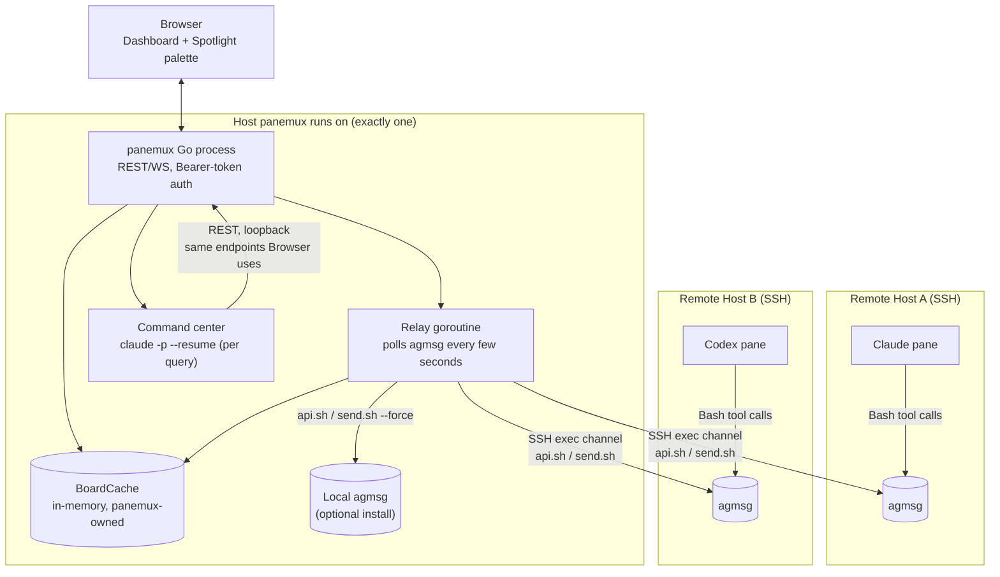
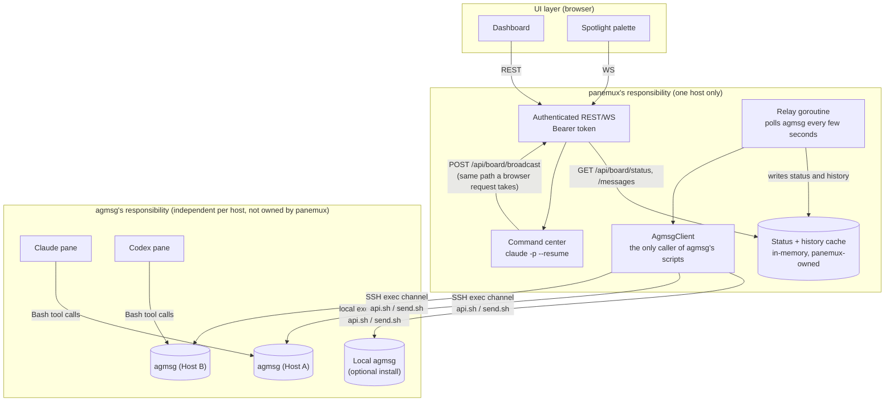
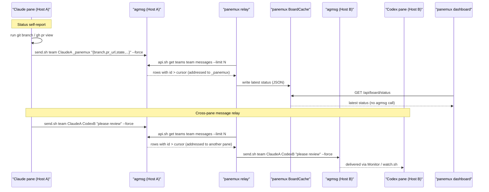
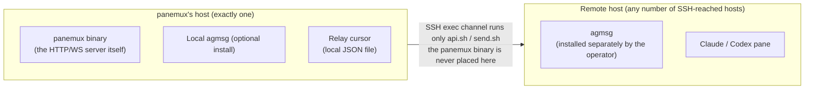

# Agent Board: Cross-Pane Claude Messaging and Status Aggregation

> **Status: Phase 1 (messaging/status/relay backend) implemented; Command center, Spotlight
> palette, and history panel are still design-only.** The `internal/board` package, the
> `BoardHostID`/`BoardExecutor`/`BoardHomeDirer` session capabilities, the bootstrap flow, the
> `agent_board`/`server.auth_token` config additions, and the first three rows of
> [API additions](#api-additions) (`GET /api/board/status`, `GET /api/board/messages`,
> `POST /api/board/broadcast`) exist and are tested as described below. Not implemented: the
> headless command-center subprocess, its MCP server, `WS /ws/board-command`,
> `GET /api/board/command/history`, the Spotlight palette, the history panel, and
> `server.auth_token` auto-generation-on-first-run (the config field and its loopback-requires-a-
> token validation rule are implemented; an operator must currently set the token explicitly to use
> board features over a non-loopback listener). Treat every [Command center](#command-center)
> section and its rows in [API additions](#api-additions) as still design-only. See
> [security.md](security.md) and [architecture.md](architecture.md) for the corresponding
> implemented-vs-planned notes.

## Purpose

panemux already runs real `git`/`gh` commands to show branch and PR info in a pane header — that
part is not inferred (see `docs/behavior.md`'s pane-header Git/PR section). What *is* inferred is
**which directory to run those commands in**: for an interactive Claude/Codex pane, panemux parses
`~/.claude/sessions/<pid>.json` and the matching transcript JSONL to decide whether the agent has
moved into a sibling worktree, using an undocumented, internal precedence across several transcript
fields (`session_meta.cwd`, `turn_context.cwd`, `Bash` `cd` targets, subagent transcript files —
see [architecture.md](architecture.md)) that has already needed at least one bug fix as Claude Code
itself evolved. When that resolution is wrong, the `git`/`gh` calls still run — just in the wrong
directory, or nowhere confidently resolvable at all — and the header shows a stale, wrong, or
missing branch/PR. In practice this happens often enough that a panemux user ends up asking Claude
directly for its own PR URL instead of trusting the header. The instability is real; it just lives
one layer deeper than "the git/PR data is inferred" — it's "the directory the real git/PR data
comes from is inferred," which is no more stable a thing to reverse-engineer.

This mechanism is also read-only and pane-local: it cannot tell whether a session is idle or
mid-turn, and it gives panemux no way to send an agent a message or to let two agents in different
panes talk to each other.

Agent Board replaces that inference with a small, self-reported channel:

1. Panes report their own state — working directory, branch, repository, PR link, and whether
   they're idle, working, or waiting for approval — by running their own commands (`git`, `gh`)
   and telling panemux the result, instead of panemux guessing from an internal file format. This
   is the same information a human looking at the pane would see, obtained the same way a human
   would get it, so it is exactly as stable as the agent's own tool use — not as fragile as
   reverse-engineering a private transcript schema. See
   [Design principles](#design-principles) for why this generalizes beyond just this one field.
2. Lets a human broadcast a message to one or more panes' Claude sessions without racing raw
   keystrokes into a live PTY, and lets a local **command center** (see
   [Command center](#command-center)) do the same conversationally on the human's behalf.
3. Aggregates all of the above into one dashboard and, for the command center, one continuous,
   reviewable conversation history.
4. Is built entirely on [agmsg](https://github.com/fujibee/agmsg), an existing MIT-licensed
   bash+sqlite3 agent-messaging tool. As of this writing agmsg's own README lists Claude Code,
   Codex, Gemini CLI, GitHub Copilot, Antigravity, OpenCode, and Hermes as supported agent types;
   treat that as a snapshot of agmsg's documentation, not a list panemux enforces or keeps in sync
   itself — implementation should re-check agmsg's current README rather than trust this document's
   copy of it, since agmsg adding or renaming a supported agent type has no effect on panemux's own
   code (panemux never branches on agent type; it only ever calls `api.sh`/`send.sh`/`join.sh`
   generically). panemux does not maintain a second, parallel messaging protocol of its own — see
   [Design principles](#design-principles) for why, and [Integration with agmsg](#integration-with-agmsg) for how.

## Design principles

- **Ask the agent; don't reverse-engineer its internal state.** This is the central lesson behind
  this whole redesign, and it applies uniformly to every piece of external state Agent Board
  touches, not only pane status:
  - panemux does not parse Claude/Codex transcript internals to guess branch/PR/cwd — it asks the
    agent to run `git`/`gh` itself and report the result (see
    [Status self-report](#status-self-report-and-message-flow)).
  - panemux does not read agmsg's `messages.db` or `teams/*/config.json` directly — those are
    agmsg's own internal storage, explicitly documented in agmsg's README as "internal and free to
    change." panemux only calls agmsg's own stable, documented entry points (`scripts/api.sh`,
    `scripts/send.sh`) — see [Integration with agmsg](#integration-with-agmsg).
  - Any future integration this document doesn't yet cover should default to the same rule: prefer
    a tool's own documented command/output contract over parsing whatever file it happens to keep
    its state in today.
- **One messaging mechanism, not two.** An earlier draft of this design also specified a
  panemux-owned SQLite schema and CLI ("`native`") for Claude-only panes, with agmsg reserved for
  panes that needed to talk to non-Claude agents. Building and maintaining a second protocol next
  to an already-working one turned out not to be worth it: agmsg already covers everything
  `native` tried to do, plus interoperability with Codex/Gemini/etc. that `native` could never
  offer, and every pane on `agmsg` from the start means no relay step is needed even for two panes
  that happen to both be Claude. Agent Board is therefore built entirely on agmsg; panemux owns no
  message schema of its own. The same reasoning was later applied to Claude Code's own native
  cross-session messaging feature — see [Alternatives
  considered](#claude-codes-native-cross-session-messaging-2026-08-08).
- **No new daemon, no new listening port — scoped to what panemux itself starts.** panemux talks to
  agmsg the same way any of its scripts or a live agent session would: local `exec.Command` calls on
  the host panemux itself runs on, and the existing SSH exec channel (`GetCWD`/`InspectGitContext`
  already use it) for every other host. panemux itself starts no new process that listens for
  anything, locally or remotely. This claim is specifically about processes *panemux* starts —
  agmsg's own `SessionStart` hook already launches its own `Monitor`/`watch.sh` process per joined
  pane independently of panemux (see [Integration with agmsg](#integration-with-agmsg)), exactly as
  it would if an operator had set up agmsg by hand with no panemux involved at all. That process is
  agmsg's, lives and dies by agmsg's own hook lifecycle, and is not a daemon this design introduces
  or is responsible for.
- **panemux itself is never installed on a remote host, under any circumstances.** The `panemux`
  binary is also a server: running it can start the HTTP/WS listener, the auth surface, and the
  command center. Placing a copy on every SSH-reached host that wants board features would mean
  each of those hosts could accidentally end up running a second, unmanaged panemux server. Board
  features on a remote host depend only on an agmsg installation the operator put there themselves
  (see the next principle) — never on anything panemux ships.
- **Backend presence is detected, never installed, by panemux.** If agmsg is not found on a pane's
  host, panemux skips board bootstrap for that pane, logs a clear warning, and leaves the pane's
  shell session otherwise untouched — board is additive, never load-bearing for the pane to
  function. panemux never runs `npx agmsg`, `npm i -g agmsg`, `git clone`, or any other installer
  on the operator's behalf, on any host. See [Integration with agmsg](#integration-with-agmsg).
- **panemux is a trusted relay, not an end-to-end encrypted channel.** See
  [Cross-host relay](#cross-host-relay) and [Security model](#security-model).

## Alternatives considered

### Claude Code's native cross-session messaging (2026-08-08)

Claude Code [added native cross-session
messaging](https://code.claude.com/docs/en/cross-session-messaging) (v2.1.224+): a `ListAgents`
tool for discovering other Claude Code sessions and a `SendMessage` tool for delivering plain text
to one of them by name, callable by Claude itself, not by an external process. Same-machine delivery
goes over a per-session Unix domain socket the receiving session binds and never touches Anthropic
servers; delivery to a session on another machine or [Claude Code on the
web](claude-code-on-the-web) goes through Anthropic servers via a Remote Control connection, and is
reply-only in that direction — a session here cannot originate a message to a session it hasn't
first heard from.

This looked promising enough to evaluate seriously against Agent Board's own goals, and was
rejected as a replacement (or a parallel mechanism) for the same reasons the earlier `native`
SQLite draft was rejected in favor of agmsg, plus one more specific to how this feature is exposed:

- **Claude-only.** It has no notion of Codex, Gemini CLI, or any other agent type — exactly the
  interoperability agmsg provides and the `native` draft could not (see [Design
  principles](#design-principles)'s "one messaging mechanism, not two"). Adopting it for board
  traffic would mean two different mechanisms depending on which agent is in a pane, which is the
  same shape of problem this document already reasoned its way out of once.
- **Doesn't fit panemux's arbitrary-SSH-host model.** Same-machine delivery requires both sessions
  to see the same on-disk registration files — it says nothing about an SSH-reached remote host.
  Cross-machine delivery exists, but only through a Remote Control connection and only as a reply,
  never as an originating send — a fundamentally different, heavier operational model than "the
  operator already has agmsg installed on that host," and one that still couldn't originate the
  status self-report or command-center broadcast this design depends on across hosts.
- **No documented interface for panemux itself to use.** The only sanctioned way to send or receive
  is Claude calling `SendMessage`/`ListAgents` itself; there is no REST/CLI entry point a Go process
  can call directly. The one adjacent primitive that looks like an external hook —
  `CLAUDE_CODE_MESSAGING_SOCKET`, the inbox socket path exported to a session's own child processes
  — has no documented wire format here, and panemux is the *parent* of a pane's shell (and thus an
  ancestor, not a child, of the Claude process running inside it), so it would not even qualify for
  the "own-child" delivery path this feature defines. Writing to that socket directly would be
  exactly the kind of undocumented-internal-format reverse-engineering [Design
  principles](#design-principles)'s "ask the agent; don't reverse-engineer its internal state" rule
  already rejects for agmsg's `messages.db` — the principle applies here just as much as it did
  there, including to a first-party Anthropic feature.

None of this rules out a Claude session itself choosing to use `SendMessage` for its own,
non-board-related purposes — that's between the user and their agent, and orthogonal to what Agent
Board specifies. It also doesn't rule out a narrower future integration (for example, prompting a
Claude pane to use `SendMessage` instead of `send.sh` when both sender and receiver are confirmed
local Claude sessions) if a real need for it shows up later. But nothing in this design should be
built toward that today: it would reintroduce exactly the two-mechanism problem "one messaging
mechanism, not two" exists to prevent, for a narrower agent-type and host-topology coverage than
agmsg already provides.

## Architecture

### System overview



Every host in this picture is either the one host panemux itself runs on, or a host panemux only
ever reaches through an SSH exec channel it already holds for that pane's session — never a host
panemux is installed on. See [Local vs remote resource
placement](#local-vs-remote-resource-placement) for that constraint in more detail.

### Responsibility boundaries



Two responsibility boundaries, not four generic layers, because the boundary that actually matters
here is "what agmsg owns" vs. "what panemux owns" — the one place a future agmsg version bump can
break something is entirely inside `AgmsgClient`'s two call sites (`api.sh`, `send.sh`), never
anywhere else in panemux:

- **panemux's responsibility**: authentication, the relay, the **in-memory status cache** the
  dashboard actually reads (see below), the command center, and the single `AgmsgClient`
  abstraction that is the *only* code in panemux allowed to call agmsg's scripts. Everything here
  is panemux's own, version-independent of agmsg beyond that one narrow interface.
- **agmsg's responsibility**: one independent agmsg installation per host, each with its own
  durable message log, team roster, and delivery to the live agent sessions that are its actual
  members. panemux does not own this box, does not persist a copy of its contents beyond what the
  cache below needs, and is never a participant *inside* more than one host's agmsg installation at
  a time — it only ever reaches a remote one through the SSH exec channel it already holds for that
  pane's session, exactly as [Local vs remote resource
  placement](#local-vs-remote-resource-placement) details.

**Where agent status actually lives.** It does not live in a database panemux owns, and it is not
recomputed from a live agmsg call on every dashboard request either — both would be wrong for
different reasons (the first re-introduces "panemux owns a schema," which [Design
principles](#design-principles) rules out; the second makes every dashboard poll pay for an agmsg
round-trip, including an SSH hop for remote hosts). Instead: the relay goroutine, which is already
polling every host's agmsg for messages to forward, updates an **in-memory status cache** as a side
effect whenever it sees a status report addressed to `_panemux`. `GET /api/board/status` reads only
that cache — never agmsg directly. agmsg's own message log remains the durable source of truth (a
lost or restarted panemux process just means the cache is empty until the next poll cycle refills
it, per [Known limitations](#known-limitations)), but the *current, dashboard-facing view* of that
state is unambiguously something panemux computes and holds itself.

## Integration with agmsg

Reads and writes go through two different scripts under agmsg's `scripts/` directory, verified
against agmsg's source (not inferred). panemux never reads or writes agmsg's `messages.db` or
`teams/*/config.json` directly, matching agmsg's own README guidance that those are internal.

**Reads — `scripts/api.sh`, read-only.** Its `case "$VERB"` block implements only `get`:

| Call | Returns |
|---|---|
| `api.sh get teams` | `{"name": "<team>"}` per line, one per team under `teams/` |
| `api.sh get teams <team> members` | `{"name","types","project"}` per line |
| `api.sh get teams <team> messages [--agent <name>] [--limit N] [--before-id <id>]` | `{"type":"message_sent","id","team","from","to","body","at"}` per line, JSONL, oldest-first |

`id` is returned as a string (agmsg's own future-proofing against a non-integer ID scheme, per its
source comments) — panemux must not assume it stays a bare integer forever, even though today's
implementation is one. Only `--limit` and `--before-id` are validated as plain digits; **`--agent`
is not** — it is a free-text name protected only by agmsg's own internal `_agmsg_sqlesc` SQL
escaping, not by any argument-shape check. An earlier revision of this document claimed all three
were digit-validated; that was wrong, and the correction matters directly for [Security
model](#security-model): panemux cannot skip its own shell-escaping on reads on the theory that
agmsg has already validated the arguments for it. Unlike agmsg's own human-facing
`inbox.sh`/`check-inbox.sh` (which mark whatever they display as read), `api.sh` never writes
`read_at` — panemux's dashboard/relay polling through it cannot cause a joined agent to miss a
message its own inbox/`Monitor` delivery would otherwise have shown it.

**There is no forward/"since" read.** `--before-id` selects `id < X` — a backwards pagination
cursor, the opposite of what an incremental poll needs — and `api.sh` has no after/since option at
all. The relay therefore cannot use `--before-id` for its poll loop (an earlier revision of this
document specified exactly that mistake). Instead, each poll calls `api.sh get teams <team>
messages --limit <N>` with **no** `--before-id`, taking the `N` most recent rows (`N` defaults to a
few hundred; see [Package layout](#package-layout)), and filters client-side to rows whose `id` is
numerically greater than the persisted cursor. **This has a real, accepted truncation risk:** if
more than `N` genuinely new rows land on one host between two poll cycles, the oldest of that
overflow are silently skipped — there is no way to detect or recover them through `api.sh`'s
documented interface. `--before-id` remains useful for one thing only: paging *backwards* through
older history on demand (e.g. a "load more" action in the dashboard's history view), never for the
relay's forward poll.

**Writes — `scripts/send.sh`, not `api.sh`.** Signature: `send.sh <team> <from> <to> <body>
[--force]`. Unlike `api.sh`, `send.sh` takes `body` as a **positional shell argument**, not stdin —
there is no stdin-based write path in agmsg to delegate to. **Both `from` and `to` are checked
against that team's roster unless `--force` is passed** — an earlier revision of this document said
only `from` was checked, which is wrong and was load-bearing: it made every message in [Status
self-report](#status-self-report-and-message-flow)'s sequence diagram fail at the source, since
`_panemux` (the status-report recipient) and any pane on a *different* host (the cross-host relay
target) are never registered in the sending pane's own local roster.

**The fix this document adopts: every board-related `send.sh` call always passes `--force`,
including the ones a live Claude/Codex session makes for itself.** The bootstrap instruction (see
[Bootstrap flow](#bootstrap-flow)) tells the agent to call `send.sh <team> <from> <to> "<body>"
--force` directly for board messages, rather than going through `/agmsg send` (which — confirmed
against agmsg's own skill templates — has no documented way to pass `--force` through). This is a
deliberate deviation from "just use agmsg's normal onboarding flow for everything": the roster
check `send.sh` performs by default is fundamentally incompatible with addressing a reserved
sentinel identity or a pane on a host that has never heard of it, so board traffic opts out of that
check uniformly instead of trying to satisfy it. A pane can still use unforced `/agmsg send` for
its *own*, non-board conversations with other agmsg-native agents already on that host (Codex,
Gemini CLI, etc.) — that path is untouched and still roster-checked normally.

**Panes join with `join.sh <team> <agent_id> <agent_type> <project_path> [--force]`**, typically
via agmsg's own onboarding (the `/agmsg` skill flow a live Claude session runs itself, or the
equivalent for another agent type) rather than the raw script directly — see [Bootstrap
flow](#bootstrap-flow). This registers the pane into `teams/<team>/config.json`. Because board
sends always pass `--force`, this registration is no longer what gates board delivery — its
purpose is solely to let other, non-board-aware agmsg agents on the same host (Codex, Gemini CLI,
etc.) address the pane normally, and to give the pane a working `/agmsg` identity for its own
non-board use. Once joined, agmsg's own `SessionStart`/`SessionEnd` hooks own that pane's `Monitor`
(`watch.sh`)-process lifecycle end-to-end (launch, liveness, cleanup) — panemux has no part in it
and does not need to.

**panemux's own relay and command center are never agmsg roster members, and never go through
agmsg's own identity-detection layer, so any send they originate uses `--force` for the same reason
board traffic from a live pane does.** A live Claude session's own unforced `/agmsg send` normally
resolves `from` automatically — `whoami.sh` matches environment variables or, failing that, walks
the process tree against each agent type's known process-name patterns, then `identities.sh`
reconciles that against a joined team/project — but that whole chain assumes a live process to
introspect. The relay and command center are panemux's own Go code, not a joined Claude/Codex
process, so no identity-detection result would ever exist for them to look up.

**Team naming.** All board-enabled panes on a given panemux instance join the same agmsg team by
default (`agent_board.team`, default `"panemux"`), so message addressing is just pane IDs within
one team — see [Config additions](#config-additions).

**Detection, not installation.** At bootstrap time panemux checks whether agmsg is available on
that pane's host by looking for `scripts/api.sh` under agmsg's configured skill-install location.
**`command -v agmsg` must not be used for this** — the `agmsg` npm package on `PATH` is a thin
bootstrapper whose own stated purpose is to *"reserve the agmsg name on npm and give users a
convenient `npx agmsg install` entry point"*; its presence says nothing about whether agmsg itself
is installed, and *invoking* it fetches and runs agmsg's real installer — exactly the auto-install
this design forbids. There is also no single fixed "known skill-install location": `install.sh`
prompts for a command name and installs under `~/.agents/skills/<that name>/`, and agmsg separately
supports an `AGMSG_STORAGE_PATH` override. panemux's detection therefore needs an explicit,
operator-set path (e.g. `agent_board.agmsg_path`, defaulting to the common `~/.agents/skills/agmsg/`
case but overridable), not a heuristic guess. If the configured/default path doesn't contain
`scripts/api.sh`, panemux skips board bootstrap for that pane, logs a clear warning naming the pane,
and leaves the pane's shell session itself untouched. panemux never runs `npx agmsg`, `npm i -g
agmsg`, `git clone`, or any other installer on the operator's behalf, on any host.

**`~` in `agmsg_path` is expanded by panemux, never left for the remote shell to expand.** A leading
`~` in `agent_board.agmsg_path` is resolved to an absolute path before it is ever placed into a
`RunBoardCommand` argument list — for the local host this is the ordinary `os.UserHomeDir()`-based
expansion this repository already uses elsewhere (see `DEVELOPMENT.md`'s testability rule); for a
remote host, panemux resolves the remote user's home directory once per SSH connection (a single
`echo -n "$HOME"` probe over the existing exec channel, cached for the life of that connection) and
substitutes it locally before building any command string. This is not optional: `shellQuotePath`
single-quotes every argument specifically to *suppress* shell expansion of its contents (see
[Security model](#security-model)), and tilde expansion only happens for an unquoted leading `~` —
a literal `~` placed inside single quotes reaches the remote shell as the two-character string `~`,
not the operator's home directory, silently breaking detection and every subsequent `api.sh`/
`send.sh` call. `validRemotePath`'s own regex already only accepts paths starting with `/` for the
same underlying reason (see [security.md](security.md)), so this expansion step is what lets an
operator write the natural `~/...` form in config while still handing `RunBoardCommand` an
already-absolute, already-safe-to-quote path.

**Remote command execution assumes a working, if non-interactive, shell environment.** The SSH exec
channel `RunBoardCommand` uses runs each command as a single non-login, typically non-interactive
shell invocation — the same channel `GetCWD`/`InspectGitContext` already use — which on many systems
does not source `~/.bashrc`, `~/.profile`, or equivalent interactive-only startup files. agmsg's own
runtime dependencies (`bash`, `node`, `sqlite3`) must therefore already be reachable from that
non-interactive shell's `PATH` for board detection and every subsequent command to succeed, even if
an operator's *interactive* SSH session (where they installed agmsg by hand) has a `PATH` that
differs — for example, a `node` made available only by an interactively-sourced version manager
(`nvm`, `asdf`, etc.) is not guaranteed visible here. This mirrors an assumption panemux's existing
SSH session handling already makes for the pane's own shell startup, and is not a new category of
risk this design introduces — but it is worth stating explicitly since a working interactive SSH
session is not sufficient evidence that board detection will also work on that host.

**Version pinning.** agmsg's own compatibility promise (per its README) only covers reading through
`scripts/api.sh`; there is no equivalent promise for `send.sh`'s argument order/behavior or for
`messages.db`. Because this design's write path depends entirely on `send.sh`, panemux is taking on
more exposure to agmsg's evolution than a "we only read from it" dependency would carry — see [J2
in Known limitations](#known-limitations) for that tradeoff stated plainly. panemux implementation
must pin a specific tested agmsg version/tag and treat any change to either script's observed
behavior as an external dependency compatibility bug, tracked the same way any other pinned
dependency's breaking change would be — and must be able to *detect* such a break mechanically
rather than discover it from a pane silently failing to communicate; see [agmsg compatibility
contract](#agmsg-compatibility-contract).

## Status self-report and message flow

Instead of a `kind='status'` field panemux owns (agmsg has no such column), status reports are
ordinary agmsg messages addressed to the reserved identity `_panemux` — the same identity the
command center uses as its own `from` when sending. Because `_panemux` is never an agmsg roster
member (see [Integration with agmsg](#integration-with-agmsg)), the agent's own `send.sh ...
--force` call is what lets a status report reach it at all. The relay goroutine, already polling
every host's agmsg with `api.sh get teams <team> messages --limit <N>` (no `--before-id` — see
[Integration with agmsg](#integration-with-agmsg) for why that flag can't do this) for message
forwarding, recognizes any row addressed to `_panemux` as a status update and writes it into
panemux's own in-memory status cache (see [Architecture](#architecture)), keeping only the newest
entry per sender. The dashboard never queries agmsg directly for this — it only ever reads that
cache.

The bootstrap instruction (see [Bootstrap flow](#bootstrap-flow)) tells Claude to gather this
itself, using its own `Bash` tool, and include it as a small JSON body:

```json
{
  "kind": "board_status",
  "state": "working",
  "cwd": "/home/user/project",
  "branch": "feature/x",
  "repo": "owner/repo",
  "pr_url": "https://github.com/owner/repo/pull/123",
  "last_tool": "Edit internal/api/handler.go",
  "summary": "fixing failing tests"
}
```

**`kind: "board_status"` is a fixed, required discriminator, not an optional field.** Detecting a
status report by *shape alone* — "does this JSON happen to have a `state` key" — has a real false-
positive edge: a human typing an ordinary chat message to `_panemux` through the command center or
Spotlight palette could, by coincidence or by pasting unrelated JSON, produce a body that parses as
valid JSON and happens to contain a `state` field, and would then be silently swallowed into the
status cache instead of showing up as a message. Requiring a literal `"kind": "board_status"` value
removes the ambiguity: the relay treats a row as a status update only when `Body` parses as JSON
*and* `kind` is exactly that string; every other body — including JSON that merely resembles the
status shape — is left alone as an ordinary message, matching [Package
layout](#package-layout)'s detection rule.

`branch`/`repo`/`pr_url` come from the agent running `git branch --show-current`, `git remote get-
url origin`, and a PR lookup (e.g. `gh pr view --json url -q .url`) itself — panemux never computes
these; it only displays what the agent reported. `cwd`/`pr_url` may be absent if the agent isn't in
a repository or there's no open PR; the dashboard shows what's present.



**Honest tradeoff, stated explicitly.** Self-report is only as good as the agent's compliance: it
depends on the agent actually running the bootstrap instruction's commands each time it reports,
whereas the old transcript-parsing approach was passive and automatic (when it worked at all). The
bet this redesign makes is that "ask, and get an answer that tracks reality because the agent just
computed it" is more often correct than "silently infer from an internal format panemux does not
control," even though the former requires the agent's cooperation and the latter didn't.

## Package layout

### `internal/board`

```go
type Row struct {
    ID          string    // agmsg's own id, host-scoped — NOT globally unique, NOT assumed numeric
    Host        string    // which AgmsgClient/host this row came from; required to compare/sort across hosts
    Team        string
    From, To    string
    Body        string
    At          time.Time
}

type Status struct {
    State, CWD, Branch, Repo, PRURL, LastTool, Summary string
    UpdatedAt   time.Time // when this status was recorded, so staleness is visible to the dashboard
}

type AgmsgClient interface {
    HostID() string
    // Send always passes --force. There is no non-forced Send: every board-originated message
    // (self-reported status, cross-host relay, command center) needs to reach a to/from identity
    // that is not guaranteed to be in the destination team's roster — see Integration with agmsg.
    // Escaping (shell, and for reads, agmsg's own incomplete argument validation) is this
    // implementation's responsibility, not the caller's — see internal/session's BoardExecutor.
    Send(ctx context.Context, team, from, to, body string) error
    // Since has no true "after" primitive to call into (api.sh has no such flag). It calls
    // `api.sh get teams <team> messages --limit <limit>` and returns only rows whose ID sorts
    // after afterID; the caller must treat the possibility of dropped rows (more than `limit` new
    // rows since the last poll) as expected, not exceptional — see Integration with agmsg.
    Since(ctx context.Context, team, afterID string, limit int) ([]Row, error)
}

// ownSendLedger is a short-lived, in-memory record of Send calls panemux itself has issued (the
// broadcast handler and the command center — see Cross-host relay), used only to verify a row the
// relay later observes with From == "_panemux" actually corresponds to one of panemux's own sends,
// since send.sh --force never checks From against a roster and an ordinary board pane could
// otherwise forge that identity. Entries expire after a few poll intervals; a body is stored only
// as a hash, since the ledger's job is matching, not re-displaying content.
type ownSendLedger struct {
    mu      sync.Mutex
    entries map[ownSendKey]time.Time // value is expiry
}

type ownSendKey struct {
    DestHost string
    Team     string
    To       string
    BodyHash string // e.g. sha256, truncated; not a security boundary by itself, only a dedup key
}

func (l *ownSendLedger) Record(destHost, team, to, body string)      { /* inserts with a short TTL */ }
func (l *ownSendLedger) Consume(destHost, team, to, body string) bool { /* true+deletes if matched, false if expired/absent */ }

// BoardCache is the in-memory, panemux-owned view of recent board activity shown in Architecture.
// Only the relay writes to it, as a side effect of the same Since polling it already does for
// message forwarding; both dashboard-facing endpoints only ever read it, never calling
// AgmsgClient directly at request time. Unlike AgmsgClient.Since's per-host afterID (an opaque
// agmsg-native string), BoardCache assigns its own monotonically increasing, panemux-local `Seq`
// to every row as it's appended, specifically because agmsg IDs from different hosts are not
// comparable or even guaranteed non-colliding with each other — Seq is what GET
// /api/board/messages?since=<id> actually paginates on.
type BoardCache struct {
    mu       sync.RWMutex
    status   map[string]Status // paneID -> latest self-reported status (pane IDs are globally unique)
    nextSeq  int64
    history  []cachedRow       // bounded ring buffer, most recent last
}

type cachedRow struct {
    Seq int64
    Row Row
}

func (c *BoardCache) RecordStatus(paneID string, s Status) { /* mutex-guarded write; sets s.UpdatedAt */ }
func (c *BoardCache) AppendMessage(r Row)                  { /* mutex-guarded write; assigns next Seq */ }
func (c *BoardCache) StatusSnapshot() map[string]Status    { /* mutex-guarded copy */ }
func (c *BoardCache) MessagesSince(afterSeq int64) []Row   { /* mutex-guarded copy, filtered by Seq */ }
```

The relay inspects every `Row` it reads: if `To == "_panemux"` and `Body` parses as JSON with
`kind == "board_status"` (see [Status self-report](#status-self-report-and-message-flow) for why
the discriminator, not shape-sniffing, is what triggers this), it calls `RecordStatus` *only* —
that row is never appended to `history` and never forwarded through the cross-host relay logic
(status reports are local bookkeeping, not messages meant for another pane, and the dashboard's
message history is not the right place to show a machine-readable status blob a human never
composed). A `Body` addressed to `_panemux` that isn't valid JSON, or is valid JSON without that
exact `kind`, is left alone as an ordinary chat message — including a body that happens to share
some field names with the status shape by coincidence — and *is* appended to `history` via
`AppendMessage`, the same as any other row that passes `from`-validation and isn't a status update.
`history` is what `GET /api/board/messages` reads from — that endpoint never calls `AgmsgClient` at
request time either, for the same reason `GET /api/board/status` doesn't: the relay has already
seen everything the dashboard needs, as a side effect of polling it was already doing.

**Correction from an earlier revision of this document:** this section previously said "every row,
status or not, is also appended to `history`," which directly contradicted this document's own
[Testing plan](#testing-plan) bullet requiring "a row addressed to `_panemux` updating `status` and
*not* appearing in `history`'s cross-pane relay output." The Testing plan's statement was correct
and is what implementation follows: a status update is cache-only. Only a non-status row addressed
to `_panemux`, and every ordinary cross-pane row that passes `from`/`to` validation (see
[Cross-host relay](#cross-host-relay)), is appended to `history`. A row dropped for failing
`from`/`to` validation is still never cached or relayed, exactly as already stated in
[Cross-host relay](#cross-host-relay).

- `LocalAgmsgClient` shells out to the local agmsg installation's `scripts/api.sh` for reads and
  `scripts/send.sh ... --force` for writes. Because this is a local `exec.Command` invocation, Go
  passes each argument as a genuine array element with no intermediate shell, so no argument to
  either script carries shell-injection risk here regardless of its content.
- `RemoteAgmsgClient` runs the same two scripts on the remote host over the SSH exec channel and
  single-quote-escapes **every** argument to **every** call — reads included, `team` and `--agent`
  included, not just writes — before building the remote command string, using the same
  `shellQuotePath`-style discipline `internal/session/ssh.go` already applies to `cwd`. This is a
  correction from an earlier revision of this document, which claimed `api.sh`'s arguments were
  all digit-validated and therefore needed no escaping; that claim was wrong for `--agent` (see
  [Integration with agmsg](#integration-with-agmsg)), and in any case agmsg's own validation runs
  *inside the already-started remote shell process*, after panemux's command string has already
  been parsed — it cannot retroactively protect the string-construction step. `send.sh` does its
  own SQL escaping internally, so panemux never needs a second, SQL-literal escaping layer of its
  own on top of the shell layer — there is no local schema of panemux's own to escape SQL text for.
  See [Security model](#security-model) and [security.md](security.md).

Because panemux owns no schema, it needs no embedded database driver of its own at all — every
board operation is either a local `exec.Command` or a remote exec-channel command running agmsg's
own scripts.

### `internal/session` capability interfaces

Following the existing optional-capability pattern (`CWDGetter`, `ActiveWorkdirGetter`,
`GitContextGetter`, `SSHConnNamer`):

```go
// BoardHostID is implemented by every session type. It returns the identifier of the host whose
// agmsg installation this session's pane participates in: "local" for local/tmux sessions, the
// SSH connection name for ssh/ssh_tmux sessions.
type BoardHostID interface {
    BoardHostID() string
}

// BoardExecutor is implemented by SSH-backed sessions. It runs an agmsg script (scriptPath) on the
// remote host over the session's existing exec channel, passing args to it. RunBoardCommand
// delivers every element of args to the remote shell over the SSH session's stdin, base64-encoded
// one line per argument, rather than concatenating them into the command string — see
// docs/agent-board.md#security-model's "Open implementation question" for why (three approaches
// short of this one were rejected by this repository's CodeQL analysis). scriptPath and args are
// deliberately separate parameters, not indices into one combined slice: even after argument
// *content* was moved off the command string, CodeQL kept flagging a shared implementation that
// read a validated scriptPath out of args[0] alongside untrusted args[1:] — this repository's
// CodeQL setup does not track slice-index provenance precisely enough to tell them apart. The
// caller passes raw, unescaped values for both, exactly like exec.Command's own argv contract, so
// there is exactly one place this can be gotten wrong rather than one per call site. Neither api.sh
// (reads) nor send.sh (writes) has a stdin option of its own for these values — RunBoardCommand's
// generated remote shell script is what bridges panemux's stdin delivery back to the
// positional-argument form those scripts require.
type BoardExecutor interface {
    RunBoardCommand(ctx context.Context, scriptPath string, args []string) ([]byte, error)
}
```

`LocalSession`/`TmuxLocalSession` implement only `BoardHostID` (`"local"`). `SSHSession`/
`SSHTmuxSession` implement both.

## Local vs remote resource placement



Nothing panemux-specific is ever written to a remote host's disk: no binary, no persisted helper
script. The only thing a remote host needs beyond what it already has for its own agents is agmsg
itself, installed by the operator for that host's own reasons (typically: so a non-Claude agent
there can participate at all).

## Cross-host relay

Two Claude/Codex processes on two different SSH-reached hosts cannot share one agmsg team directly
(agmsg is a single-host tool with no cross-host awareness, and the two hosts may not even be able
to reach each other). panemux is the only node with a connection to every host, so it relays:

1. A single goroutine polls every known host's `Since(team, cursor, limit)` every few seconds (see
   [Integration with agmsg](#integration-with-agmsg) for why this is a bounded `--limit` poll with
   client-side filtering, not a true incremental read, and the truncation risk that implies).
2. `cursor` is one value per (host, team) — agmsg's own opaque `id` string for that host, *not*
   comparable across hosts — persisted in a small local JSON file (e.g.
   `~/.config/panemux/board-relay-cursor.json`) — not a database table, since panemux owns no
   database — so a panemux restart resumes roughly where it left off.
3. For each new row, panemux first checks `from`. If `from` is a board-enabled pane ID panemux
   knows about on that row's source host, the row passes. **If `from == "_panemux"`, the row passes
   only if it matches an entry in panemux's own short-lived "own-send ledger"** (see [Package
   layout](#package-layout)) — a small in-memory record of `(destination host, team, to, body hash)`
   for every `Send` panemux's own broadcast handler and command center have issued recently, kept
   for a few poll intervals and then discarded. This is deliberately stricter than treating
   `_panemux` as unconditionally trusted: because `send.sh --force` never checks `from` against a
   roster, any agent on any host can locally write a row claiming `from: "_panemux"`, and nothing at
   the agmsg layer distinguishes that from a row that reached the same host because panemux's own
   broadcast handler really did call `Send` there — the ledger match is what tells them apart. A row
   with `from == "_panemux"` that matches nothing in the ledger is a suspected forgery: it is dropped
   and logged the same as any other failed check, never relayed and never cached. Any other `from` —
   one that is neither a known local pane ID nor a ledger-matched `_panemux` — is dropped and logged
   too. See [Security model](#security-model) for the forgery scenario this closes and why a
   universal `_panemux` allowance (an earlier revision of this document's check) was not enough. If
   `from` passes: when `to == "_panemux"`, panemux updates the
   [in-memory status cache](#architecture) instead of relaying it — status reports never leave the
   host they were written on. Otherwise, panemux resolves `to` to its owning pane and that pane's
   host via the already-known pane→session config; if that host differs from the source host,
   panemux calls `Send` (always `--force`, per [Integration with
   agmsg](#integration-with-agmsg)) on the destination host's `AgmsgClient`. A `to` that doesn't
   resolve to any known pane is dropped and logged, the same as an invalid `from`.
4. Same-host `to` needs no relay: sender and receiver are already members of the same local agmsg
   team.
5. `GET /api/board/status` never triggers an `AgmsgClient` call at all — it only reads the status
   cache the relay already keeps current, per [Architecture](#architecture).

**Cold-start backfill.** `BoardCache` starts empty on every panemux process start (see [Known
limitations](#known-limitations)), and the regular poll loop's small `--limit` (tuned for "a few
seconds' worth of new rows," per [Package layout](#package-layout)) is the wrong size for
repopulating a cold cache — most panes' latest status could easily be older than that small a
window. Before entering its steady-state poll loop, the relay therefore performs exactly one
larger-`--limit` call per (host, team) — e.g. `--limit 1000` versus the steady-state default — scans
those rows the same way the steady-state loop would (status rows update the cache, per-pane keeping
only the newest; ordinary messages are appended to `history`), and only then starts polling normally
from whatever cursor position that backfill pass reached. This does not change any of the
correctness properties above: it is still a bounded `--limit` read with the same accepted truncation
risk if a host has produced more than the backfill limit's worth of rows since the cursor file was
last written, and it does not retroactively fix a restart that lost the cursor file entirely (that
case still starts from the newest rows only, same as today). It shortens, but does not eliminate,
the window in which the dashboard shows stale or empty status after a panemux restart.

**Delivery is at-least-once, not exactly-once — an accepted simplification, not an oversight.**
Because agmsg's own schema has no field for panemux to mark "this row has already been relayed,"
the cursor file is the only bookkeeping. If panemux crashes or restarts between relaying a message
and persisting the updated cursor, that message can be relayed again, and the destination agent
sees a duplicate. This is judged an acceptable, self-evident nuisance (a repeated message is easy
for an agent to recognize and ignore) rather than something worth a more complex dedup scheme —
consistent with agmsg's own documented v1 limitations elsewhere (see [Known
limitations](#known-limitations)).

This makes panemux's relay role structurally similar to a TURN server (always in the data path for
the life of the exchange, because a direct path between the two remote hosts is not assumed to
exist) rather than a STUN server (which only helps two peers find each other and then steps aside).
Unlike a general-purpose TURN server, panemux is the only possible relay for a given pair of hosts
(it is the sole node holding SSH credentials to both), so there is no negotiation step — delivery is
always routed through it by construction.

## Bootstrap flow

1. A pane config (or the global default) sets `agent_board.enabled: true`, optionally overriding
   `team` or `mode`.
2. panemux's existing interactive-agent process detection (already used for the Claude worktree
   override in [architecture.md](architecture.md)) notices a `claude` (or other configured agent)
   process start in that pane, then runs the agmsg detection check from [Integration with
   agmsg](#integration-with-agmsg). If agmsg is not found on that host, it logs a warning naming the
   pane and stops here — no PTY write happens, and the pane's shell session is otherwise unaffected.
3. panemux writes a one-time instruction into the pane's PTY (the same `Session.Write` path already
   used for all terminal input) telling the agent to: join agmsg's team **using the pane's own ID
   (the same `<pane-id>` panemux's config and every other part of this document address it by) as
   the agmsg `agent_id`** — required, and stated explicitly, because agmsg's own onboarding can
   otherwise prompt for an arbitrary name of the agent's choosing, which would silently break every
   cross-pane and relay address in this design (they all assume `from`/`to` *are* pane IDs) — via
   agmsg's own onboarding flow (e.g. `/agmsg` or the equivalent first-run prompt), rely on agmsg's
   own `Monitor`/hook wiring for delivery exactly as it would if the user had set this up by hand,
   include the [status self-report](#status-self-report-and-message-flow) fields on every status
   update, and — this is the one deviation from "just do what agmsg's normal flow does" — send
   every board-related message (status reports, cross-pane messages) with the raw `send.sh <team>
   <from> <to> "<body>" --force` invocation rather than `/agmsg send`, per [Integration with
   agmsg](#integration-with-agmsg). Joining and non-board `/agmsg` use are unaffected by local vs.
   remote — it is agmsg's own already-installed skill doing the work either way, not something
   panemux provisions per pane. This step only ever establishes *that pane's* participation; it
   never touches any other pane or any other agent already using agmsg on that host (a pre-existing
   Codex agent, for example, keeps working exactly as it did before panemux was involved).
4. If `mode` is `turn` or `both` (mirroring agmsg's own `/agmsg mode monitor|turn|both|off`, default
   `monitor`), the bootstrap instruction also tells the agent to run `/agmsg mode <value>` — this
   is agmsg's own setting, not something panemux tracks or enforces separately. agmsg's own docs
   mark `turn` as a legacy mode kept for backward compatibility rather than the recommended one;
   this document does not steer operators toward it, and `mode: turn` in panemux's config is a
   pass-through of an operator's explicit choice, not a default panemux picks. `off` is agmsg's own
   way to disable its hook-driven delivery for a pane without leaving the team — panemux's config
   equivalent is `agent_board.enabled: false`, which is the preferred way to keep a pane out of
   board features entirely, since it skips bootstrap for that pane rather than bootstrapping it and
   then telling it to turn itself back off. **This step has a real repo-local side effect worth
   stating plainly: `/agmsg mode` writes hook wiring into the pane's own project
   `.claude/settings.local.json`, a file that outlives the pane session and is scoped to that Git
   repository, not to panemux or to this one pane.** "Additive, never load-bearing" (see [Design
   principles](#design-principles)) describes what happens when board features are *unavailable* —
   the pane's shell keeps working normally — not a claim that bootstrap makes zero changes outside
   panemux's own state. Because this write is agmsg's own onboarding behavior, not something panemux
   scripts itself, panemux does not attempt to undo it if a pane later disables
   `agent_board.enabled`; an operator who wants that hook wiring removed does so the same way they
   would for any other agmsg-managed repo, outside panemux entirely.

## Command center

### What it is

- A single, persistent **headless** Claude session, not a pane and not a PTY. panemux invokes it as
  a short-lived subprocess per query — `claude -p --resume <command-center-session-id>
  --output-format=stream-json "<prompt>"` — rather than a long-running process, so this does not
  introduce the "new daemon" [Design principles](#design-principles) rules out. `--resume` against
  one fixed session id is what gives the command center conversational continuity across separate
  queries.
- **It reads and writes the board through panemux's own authenticated REST API — `GET
  /api/board/status`, `GET /api/board/messages`, `POST /api/board/broadcast` — the same endpoints
  the browser dashboard uses, over loopback, with a token panemux injects into the subprocess's
  environment.** The LLM itself never composes the HTTP call: panemux points the subprocess at a
  narrow MCP server it provides (see [Process lifecycle](#process-lifecycle)) that exposes exactly
  those three operations as tools and makes the actual authenticated request on the model's behalf.
  This is a correction from an earlier revision of this document, which had the
  command center shell out to `send.sh`/`api.sh` directly. That was wrong on two counts: it made
  the LLM itself responsible for composing safely-escaped shell invocations, a second, unaudited
  path to the same exec sink alongside `AgmsgClient`'s own (see [Security
  model](#security-model)); and it meant the command center could only ever see the *local* agmsg
  installation's status, never a remote pane's, because [Cross-host relay](#cross-host-relay)
  intercepts `_panemux`-addressed status reports before they ever leave the host they were written
  on. Reading `BoardCache` through `GET /api/board/status` (already aggregated across every host by
  the relay) fixes both: `AgmsgClient` stays the *only* code that ever calls agmsg's scripts, and
  the command center sees every pane's status, not just local ones.
- **The command center therefore needs no local agmsg installation of its own** — it never calls
  agmsg directly, so `command_center.enabled: true` is not gated on the same agmsg-presence check a
  board-enabled pane is (see [Config additions](#config-additions)).
- Sending a message is `POST /api/board/broadcast` with the command center's own reserved `from`
  identity, `_panemux` — the exact same code path a human-triggered broadcast takes, which already
  resolves the destination pane's host and calls that host's `AgmsgClient.Send` (always `--force`)
  without the command center needing any host-routing logic of its own.

### Process lifecycle

- **First run.** No persisted command-center session id exists yet the first time a query arrives.
  panemux invokes `claude -p --output-format=stream-json --verbose "<prompt>"` — note `--verbose` is
  required alongside `-p --output-format=stream-json`; the CLI refuses to stream structured output
  in print mode without it — omitting `--resume` entirely, captures the `session_id` the stream-json
  output reports for that first exchange, and persists it to a small local file (e.g.
  `~/.config/panemux/command-center-session.json`, the same kind of local bookkeeping file as the
  relay cursor in [Cross-host relay](#cross-host-relay)). Every later query reuses that id:
  `claude -p --resume <id> --output-format=stream-json --verbose "<prompt>"`.
- **Permissions.** The subprocess never receives `--dangerously-skip-permissions`. It has no PTY to
  surface an interactive approval prompt through, and this design does not substitute a blanket
  bypass for that missing prompt. Instead panemux runs a narrow, purpose-built MCP server exposing
  exactly three tools — `board_status`, `board_messages`, `board_broadcast`, thin wrappers around the
  three REST endpoints in [API additions](#api-additions) — and launches the command center with
  `--allowedTools` scoped to only those three, no `Bash`, no filesystem tools, and no other MCP
  servers an interactive Claude Code session might otherwise have configured. This is also why the
  command center goes through an MCP server rather than a `Bash`+`curl` tool call: an MCP tool can be
  individually allow-listed ahead of time, while a generic `Bash` grant cannot be scoped down to "only
  run curl against this one loopback endpoint" — granting `Bash` at all would hand the command center
  everything `Bash` can do, which is exactly the blanket-bypass outcome this design avoids.
- **Concurrency.** At most one query may be in flight against the command center's session id at a
  time. A `WS /ws/board-command` request that arrives while one is already running is rejected
  immediately with an explicit "command center busy" error rather than queued — two concurrent
  `claude -p --resume <same-id>` invocations against one session id have no ordering guarantee from
  the CLI itself, and building a queue would add state-machine complexity this design deliberately
  avoids for a feature kept to [one session per instance](#scope-kept-intentionally-narrow-for-now).
- **Failure modes.** A subprocess that exits non-zero, emits malformed `stream-json`, or times out
  surfaces as an explicit error frame on the WS connection — never a silently empty response, so the
  frontend can distinguish "no output yet" from "the query failed." A failed query never corrupts
  `--resume` continuity for the next one: the persisted session id is replaced only by a fresh
  first-run capture, never derived from a failed query's absent or partial output.

### Authorization

The command center's privilege (it can message *any* board-enabled pane) is not granted by any
per-pane role — there is no pane role in this design. It is granted the same way every other
capability in panemux is: WS/REST access to the command center's own endpoints requires the global
bearer-token auth described in [Security model](#security-model).

**Trust implication, stated explicitly:** a message the command center sends is an ordinary
instruction to the receiving pane, not something pre-authorized — the same caveat already called
out for the `SendMessage` tool in Claude Code itself. The receiving pane's own normal confirmation
flow still applies.

### API and streaming

- `WS /ws/board-command`: the frontend sends `{"prompt": "..."}`, panemux runs `claude -p --resume
  <id> --output-format=stream-json "<prompt>"` and streams the subprocess's output back as it
  arrives, so the palette can show live output instead of waiting for the full response.
- `GET /api/board/command/history`: returns the command center's own turn-by-turn history. This is
  **not** re-derived from Claude Code's transcript file after the fact — per [Design
  principles](#design-principles)'s "ask, don't reverse-engineer" rule, panemux persists what it
  already captured directly from the `--output-format=stream-json` stream while relaying it to the
  WS client (a documented, stable CLI output contract), appending it to a local file panemux fully
  owns the format of. Because `send.sh`/`api.sh` calls the command center makes appear as ordinary
  tool-use entries in that same captured stream, the returned history already interleaves "what the
  user asked," "what the command center did on the board," and "what it told the user" in one
  chronological feed, with no extra bookkeeping required.

### UI

- A global keyboard shortcut opens a Spotlight-style modal palette (exact binding to be decided at
  implementation time, avoiding conflicts with OS-level shortcuts and existing terminal bindings).
- The palette shows recent history inline on open (via the history endpoint above) and streams the
  live response as it's generated.
- A separate, persistently accessible history panel (following the same UI pattern as the existing
  workspace-summary overlay) exposes the same history outside the quick-palette flow, for scrolling
  back further than what the palette shows inline.

See [ui-design.md's Agent Board UI section](ui-design.md#agent-board-ui-planned) for how these
surfaces are meant to reuse this repository's existing dialog/overlay patterns and status vocabulary
instead of introducing a parallel visual language.

### Scope, kept intentionally narrow for now

Exactly one command center session per panemux instance — not per-workspace, not multiple
concurrent command centers. Nothing in this design forecloses that later, but nothing here should
be built to anticipate it either, per this repository's own guidance against designing for
hypothetical future requirements.

## API additions

All of the following require the global bearer-token auth described in
[Security model](#security-model) — board auth is not scoped narrower than the rest of the API,
because an unauthenticated board endpoint would be a smaller problem than the pre-existing
unauthenticated `/ws/{sessionID}` full-shell endpoint, and once auth exists it should cover both.

| Endpoint | Purpose |
|---|---|
| `GET /api/board/status` | A snapshot of panemux's in-memory status cache — no `AgmsgClient` call happens on this request (see [Architecture](#architecture)) |
| `GET /api/board/messages?since=<seq>` | History feed for the dashboard UI. `<seq>` is `BoardCache`'s own panemux-local sequence number (see [Package layout](#package-layout)), not an agmsg-native `id` — those aren't comparable across hosts |
| `POST /api/board/broadcast` | `{ "to": ["pane-a","pane-b"], "body": "..." }`; sends directly to each target's own host via `AgmsgClient` (never via PTY injection, so it is safe to send to a pane mid-turn); delivery to the pane is immediate, but the message appears in `GET /api/board/messages`' history only after the relay's next poll cycle reads it back — see [Known limitations](#known-limitations) |
| `WS /ws/board-command` | Command center chat: client sends `{"prompt": "..."}`, server streams the headless Claude response — see [Command center](#command-center) |
| `GET /api/board/command/history` | Command center's own captured conversation history — see [Command center](#command-center) |

## Config additions

```yaml
server:
  host: "127.0.0.1"
  port: 8080
  auth_token: ""   # empty = auto-generate on first run, saved to ~/.config/panemux/token (0600)

command_center:
  enabled: true   # default false; talks only to panemux's own REST API, no local agmsg needed

agent_board:
  team: "panemux"  # default; all board-enabled panes share this agmsg team unless overridden
  agmsg_path: "~/.agents/skills/agmsg"  # default; where scripts/api.sh is expected, per-host override possible

panes:
  - id: pane-a
    type: local
    agent_board:
      enabled: true
      mode: monitor    # monitor (default) | turn (legacy) | both | off, mirrors agmsg's own /agmsg mode

  - id: pane-b          # e.g. a Codex pane
    type: ssh
    connection: build-host
    agent_board:
      enabled: true
```

A global `agent_board.enabled` default may also be supported so individual panes don't need to
repeat it, but board features on any given host still require agmsg to already be present there —
panemux will not install it, per [Integration with agmsg](#integration-with-agmsg).

**Why `command_center` is a top-level key, not nested under `agent_board`, despite both belonging to
the same Agent Board feature.** Nesting it would imply command_center depends on agent_board/agmsg
being configured too, which is false by design: the command center never calls agmsg directly (see
[Command center](#command-center)) and works with every pane's `agent_board.enabled` left `false`.
The two keys are siblings in this config because their actual dependency graph is siblings — not
because they're unrelated features that happen to share a document.

**`_panemux` is reserved and validated where panemux can actually enforce it.** `internal/config/
validate.go` rejects any pane config whose `id` is literally `_panemux`, the same way it already
rejects duplicate pane IDs (see [architecture.md](architecture.md)) — panemux will not let itself be
configured into a collision with its own reserved sentinel. This is a real but partial guarantee:
nothing stops an operator or a live agent from running agmsg's own `join.sh <team> _panemux ...`
by hand, outside any pane panemux bootstrapped, since agmsg's roster is agmsg's own state and
`join.sh` is not gated by panemux at all. That gap is exactly why the [own-send
ledger](#package-layout) check in [Cross-host relay](#cross-host-relay) does not trust the
`_panemux` string by itself even after this validation — config-time reservation closes the
"panemux accidentally misconfigures itself" case, not the "an agmsg team member deliberately
registers the reserved name" case, which only the ledger check closes.

## Security model

Full implementation rules live in [security.md](security.md); this section states the requirements
that shaped the design.

- **panemux does not terminate TLS.** `server.host` defaults to `127.0.0.1`. Exposing panemux
  beyond loopback is the operator's responsibility, using infrastructure built for it (an
  ALB/nginx/Caddy TLS-terminating reverse proxy, an SSH tunnel, Tailscale/WireGuard, etc.). The
  panemux↔proxy hop is then treated as trusted network, the same way panemux already treats its
  own host as trusted.
- **Auth token without transport encryption is close to meaningless** — a token sniffed on an
  unencrypted hop can be replayed, and worse, a request can be tampered with in transit (this
  matters more than usual here because `POST /api/board/broadcast` and the terminal WebSocket both
  ultimately drive shell-executing agents). Config validation must therefore fail closed: if
  `server.host` resolves to a non-loopback address and `server.auth_token` is empty, startup must
  be rejected (`internal/config/validate.go`, alongside the existing `server.port` range check).
- **No argument, on any `RemoteAgmsgClient` call — reads included — ever reaches the remote shell
  unescaped.** Neither `api.sh` nor `send.sh` has a stdin-based way to receive the values panemux
  passes them, so the remote command string is the only place they can go, and it must be built
  with every argument single-quote-escaped, the same discipline already applied to `cwd` in
  `internal/session/ssh.go` (`validRemotePath` / `shellQuotePath`). Reads are **not** exempt: an
  earlier revision of this document claimed `api.sh`'s arguments were digit-validated and therefore
  safe to leave unescaped, which was both factually wrong (`--agent` isn't validated at all — see
  [Integration with agmsg](#integration-with-agmsg)) and structurally wrong even where validation
  does exist, because agmsg's own argument checks run *inside the remote shell process that only
  exists because panemux's command string has already been parsed* — they cannot protect the
  construction of that string. `send.sh` does its own SQL escaping internally, so shell-escaping is
  the only layer panemux is responsible for on the write path — there is no panemux-owned SQL text
  to also escape, unlike an earlier draft of this design that had panemux building its own SQL.
- **Resolved in Phase 1's implementation, after three false starts: `shellQuotePath`-style
  escaping — even a base64-encode-then-allowlist variant of it, and even after moving argument
  content off the command string entirely — does not satisfy this repository's own CodeQL bar for
  a message body unless the trusted script path is also structurally separated from untrusted
  argument content, not just from its bytes.** `docs/security.md`'s accepted pattern (`cwd`) is a
  **regex allowlist** (`validRemotePath`) applied *before* `shellQuotePath`. A message body is
  arbitrary agent-authored text and cannot be regex-allowlisted directly the way a path can, so the
  first attempt had `RunBoardCommand` base64-encode the body first and allowlist the *encoded* form
  (a base64 alphabet cannot contain a shell metacharacter, mirroring `validRemotePath`'s role)
  before embedding it, single-quoted, inline in the command string. CodeQL's `go/command-injection`
  query still reported 2 critical alerts on PR #163 (one per `RunBoardCommand` call site). The
  second attempt made the allowlist check return an error on mismatch instead of silently
  substituting a default value — exactly matching `validateRemotePath`'s early-return shape — on
  the theory that the *shape* of the check, not just its presence, was what CodeQL needed. Same 2
  alerts, unchanged. Both attempts missed the actual problem: on the success path (the only one
  that matters, since the encoding can't realistically fail), the checked, encoded value was still
  concatenated into the command string either way — a regex check does not remove a value from a
  taint-tracking dataflow graph just because it passed, if the value still reaches the sink
  afterward.

  The third attempt moved every argument off the command string entirely: base64-encoded and
  delivered over the SSH session's **stdin**, one line per argument, with the remote shell reading
  each into a variable (`IFS= read -r aN`) before decoding and using it — but `RunBoardCommand`
  still took one `args []string` parameter with the script path at `args[0]`, the same shape it had
  always used. CodeQL cleared the `tmux_ssh.go` alert (that method no longer builds a command string
  at all) but kept flagging the shared helper in `ssh.go`, even though that helper's command-string
  construction only ever reads `args[0]` (already regex-validated via `validateRemotePath`) and
  integer loop indices — never `args[i]` for `i > 0`, where the actual untrusted content lives. The
  most plausible explanation: this repository's CodeQL setup doesn't track slice-index provenance
  precisely — once *any* read from a slice is tainted because some caller puts agent-authored
  content into it, *every* read from that slice, including one already validated, is treated as
  tainted too.

  **The fix that actually cleared both alerts: `RunBoardCommand(ctx, scriptPath string, args
  []string)` — splitting the script path into its own parameter, never read from the same slice as
  args.** `BoardExecutor`'s signature and every implementation/caller (`internal/session`,
  `internal/board.BoardExecutor`, `RemoteAgmsgClient.Send`/`Since`, `HasAgmsgRemote`) changed to
  match. The lesson for future work on this repository's CodeQL bar, beyond this one feature: a
  regex-allowlist-then-quote pattern is only a sanitizer when the checked value itself never reaches
  the sink through string concatenation (moving a value to a different channel like stdin is a
  stronger guarantee than checking-then-quoting it in place) — *and*, separately, when a function
  takes both a trusted validated value and an untrusted collection, keep them as genuinely distinct
  parameters, not different indices into one combined slice, even after the untrusted collection's
  *content* has already been moved off the dangerous path. See `docs/security.md`'s "Agent board
  remote writes" section and `buildBoardCommand`/`runBoardCommandOverSSH` in
  `internal/session/ssh.go`.
- **panemux itself is never deployed to a remote host.** Beyond the injection-surface argument
  above, the `panemux` binary is also the server: a copy running on an SSH-reached host could start
  its own HTTP/WS listener, auth surface, and command center — a second, unmanaged instance of
  everything this section already works to contain for the primary one, multiplied by every remote
  host in the config. Board features depend only on an agmsg installation the operator placed
  there, never on anything panemux ships.
- **agmsg is an operator-installed, unpinned-by-panemux external dependency.** panemux only detects
  and calls it; it never bundles, vendors, or auto-installs it (see [Integration with
  agmsg](#integration-with-agmsg) and [Design principles](#design-principles)). MIT license permits
  depending on it, but panemux's implementation still owes itself a pinned tested version/tag and
  treats a break in `scripts/api.sh`'s or `scripts/send.sh`'s behavior as an external dependency
  compatibility bug.
- **panemux sees plaintext at each relay hop.** SSH encrypts each hop (panemux↔host A,
  panemux↔host B), but panemux itself decrypts and re-serializes the row in between, so the
  panemux process/host must be trusted for the relay to be meaningful. There is no end-to-end
  encryption between two remote agents' Claude/Codex processes.
- **Universal `--force` makes `from` forgeable across the whole team, including impersonating
  `_panemux` itself, unless the relay actively checks it.** `send.sh --force` accepts any `from`
  without checking it against a roster, and by design *every* board send uses `--force` (see
  [Integration with agmsg](#integration-with-agmsg)) — so nothing at the agmsg layer stops an agent
  on Host A from sending a message with `from: "_panemux"` to a pane on Host B, which
  [Cross-host relay](#cross-host-relay) would otherwise happily forward as if the command center had
  sent it. Unconditionally trusting any row with `from == "_panemux"` would not close this — that
  string carries no more authority than any other free-text `from` value once `--force` is
  universal, so treating it as automatically legitimate is exactly the gap being described, not a
  fix for it. The actual check the relay performs — matching the row against panemux's own
  short-lived **own-send ledger** of `Send` calls it issued itself (see [Cross-host
  relay](#cross-host-relay) and [Package layout](#package-layout)) — is what closes this: a
  `_panemux`-attributed row is only accepted if it corresponds to a send panemux's own broadcast
  handler or command center actually made, never on the strength of the string alone.
- **The command center's `/ws/board-command` and `/api/board/command/history` are gated by the same
  bearer token as everything else, and that gate is the entire authorization model for messaging
  any pane from the command center** — see [Command center](#command-center). There is deliberately
  no separate, weaker permission tier for it; anyone who can authenticate to panemux at all can
  already reach the full-shell terminal WebSocket, so a second, narrower gate here would not reduce
  real risk, only add a second thing to keep in sync.

## Known limitations

- **Account-wide token/cost totals are explicitly out of scope for Agent Board.** Unlike
  branch/PR/cwd, token usage isn't external world-state an agent can query with an ordinary command
  (`git`, `gh`), and there's no verified way for an agent to introspect its own cumulative usage and
  include it in a self-report. Since panemux-managed panes and the command center all run under the
  same Claude account in the common case, Claude Code's own `/usage` already gives an accurate
  account-wide view; Agent Board does not need to duplicate it.
- **Per-pane usage — "which session is using disproportionately more than the others" — is a
  different, genuinely useful question `/usage` doesn't answer, and is not ruled out by the above.**
  Every assistant turn's `usage` field (input/output/cache tokens) is a foundational, stable part
  of the Messages API response envelope that Claude Code's transcript already records for each
  turn — reading and summing it is a much shallower, lower-risk read than the branch/PR/worktree
  heuristics this redesign moved away from (those depended on deep, undocumented precedence rules
  across `session_meta.cwd`, `turn_context.cwd`, and subagent transcript files, which is what
  actually proved unstable in practice). **This looks like it contradicts [Design
  principles](#design-principles)'s "ask the agent, don't reverse-engineer its internal state" rule
  — it isn't, and the distinction matters.** That rule targets *inference*: guessing a fact (which
  directory the agent is really in) from a schema panemux does not control and that has already
  drifted once. Reading `usage` is not inference — it is summing a documented, versioned field of
  the Messages API response envelope itself, the same envelope Claude Code's own transcript already
  stores verbatim per turn. There is no guessing step, no precedence chain across several
  loosely-related fields, and no plausible "wrong directory" analogue: a turn's `usage` object either
  is present with the numbers the API returned, or it isn't. This is not Agent Board's own
  responsibility to build, though: it fits naturally as an extension of panemux's existing, pre-board
  per-pane transcript inspection (already used for worktree/PR detection — see
  [architecture.md](architecture.md) and [behavior.md](behavior.md)), summing a stable field rather
  than parsing fragile ones, not as something carried through the agmsg self-report this document
  specifies. A future change to that existing mechanism, not to `internal/board`, is the right place
  for it.
- The status/history cache is in-memory only, not persisted to disk. A panemux restart starts it
  empty; the relay's [cold-start backfill](#cross-host-relay) pass shortens the gap before
  `GET /api/board/status`/`/messages` show current data again, but it is still a bounded `--limit`
  read, not a full replay — a host that produced more rows than the backfill limit since the cursor
  was last persisted still shows a gap. This is the same accepted eventual-consistency tradeoff
  already made for the relay cursor itself.
- No claim/lease semantics: if two workers were both addressed by the same message (not a supported
  case today, since `to` targets one pane), there is no exclusion mechanism. This mirrors agmsg's
  own documented v1 limitation. Distinct from that: agmsg's `actas-claim.sh` lock only prevents two
  sessions from claiming the *same role name* at once (exit code 1 if already held) — it says
  nothing about, and does not provide, message claim/lease semantics for delivery.
- Agents/teams are free-text identifiers with no cryptographic authentication of `from`. The relay's
  own `from` check (see [Cross-host relay](#cross-host-relay)) rejects a forged `from` that doesn't
  match a known local pane ID or `_panemux`, but within that set there is still no proof a given
  message actually came from the pane process it claims to — any local process that can reach a
  host's agmsg installation and pick a real, currently-registered pane ID can forge a sender inside
  that host. This is an integrity gap distinct from the transport-confidentiality concerns above and
  is accepted for the same reason panemux already accepts same-user process trust elsewhere.
- **A broadcast's delivery and its appearance in dashboard history are decoupled.**
  `POST /api/board/broadcast` calls `AgmsgClient.Send` directly, so the destination pane receives it
  immediately through agmsg's own hook delivery — but `BoardCache.AppendMessage` is only ever called
  from the relay's own poll loop, not from the broadcast handler itself, so the dashboard's history
  view of that same message lags by up to one poll interval, same as any other row. This is a
  deliberate choice to keep `BoardCache` populated from exactly one code path (the relay) rather than
  give the broadcast handler a second, racing write path into the same cache that would need its own
  reconciliation against the row the relay later reads back for the same send. The [own-send
  ledger](#package-layout) used for `_panemux` forgery detection intentionally is not repurposed to
  paper over this lag: it exists for that one security check, not as a second history source.
- Relay delivery is at-least-once, bounded by the poll interval, not real-time or exactly-once; see
  [Cross-host relay](#cross-host-relay) for why a duplicate message after a panemux restart is an
  accepted outcome rather than something engineered away. Separately, and for a different reason
  (`api.sh` has no forward/since read at all — see [Integration with
  agmsg](#integration-with-agmsg)), delivery is also **not guaranteed-complete**: if more new rows
  land on one host between two poll cycles than the poll's `--limit`, the oldest of that overflow
  are silently missed rather than delivered late. This is accepted as a bound to keep the design
  simple, not engineered around with unbounded polling or pagination.
- **Board features' write path depends on an operator-installed third-party tool (agmsg) whose own
  maintainer makes no compatibility promise for that path.** agmsg has real engineering discipline
  behind it (a bats-core test suite, CI, multiple contributors) — this is not a concern about code
  quality — but its README's stability promise explicitly covers reading through `scripts/api.sh`
  only; `send.sh`'s argument order and behavior, which this design's entire write path depends on,
  carries no such promise. If that script's behavior changes in a future agmsg release, panemux's
  `AgmsgClient` can fail even though nothing in panemux's own config changed. This is a real,
  accepted cost of not vendoring/pinning a copy of agmsg inside panemux itself, and is more exposure
  than a read-only dependency on `api.sh` alone would have carried — worth weighing against the
  cross-agent interoperability agmsg provides that a panemux-owned protocol never could. See [agmsg
  compatibility contract](#agmsg-compatibility-contract) for how this exposure is meant to be
  caught mechanically rather than discovered by a user.
- Bootstrap is not free of side effects outside panemux's own state: `/agmsg mode turn|both` (see
  [Bootstrap flow](#bootstrap-flow)) writes hook wiring into the pane's project
  `.claude/settings.local.json`, which persists in that Git repository after the pane closes and is
  never reverted by panemux, including when a pane later disables `agent_board.enabled`.
- Self-reported status depends on the agent's cooperation each time — see the honest tradeoff
  called out in [Status self-report](#status-self-report-and-message-flow). A pane that stops
  following its bootstrap instruction (e.g. a very long uninterrupted tool-use turn) simply stops
  updating its status until its next report, with no separate liveness signal from panemux itself.
- Exactly one command center session exists per panemux instance (see
  [Command center](#command-center)); it is not per-workspace and does not support multiple
  concurrent orchestrators today.
- The command center spawns `claude -p` as a subprocess per query; response latency includes
  process startup plus generation time, which is higher than a warm, already-running interactive
  session would give — acceptable for a "converse with an orchestrator" UX, not for anything
  latency-sensitive.

## agmsg compatibility contract

agmsg's own compatibility promise only covers reading through `scripts/api.sh` (see [Version
pinning](#integration-with-agmsg)); `send.sh`, `join.sh`, and everything else this design depends on
carry no such promise. Without a mechanical check, an agmsg upgrade that changes one of those
scripts' behavior would surface as a pane silently failing to communicate, discovered by a user
long after the fact rather than by CI at the moment it happened.

**What this borrows from [Pact](https://docs.pact.io/), and what it deliberately doesn't.** Pact's
core idea — the *consumer* writes down the exact interactions it depends on as a contract, and that
contract is mechanically verified against the real *provider* — is exactly the right shape here:
panemux is the consumer, agmsg is the provider, and [Integration with
agmsg](#integration-with-agmsg)'s precise, source-verified prose about `api.sh`/`send.sh`/`join.sh`
*is* that contract in everything but file format. What doesn't transfer is Pact's actual
machinery: Pact is built for HTTP/message request-response between two services that both
participate in verification (typically via a shared Pact Broker, with the *provider's own CI*
replaying the consumer's recorded interactions against itself). agmsg is a CLI script tool whose
maintainers are not signed up for any such loop, and there is no request/response protocol here to
generate Pact's consumer-side mocks from in the first place — shoehorning the actual Pact
tooling/broker onto shell-exec fixtures would add a heavyweight dependency for no benefit over a
plain table-driven Go test. So: adopt the *idea*, skip the *tool*.

**Two test tiers, not one:**

- **Tier 1 — fast, hermetic, part of `make check` on every commit.** `internal/board`'s existing
  test bullets (below) already do this: a fake `AgmsgClient`/`BoardExecutor` asserts the exact
  command strings panemux builds for each operation, and parses fixed, versioned fixture output
  (frozen JSONL captured from a real, pinned agmsg run — e.g. `internal/board/testdata/agmsg-v1.1.x/
  *.jsonl`) the way the real `api.sh` would produce it. This protects panemux's own code from
  regressing against its own documented assumptions; it cannot, by itself, detect that agmsg
  changed, since it never touches a real agmsg install.
- **Tier 2 — a separate, non-blocking-by-default CI job that runs the same contract against a real
  agmsg install.** Install the pinned agmsg version (via its own documented installer, the same way
  an operator would) into an ephemeral CI environment, run the exact `join.sh`/`send.sh`/`api.sh`
  invocations the contract specifies against a throwaway team, and assert the real output/exit-code
  behavior matches what Tier 1's fixtures encode. This is the piece that actually catches drift, and
  it should run in at least two situations: **on a schedule** (e.g. weekly) against agmsg's latest
  tag, as an early warning before panemux's maintainers have chosen to bump the pin at all; and **as
  a required check** whenever a change actually bumps the pinned version, so a real behavioral diff
  blocks that bump rather than shipping silently. It is deliberately kept out of the main `make
  check` gate — it depends on installing and executing a real external tool, which is slower and
  less hermetic than the rest of this repository's test suite is designed to be.

This does not remove the underlying risk noted in [Known limitations](#known-limitations) — agmsg
still makes no compatibility promise for the scripts panemux's write path depends on — but it turns
a silent, user-discovered failure into a specific, actionable CI signal naming exactly which
documented behavior changed.

## Testing plan (see DEVELOPMENT.md for the TDD/coverage rules this must follow)

- `internal/board`: status JSON parsing (valid full payload with `kind: "board_status"`, missing
  optional fields, a body that isn't valid JSON falls back to being treated as a plain message, and
  — the regression test for the shape-sniffing ambiguity this document used to have — a body that
  *is* valid JSON, contains a `state` field, but is missing or has the wrong `kind` is also treated
  as a plain message rather than mistaken for a status update), `BoardCache.StatusSnapshot` with
  multiple status rows for one pane (only the
  newest wins, `UpdatedAt` reflects when it was recorded) and across multiple panes, `BoardCache`'s
  own `Seq` assignment giving a stable total order across rows from different hosts even when their
  agmsg-native `ID`s collide or aren't comparable, `MessagesSince(afterSeq)` ordering and bounding,
  a row addressed to `_panemux` updating `status` and *not* appearing in `history`'s cross-pane
  relay output (a plain non-status row addressed to `_panemux` correctly *does* appear, as an
  ordinary message), an empty cache read (fresh start / post-restart) returning a well-defined empty
  result rather than an error, relay cursor persistence across a simulated restart (including the
  accepted at-least-once duplicate case — assert it is delivered again, not that it's silently
  dropped or that the relay errors), the accepted truncation case (more new rows on one host than
  one poll's `--limit` — assert the newest ones are kept and the oldest of the overflow are dropped,
  not that everything is delivered), the relay's `from`-validation (a row whose `from` is neither a
  known local pane ID on its source host nor a ledger-matched `_panemux` is dropped and logged, never
  cached or relayed), the own-send ledger specifically (a `from == "_panemux"` row that matches a
  recently recorded `Send` is accepted; a `from == "_panemux"` row with no matching ledger entry —
  including one crafted with a `to`/`body` that doesn't match any real recent send — is dropped and
  logged, never treated as legitimate on the strength of the string alone; an entry past its TTL is
  no longer matchable — this is the regression test for the cross-host `_panemux` impersonation
  scenario in [Security model](#security-model), and for why an earlier revision's blanket
  `_panemux` allowance was insufficient), empty team.
- `internal/session`: for `RemoteAgmsgClient`, a body containing shell metacharacters (`'`, `;`,
  `` ` ``, `$(...)`) round-trips through the built `send.sh` command string as a single escaped
  literal argument, not as executed shell syntax — and the same for a `team`/`--agent` value
  containing metacharacters on the **read** path (`api.sh get ...`), which is the regression test
  for the earlier, incorrect "reads are digit-validated so don't need escaping" claim; every
  `AgmsgClient.Send` call is asserted to include `--force` unconditionally, with no code path that
  omits it.
- `internal/config`: `host != loopback && auth_token == ""` is a validation error; all other
  combinations are valid. `agent_board.team` defaults to `"panemux"` when unset. A pane config with
  `id: "_panemux"` is a validation error, both alone and alongside otherwise-valid other panes.
- `internal/api`: missing/incorrect bearer token is rejected (401) on both REST and the WebSocket
  handshake; correct token succeeds.
- `internal/ws`: `/ws/board-command` is new surface under the same package as the existing terminal
  WebSocket handler, so it is covered by `coverage-go`'s existing `internal/ws` gate (see
  `DEVELOPMENT.md`) — no separate coverage carve-out is introduced for it. Its handshake rejection
  and message-framing tests follow the same pattern as the terminal socket's existing tests.
- Frontend (schema-first, per `DEVELOPMENT.md`): `frontend/src/schemas/index.ts` gets Zod schemas
  for every board API shape before any component consumes it — `BoardStatus`, `BoardMessage` (the
  `GET /api/board/messages` row shape), and the `board-command` WS frame shapes (prompt, streamed
  assistant text/tool-use chunks, error frame) — with acceptance tests for a valid payload and
  rejection tests for a payload missing a required field or carrying an unexpected type, matching
  the existing coverage pattern for other API schemas. The Spotlight-style command palette and the
  separate history panel (see [Command center](#command-center)) each need component tests covering:
  opening the palette renders inline history from a fixture history response; a streamed response
  updates the visible output incrementally as WS frames arrive; an error frame renders a visible
  error state rather than leaving the palette silently stuck; the history panel's empty state before
  the command center has ever been used; and dismiss/close behavior returning focus to the
  previously focused pane. These fall under `coverage-frontend`'s existing `frontend/src/hooks/` and
  `frontend/src/schemas/` gates for the schema and any new hook, plus ordinary component tests for
  the palette/history UI itself, matching the existing project convention rather than introducing a
  new coverage carve-out.
- agmsg detection: a pane on a host where the configured/default agmsg path doesn't contain
  `scripts/api.sh` skips bootstrap and logs a warning without touching the pane's session (asserted
  against a fake/no-op `BoardExecutor`/host check, not a real agmsg install, and not via `command -v
  agmsg` — see [Integration with agmsg](#integration-with-agmsg) for why that check is unreliable);
  a pane on a host where agmsg is present bootstraps normally.
- `agmsg_path` expansion: a config value with a leading `~` resolves to a fully expanded absolute
  path for a local host (via the injectable home-dir override, per `DEVELOPMENT.md`'s testability
  rule) and for a remote host (via a fake exec channel returning a fixed `$HOME` probe response)
  before it reaches any `RunBoardCommand` call, asserted by inspecting the built argument list
  directly rather than the final shell string — this is the regression test for a literal `~`
  reaching the remote shell inside single quotes and failing to expand.
- Command center: `/ws/board-command` rejects an unauthenticated connection the same way the
  terminal WebSocket does; a `POST /api/board/broadcast` call issued from the command center's own
  HTTP client reaches a target pane regardless of that pane's host, using a fake `AgmsgClient` per
  host to assert routing without a real agmsg/SSH dependency, and never invokes `AgmsgClient`
  directly from the command center's own code path (it goes through the same handler a browser
  request would); `GET /api/board/command/history` returns a correctly ordered feed built from a
  fixture `stream-json` capture containing interleaved user turns, assistant text, and tool calls,
  and returns an empty/well-defined result before the command center has ever been used; enabling
  `command_center` does not require or check for a local agmsg installation.
- Command center [process lifecycle](#process-lifecycle): a first query with no persisted session id
  invokes the subprocess without `--resume` and persists the `session_id` captured from a fixture
  stream-json response; a subsequent query reuses that persisted id with `--resume`; a second query
  arriving while one is still in flight is rejected with the "busy" error and never spawns a second
  subprocess; the invoked command line always includes `--verbose` whenever `--output-format=stream-
  json` is present; the subprocess is always launched with `--allowedTools` scoped to exactly the
  three board MCP tools and never with `--dangerously-skip-permissions`; a non-zero subprocess exit
  and a malformed `stream-json` line each surface as a distinct WS error frame rather than an empty
  or hung response, and neither overwrites the previously persisted session id.

## Related documents

- Implementation structure: [architecture.md](architecture.md)
- Security requirements for implementation: [security.md](security.md)
- Runtime behavior and API specification: [behavior.md](behavior.md)
- UI intent for the dashboard, palette, and history panel: [ui-design.md](ui-design.md#agent-board-ui-planned)
- Developer workflow rules: [../DEVELOPMENT.md](../DEVELOPMENT.md)
