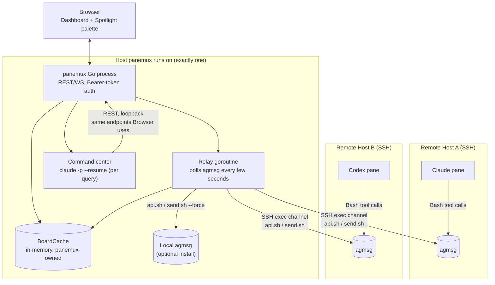
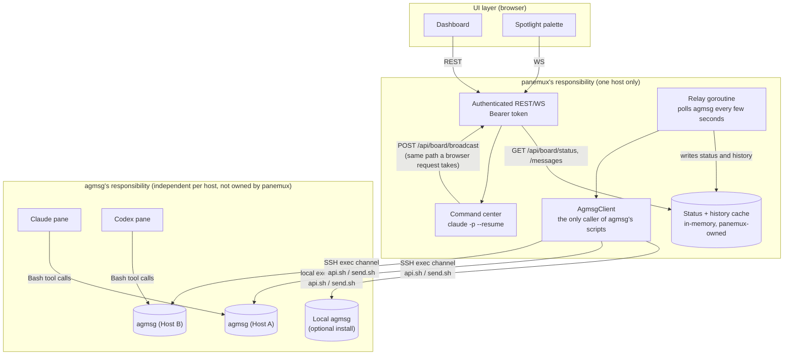
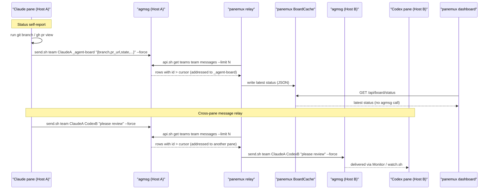
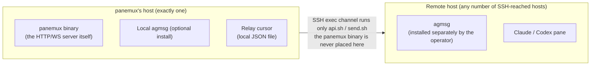
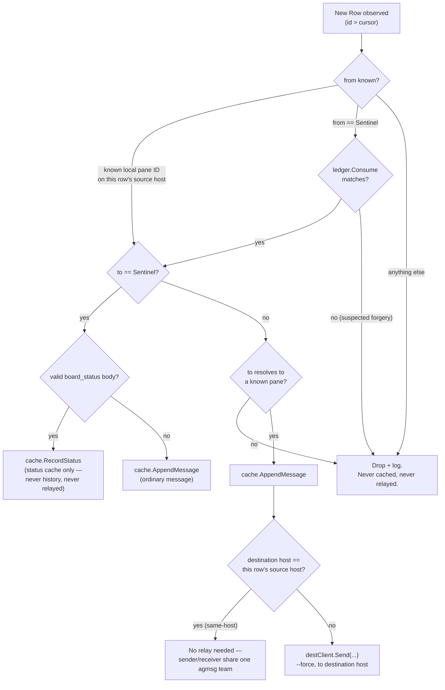

# Agent Board: Cross-Pane Claude Messaging and Status Aggregation

> **Status: Phase 1 (messaging/status/relay backend) implemented.** The `internal/board` package,
> the `BoardHostID`/`BoardExecutor`/`BoardHomeDirer` session capabilities, the bootstrap flow, the
> `agent_board`/`server.auth_token` config additions, and `GET /api/board/status`,
> `GET /api/board/messages`, `POST /api/board/broadcast` exist and are tested. **Not implemented:**
> the headless command-center subprocess, its MCP server, `WS /ws/board-command`,
> `GET /api/board/command/history`, the Spotlight palette, the history panel, and
> `server.auth_token` auto-generation-on-first-run. Every [Command center](#command-center) section
> and its API rows are still design-only. See [security.md](security.md#agent-board-remote-writes)
> and [architecture.md](architecture.md#internalboard) for the matching implemented/planned notes.
> For why this design looks the way it does — including choices later replaced — see
> [DECISIONLOG.md](DECISIONLOG.md#agent-board).

## Purpose

panemux's pane header shows branch/PR info inferred from parsing Claude/Codex transcript internals
(see [architecture.md](architecture.md)) — a private, undocumented format that has already needed
bug fixes as Claude Code evolved, and gives panemux no way to tell whether a pane is idle or
mid-turn, or to let two panes talk to each other.

Agent Board replaces that inference with a self-reported channel:

1. Panes report their own state — cwd, branch, repo, PR link, idle/working/waiting — by running
   their own `git`/`gh` commands and telling panemux the result, the same way a human at that pane
   would find it out.
2. Lets a human broadcast a message to one or more panes without racing raw keystrokes into a live
   PTY, and lets a **command center** (design-only, see [below](#command-center)) do the same
   conversationally.
3. Aggregates both into one dashboard and, for the command center, one reviewable conversation
   history.
4. Is built entirely on [agmsg](https://github.com/fujibee/agmsg), an MIT-licensed bash+sqlite3
   agent-messaging tool supporting Claude Code, Codex, Gemini CLI, and other agent types (check
   agmsg's own README for its current list — panemux never branches on agent type, so this doesn't
   affect panemux's own code either way).

## Design principles

- **Ask the agent; don't reverse-engineer its internal state.** panemux asks the agent to run
  `git`/`gh` and report the result, rather than parsing transcript internals. It calls only agmsg's
  documented entry points (`scripts/api.sh`, `scripts/send.sh`), never `messages.db` or
  `teams/*/config.json` directly. Any future integration should default to the same rule: a tool's
  documented command/output contract over whatever file it keeps its state in.
- **One messaging mechanism, not two.** Agent Board is built entirely on agmsg; panemux owns no
  message schema of its own. See [DECISIONLOG.md](DECISIONLOG.md#agmsg-only-messaging-no-panemux-owned-protocol-2026-08-pr-162-design)
  for the alternative this replaced, and
  [DECISIONLOG.md](DECISIONLOG.md#claude-codes-native-cross-session-messaging-evaluated-and-rejected-2026-08-08)
  for why Claude Code's own native cross-session messaging isn't used for this either.
- **No new daemon, no new listening port — scoped to what panemux itself starts.** panemux talks to
  agmsg via local `exec.Command` (same host) or the existing SSH exec channel (every other host,
  already used by `GetCWD`/`InspectGitContext`). agmsg's own `SessionStart` hook launches its own
  `Monitor`/`watch.sh` process per joined pane independently of panemux — that process is agmsg's,
  not a daemon this design introduces.
- **panemux itself is never installed on a remote host.** The `panemux` binary is also a server; a
  stray copy on an SSH-reached host could start its own HTTP/WS listener and command center. Board
  features on a remote host depend only on an agmsg installation the operator placed there.
- **Backend presence is detected, never installed.** If agmsg is not found on a pane's host, panemux
  skips board bootstrap for that pane, logs a warning, and leaves the pane's shell otherwise
  untouched. panemux never runs `npx agmsg`, `npm i -g agmsg`, `git clone`, or any installer.
- **panemux is a trusted relay, not an end-to-end encrypted channel.** See
  [Cross-host relay](#cross-host-relay) and [Security model](#security-model).

## Architecture

### System overview



Every host here is either the one host panemux itself runs on, or a host panemux only ever reaches
through an SSH exec channel it already holds for that pane's session — see
[Local vs remote resource placement](#local-vs-remote-resource-placement).

### Responsibility boundaries



The boundary that matters is "what agmsg owns" vs. "what panemux owns" — the one place a future
agmsg version bump can break something is entirely inside `AgmsgClient`'s two call sites (`api.sh`,
`send.sh`), never anywhere else in panemux.

- **panemux's responsibility**: authentication, the relay, the in-memory status cache the dashboard
  reads, the command center, and the single `AgmsgClient` abstraction — the *only* code in panemux
  allowed to call agmsg's scripts.
- **agmsg's responsibility**: one independent installation per host, its own durable message log,
  team roster, and delivery to its actual members. panemux never persists a copy of its contents
  beyond what the cache needs, and never touches more than one host's agmsg installation directly.

**Where agent status lives:** neither a database panemux owns, nor recomputed from a live agmsg call
per dashboard request (that would cost every poll an agmsg round-trip, including an SSH hop for
remote hosts). The relay goroutine — already polling every host's agmsg for messages to forward —
updates an in-memory status cache as a side effect whenever it sees a status report addressed to the
sentinel identity. `GET /api/board/status` reads only that cache. agmsg's own message log remains
the durable source of truth; a lost or restarted panemux process leaves the cache empty until the
next poll cycle refills it (see [Known limitations](#known-limitations)).

## Integration with agmsg

Reads and writes go through two scripts under agmsg's `scripts/` directory. panemux never reads or
writes agmsg's `messages.db` or `teams/*/config.json` directly.

**Reads — `scripts/api.sh`, read-only.** Its `case "$VERB"` block implements only `get`:

| Call | Returns |
|---|---|
| `api.sh get teams` | `{"name": "<team>"}` per line, one per team under `teams/` |
| `api.sh get teams <team> members` | `{"name","types","project"}` per line |
| `api.sh get teams <team> messages [--agent <name>] [--limit N] [--before-id <id>]` | `{"type":"message_sent","id","team","from","to","body","at"}` per line, JSONL, oldest-first |

`id` is a string (agmsg's own future-proofing against a non-integer ID scheme) — panemux must not
assume it stays a bare integer. Only `--limit` and `--before-id` are digit-validated; `--agent` is
free text, protected only by agmsg's own internal SQL escaping, not any argument-shape check —
`RemoteAgmsgClient` shell-escapes every argument on every call, reads included (see
[Security model](#security-model)). `api.sh` never writes `read_at`, unlike agmsg's own
`inbox.sh`/`check-inbox.sh` — panemux's polling never causes a joined agent to miss a message its
own delivery would otherwise have shown it.

**There is no forward/"since" read.** `--before-id` selects `id < X` — backwards pagination, the
opposite of what an incremental poll needs. The relay instead calls `api.sh get teams <team>
messages --limit <N>` with no `--before-id`, taking the `N` most recent rows, and filters
client-side to rows whose `id` is numerically greater than the persisted cursor. This has an
accepted truncation risk: if more than `N` genuinely new rows land between two poll cycles, the
oldest of that overflow are silently skipped. `--before-id` is useful only for paging *backwards*
through older history on demand, never for the relay's forward poll.

**Writes — `scripts/send.sh <team> <from> <to> <body> [--force]`.** `body` is a positional shell
argument, not stdin — there is no stdin-based write path in agmsg. Both `from` and `to` are checked
against the team's roster unless `--force` is passed. **Every board-related `send.sh` call always
passes `--force`**, including a live Claude/Codex session's own — the bootstrap instruction (see
[Bootstrap flow](#bootstrap-flow)) tells the agent to call `send.sh ... --force` directly rather
than `/agmsg send` (which has no documented way to pass `--force` through), since the roster check
is incompatible with addressing the reserved sentinel or a pane on a host that's never heard of it.
A pane can still use unforced `/agmsg send` for its own, non-board conversations with other
agmsg-native agents already on that host.

**Panes join with `join.sh <team> <agent_id> <agent_type> <project_path> [--force]`**, via agmsg's
own onboarding rather than the raw script — see [Bootstrap flow](#bootstrap-flow). This registers
the pane into `teams/<team>/config.json`; because board sends always pass `--force`, this
registration doesn't gate board delivery — it lets other, non-board-aware agmsg agents on the same
host address the pane normally, and gives the pane a working `/agmsg` identity for its own
non-board use. Once joined, agmsg's own `SessionStart`/`SessionEnd` hooks own that pane's `Monitor`
process lifecycle end-to-end.

**panemux's own relay and command center are never agmsg roster members** and never go through
agmsg's identity-detection layer (`whoami.sh`/`identities.sh`, which assumes a live process to
introspect) — any send they originate uses `--force` for the same reason live-pane board traffic
does.

**Team naming.** All board-enabled panes on a panemux instance join the same agmsg team by default
(`agent_board.team`, default `"panemux"`) — see [Config additions](#config-additions).

**Detection, not installation.** panemux checks for `scripts/api.sh` under the configured/default
`agent_board.agmsg_path` (default `~/.agents/skills/agmsg/`, overridable). `command -v agmsg` is
never used — the `agmsg` npm package on `PATH` is a thin bootstrapper that itself triggers agmsg's
installer when invoked, which is exactly the auto-install this design forbids. If the path doesn't
contain `scripts/api.sh`, panemux skips bootstrap for that pane, logs a warning naming the pane, and
leaves the pane's shell untouched.

**`~` in `agmsg_path` is expanded by panemux, never left for the remote shell.** A leading `~` is
resolved to an absolute path before it reaches any `RunBoardCommand` argument — locally via
`os.UserHomeDir()`-based expansion, remotely via a cached `echo -n "$HOME"` probe per SSH connection.
This must happen before quoting: `shellQuotePath` single-quotes every argument specifically to
suppress shell expansion, and a literal `~` inside single quotes reaches the remote shell as the
two-character string `~`, not the home directory.

**Remote command execution assumes a working, non-interactive shell environment.** The SSH exec
channel runs each command as a single non-login, non-interactive shell invocation, which on many
systems does not source `~/.bashrc`/`~/.profile`. agmsg's runtime dependencies (`bash`, `node`,
`sqlite3`) must be reachable from that shell's `PATH`, even if an operator's *interactive* SSH
session (where agmsg was installed by hand) has a different `PATH` (e.g. via `nvm`/`asdf`).

**Version pinning.** agmsg's compatibility promise covers reading through `scripts/api.sh` only;
there is no equivalent promise for `send.sh`'s behavior. panemux implementation pins a specific
tested agmsg version/tag and treats a change to either script's observed behavior as an external
dependency compatibility bug — see [agmsg compatibility contract](#agmsg-compatibility-contract) for
how that's meant to be caught mechanically.

## Status self-report and message flow

Status reports are ordinary agmsg messages addressed to the reserved sentinel identity
(`board.Sentinel` = `"_agent-board"`) — the same identity the command center uses as its own `from`.
Because the sentinel is never an agmsg roster member, the agent's own `send.sh ... --force` call is
what lets a status report reach it at all. The relay, already polling for message forwarding,
recognizes any row addressed to the sentinel as a status update and writes it into panemux's status
cache, keeping only the newest entry per sender. The dashboard never queries agmsg directly — it
only reads that cache.

The bootstrap instruction tells Claude to gather this itself, via its own `Bash` tool, as a JSON
body:

```json
{
  "kind": "board_status",
  "state": "working",
  "cwd": "/home/user/project",
  "branch": "feature/x",
  "repo": "owner/repo",
  "pr_url": "https://github.com/owner/repo/pull/123",
  "last_tool": "Edit internal/api/handler.go",
  "summary": "fixing failing tests"
}
```

**`kind: "board_status"` is a fixed, required discriminator, not shape-sniffing.** A human typing an
ordinary chat message to the sentinel through the command center or Spotlight palette could produce
a body that happens to parse as JSON with a similarly named field; requiring the exact `kind` value
means the relay treats a row as a status update only when `Body` parses as JSON *and* `kind` is
exactly `"board_status"` — every other body, including one that merely resembles the status shape,
is left alone as an ordinary message.

`branch`/`repo`/`pr_url` come from the agent running `git branch --show-current`, `git remote get-url
origin`, and a PR lookup itself — panemux never computes these, only displays what was reported.
`cwd`/`pr_url` may be absent if the agent isn't in a repository or there's no open PR.



**Honest tradeoff:** self-report is only as good as the agent's compliance — it depends on the agent
running the bootstrap instruction's commands each time it reports. The bet: "ask, and get an answer
that tracks reality because the agent just computed it" is more often correct than silently
inferring from an internal format panemux does not control, even though the former needs the
agent's cooperation and the latter didn't.

## Package layout

### `internal/board`

```go
type Row struct {
    ID          string    // agmsg's own id, host-scoped — NOT globally unique, NOT assumed numeric
    Host        string    // which AgmsgClient/host this row came from; required to compare/sort across hosts
    Team        string
    From, To    string
    Body        string
    At          time.Time
}

type Status struct {
    State, CWD, Branch, Repo, PRURL, LastTool, Summary string
    UpdatedAt   time.Time // when this status was recorded, so staleness is visible to the dashboard
}

type AgmsgClient interface {
    HostID() string
    // Send always passes --force — every board-originated message needs to reach a to/from
    // identity that is not guaranteed to be in the destination team's roster.
    Send(ctx context.Context, team, from, to, body string) error
    // Since has no true "after" primitive (api.sh has no such flag). Calls
    // `api.sh get teams <team> messages --limit <limit>` and returns rows whose ID sorts after
    // afterID; the caller must treat dropped rows (more than `limit` new rows since the last
    // poll) as expected, not exceptional.
    Since(ctx context.Context, team, afterID string, limit int) ([]Row, error)
}

// ownSendLedger is a short-lived, in-memory record of Send calls panemux itself has issued,
// used to verify a row the relay observes with From == Sentinel actually corresponds to one of
// panemux's own sends, since send.sh --force never checks From against a roster. Entries expire
// after a few poll intervals; a body is stored only as a hash — the ledger's job is matching, not
// re-displaying content. Repeated identical Records (e.g. two genuine broadcasts with the same
// destination/body) each get an independently consumable entry.
type ownSendLedger struct {
    mu      sync.Mutex
    entries map[ownSendKey][]time.Time // one expiry per pending Record, oldest first
}

type ownSendKey struct {
    DestHost string
    Team     string
    To       string
    BodyHash string // e.g. sha256, truncated; not a security boundary by itself, only a dedup key
}

func (l *ownSendLedger) Record(destHost, team, to, body string)      { /* appends an entry with a fresh TTL */ }
func (l *ownSendLedger) Consume(destHost, team, to, body string) bool { /* pops+returns whether the oldest entry was live */ }

// BoardCache is the in-memory, panemux-owned view of recent board activity. Only the relay writes
// to it, as a side effect of the Since polling it already does; both dashboard-facing endpoints
// only ever read it, never calling AgmsgClient at request time. BoardCache assigns its own
// monotonically increasing, panemux-local Seq to every row, since agmsg IDs from different hosts
// are not comparable — Seq is what GET /api/board/messages?since=<id> paginates on.
type BoardCache struct {
    mu       sync.RWMutex
    status   map[string]Status // paneID -> latest self-reported status (pane IDs are globally unique)
    nextSeq  int64
    history  []cachedRow       // bounded ring buffer, most recent last
}

func (c *BoardCache) RecordStatus(paneID string, s Status) { /* mutex-guarded write; sets s.UpdatedAt */ }
func (c *BoardCache) AppendMessage(r Row)                  { /* mutex-guarded write; assigns next Seq */ }
func (c *BoardCache) StatusSnapshot() map[string]Status    { /* mutex-guarded copy */ }
func (c *BoardCache) MessagesSince(afterSeq int64) []Row   { /* mutex-guarded copy, filtered by Seq */ }
```

See [Cross-host relay](#cross-host-relay) for how the relay routes each `Row` it reads (status
cache vs. `history` vs. cross-host forward).

- `LocalAgmsgClient` shells out to the local agmsg installation's `scripts/api.sh`/`scripts/send.sh
  ... --force`. Go passes each argument as a genuine array element with no intermediate shell, so no
  shell-injection risk here regardless of content.
- `RemoteAgmsgClient` runs the same scripts over the SSH exec channel and single-quote-escapes every
  argument to every call — reads included — before building the remote command string. See
  [Security model](#security-model) and [security.md](security.md#agent-board-remote-writes).

panemux owns no schema, so it needs no embedded database driver — every board operation is a local
`exec.Command` or a remote exec-channel command running agmsg's own scripts.

### `internal/session` capability interfaces

Following the existing optional-capability pattern (`CWDGetter`, `ActiveWorkdirGetter`,
`GitContextGetter`, `SSHConnNamer`):

```go
// BoardHostID is implemented by every session type. It returns the identifier of the host whose
// agmsg installation this session's pane participates in: "local" for local/tmux sessions, the
// SSH connection name for ssh/ssh_tmux sessions.
type BoardHostID interface {
    BoardHostID() string
}

// BoardExecutor is implemented by SSH-backed sessions. It runs an agmsg script (scriptPath) on the
// remote host, passing args to it over the SSH session's stdin (base64-encoded, one line per
// argument) rather than concatenating them into the command string — see
// security.md#agent-board-remote-writes for the escaping mechanism and DECISIONLOG.md for why.
// scriptPath and args are deliberately separate parameters, never indices into one combined slice
// (see DECISIONLOG.md). The caller passes raw, unescaped values for both, exactly like
// exec.Command's own argv contract.
type BoardExecutor interface {
    RunBoardCommand(ctx context.Context, scriptPath string, args []string) ([]byte, error)
}
```

`LocalSession`/`TmuxLocalSession` implement only `BoardHostID` (`"local"`). `SSHSession`/
`SSHTmuxSession` implement both.

## Local vs remote resource placement



Nothing panemux-specific is ever written to a remote host's disk. The only thing a remote host needs
beyond what it already has for its own agents is agmsg itself, installed by the operator.

## Cross-host relay

Two Claude/Codex processes on different SSH-reached hosts cannot share one agmsg team directly
(agmsg is single-host, and the two hosts may not even reach each other). panemux is the only node
connected to every host, so it relays:

1. A single goroutine polls every known host's `Since(team, cursor, limit)` every few seconds.
2. `cursor` is one value per (host, team) — agmsg's own opaque `id` string, not comparable across
   hosts — persisted in a local JSON file (e.g. `~/.config/panemux/board-relay-cursor.json`), so a
   panemux restart resumes roughly where it left off.
3. Each row is routed per the decision flow below.
4. Same-host `to` needs no relay: sender and receiver already share one local agmsg team.
5. `GET /api/board/status` never triggers an `AgmsgClient` call — it only reads the status cache the
   relay already keeps current.



**The own-send ledger is what makes `from == Sentinel` acceptable.** `send.sh --force` never checks
`from` against a roster, and every board send uses `--force` by design, so nothing at the agmsg
layer stops an agent on Host A from writing a row claiming `from: "_agent-board"` to a pane on Host
B. The ledger — a short-lived record of `Send` calls panemux's own broadcast handler and command
center have actually issued — is the only thing that tells a real sentinel-attributed row apart from
a forged one; see [Security model](#security-model).

**Cold-start backfill.** `BoardCache` starts empty on every process start, and the steady-state
poll's small `--limit` is the wrong size for repopulating a cold cache. Before entering steady-state
polling, the relay performs one larger-`--limit` pass per (host, team) (e.g. `--limit 1000`),
scanning those rows the same way steady-state would, then starts polling normally from wherever that
backfill reached. This shortens, but does not eliminate, the window in which the dashboard shows
stale or empty status after a restart — it's still a bounded `--limit` read with the same accepted
truncation risk.

**Delivery is at-least-once, not exactly-once.** agmsg's schema has no field for "this row has
already been relayed," so the cursor file is the only bookkeeping; a crash between relaying a
message and persisting the cursor can relay it again. Accepted as a self-evident nuisance (a
duplicate message is easy for an agent to recognize) rather than a reason for a dedup scheme.

This makes panemux's relay role structurally similar to a TURN server (stays in the data path for
the life of the exchange, since a direct path between the two remote hosts isn't assumed to exist)
rather than a STUN server. Unlike a general-purpose TURN server, panemux is the only possible relay
for a given host pair — it's the sole node holding SSH credentials to both — so there's no
negotiation step.

## Bootstrap flow

1. A pane config (or the global default) sets `agent_board.enabled: true`, optionally overriding
   `team` or `mode`.
2. panemux's existing interactive-agent process detection notices a `claude` (or other configured
   agent) process start in that pane, then runs agmsg detection (see
   [Integration with agmsg](#integration-with-agmsg)). If agmsg isn't found, it logs a warning and
   stops — no PTY write happens.
3. panemux writes a one-time instruction into the pane's PTY (the same `Session.Write` path used for
   all terminal input) telling the agent to: join agmsg's team **using the pane's own ID as the
   agmsg `agent_id`** (required — agmsg's own onboarding can otherwise prompt for an arbitrary name,
   which would silently break every address in this design) via agmsg's own onboarding flow, rely on
   agmsg's own delivery, include the [status self-report](#status-self-report-and-message-flow)
   fields on every update, and send every board-related message with the raw
   `send.sh <team> <from> <to> "<body>" --force` invocation rather than `/agmsg send`. This step
   only ever establishes that pane's own participation.
4. If `mode` is `turn` or `both` (mirroring agmsg's own `/agmsg mode`, default `monitor`), the
   instruction also tells the agent to run `/agmsg mode <value>`. `off` is agmsg's own way to
   disable hook-driven delivery without leaving the team; panemux's equivalent is
   `agent_board.enabled: false`, which skips bootstrap entirely. **`/agmsg mode turn|both` writes
   hook wiring into the pane's own project `.claude/settings.local.json`**, which outlives the pane
   session and is scoped to that Git repository, not to panemux — panemux does not attempt to undo
   this if a pane later disables `agent_board.enabled`.

## Command center

*Design-only — not implemented in Phase 1. See the status note at the top of this document.*

### What it is

- A single, persistent **headless** Claude session, not a pane and not a PTY. panemux invokes it as
  a short-lived subprocess per query — `claude -p --resume <command-center-session-id>
  --output-format=stream-json "<prompt>"` — rather than a long-running process. `--resume` against
  one fixed session id gives it conversational continuity across queries.
- **It reads and writes the board through panemux's own authenticated REST API** — `GET
  /api/board/status`, `GET /api/board/messages`, `POST /api/board/broadcast`, the same endpoints
  the browser dashboard uses, over loopback, with a token panemux injects into the subprocess's
  environment. The LLM itself never composes the HTTP call: panemux points the subprocess at a
  narrow MCP server (see [Process lifecycle](#process-lifecycle)) that exposes exactly those three
  operations and makes the authenticated request on the model's behalf. This is what keeps
  `AgmsgClient` the only code that ever calls agmsg's scripts, and lets the command center see every
  pane's status, not just local ones (see [DECISIONLOG.md](DECISIONLOG.md#command-center-readswrites-through-panemuxs-own-rest-api-not-agmsg-directly-2026-08-pr-162-review)
  for why).
- **The command center needs no local agmsg installation** — it never calls agmsg directly, so
  `command_center.enabled: true` is not gated on the agmsg-presence check a board-enabled pane is.
- Sending a message is `POST /api/board/broadcast` with the command center's own reserved `from`
  identity (the sentinel) — the same code path a human-triggered broadcast takes.

### Process lifecycle

- **First run.** No persisted command-center session id exists yet. panemux invokes `claude -p
  --output-format=stream-json --verbose "<prompt>"` (`--verbose` is required alongside `-p
  --output-format=stream-json`), omitting `--resume`, captures the `session_id` the stream reports,
  and persists it locally (e.g. `~/.config/panemux/command-center-session.json`). Every later query
  reuses that id via `--resume`.
- **Permissions.** The subprocess never receives `--dangerously-skip-permissions`. panemux runs a
  narrow MCP server exposing exactly three tools (`board_status`, `board_messages`,
  `board_broadcast`) and launches the command center with `--allowedTools` scoped to only those
  three — no `Bash`, no filesystem tools, no other MCP servers.
- **Concurrency.** At most one query in flight against the command center's session id at a time. A
  `WS /ws/board-command` request arriving mid-query is rejected immediately with a "command center
  busy" error rather than queued.
- **Failure modes.** A subprocess that exits non-zero, emits malformed `stream-json`, or times out
  surfaces as an explicit error frame on the WS connection, never a silently empty response. A
  failed query never corrupts `--resume` continuity — the persisted session id is replaced only by a
  fresh first-run capture.

### Authorization

The command center's privilege (message *any* board-enabled pane) is granted the same way every
other panemux capability is: the global bearer-token auth described in
[Security model](#security-model). There is no separate per-pane role.

A message the command center sends is an ordinary instruction to the receiving pane, not something
pre-authorized — the receiving pane's own normal confirmation flow still applies.

### API and streaming

- `WS /ws/board-command`: client sends `{"prompt": "..."}`, panemux runs `claude -p --resume <id>
  --output-format=stream-json "<prompt>"` and streams the subprocess's output as it arrives.
- `GET /api/board/command/history`: the command center's own turn-by-turn history, captured directly
  from the `--output-format=stream-json` stream while relaying it (not re-derived from a transcript
  file afterward), appended to a local file panemux fully owns the format of.

### UI

- A global keyboard shortcut opens a Spotlight-style modal palette.
- The palette shows recent history inline on open and streams the live response.
- A separate, persistently accessible history panel exposes the same history outside the palette.

See [ui-design.md's Agent Board UI section](ui-design.md#agent-board-ui-planned) for how these
surfaces reuse this repository's existing dialog/overlay patterns.

### Scope, kept intentionally narrow for now

Exactly one command center session per panemux instance — not per-workspace, not multiple
concurrent command centers.

## API additions

All require the global bearer-token auth in [Security model](#security-model).

| Endpoint | Status | Purpose |
|---|---|---|
| `GET /api/board/status` | Implemented | Snapshot of panemux's in-memory status cache — no `AgmsgClient` call |
| `GET /api/board/messages?since=<seq>` | Implemented | History feed; `<seq>` is `BoardCache`'s own local sequence number, not an agmsg-native `id` |
| `POST /api/board/broadcast` | Implemented | `{ "to": ["pane-a","pane-b"], "body": "..." }`; sends directly via `AgmsgClient` (never PTY injection); delivery is immediate, but appearance in `GET /api/board/messages` lags until the relay's next poll (see [Known limitations](#known-limitations)) |
| `WS /ws/board-command` | Design-only | Command center chat — see [Command center](#command-center) |
| `GET /api/board/command/history` | Design-only | Command center's captured conversation history |

## Config additions

```yaml
server:
  host: "127.0.0.1"
  port: 8080
  auth_token: ""   # empty = auto-generate on first run (design-only; not yet implemented)

command_center:
  enabled: true   # default false; design-only — talks only to panemux's own REST API, no local agmsg needed

agent_board:
  team: "panemux"  # default; all board-enabled panes share this agmsg team unless overridden
  agmsg_path: "~/.agents/skills/agmsg"  # default; where scripts/api.sh is expected, per-host override possible

panes:
  - id: pane-a
    type: local
    agent_board:
      enabled: true
      mode: monitor    # monitor (default) | turn (legacy) | both | off, mirrors agmsg's own /agmsg mode

  - id: pane-b          # e.g. a Codex pane
    type: ssh
    connection: build-host
    agent_board:
      enabled: true
```

A global `agent_board.enabled` default may also be supported so individual panes don't need to
repeat it, but board features on any host still require agmsg to already be present there.

`command_center` is a top-level key, not nested under `agent_board`: the command center never calls
agmsg directly and works with every pane's `agent_board.enabled` left `false` — the two keys'
dependency graph is siblings, not the same tree.

**The sentinel pane ID is reserved.** `internal/config/validate.go` rejects any pane config whose
`id` is literally `_agent-board`, the same way it rejects duplicate pane IDs. This is a partial
guarantee: nothing stops an operator or a live agent from running agmsg's own
`join.sh <team> _agent-board ...` by hand outside any pane panemux bootstrapped, since agmsg's
roster is agmsg's own state. That gap is exactly why the [own-send ledger](#package-layout) check in
[Cross-host relay](#cross-host-relay) doesn't trust the sentinel string by itself — config-time
reservation closes panemux misconfiguring itself; the ledger closes an agmsg team member forging it.

## Security model

Full implementation rules live in [security.md](security.md); this section states the requirements
that shaped the design.

- **panemux does not terminate TLS.** `server.host` defaults to `127.0.0.1`. Exposing panemux
  beyond loopback is the operator's responsibility (a TLS-terminating reverse proxy, SSH tunnel,
  Tailscale/WireGuard, etc.); that hop is then treated as trusted network.
- **Auth token without transport encryption is close to meaningless.** A token sniffed on an
  unencrypted hop can be replayed, and a request can be tampered with in transit — this matters more
  than usual here because `POST /api/board/broadcast` and the terminal WebSocket both drive
  shell-executing agents. Config validation fails closed: if `server.host` resolves to a
  non-loopback address and `server.auth_token` is empty, startup is rejected.
- **No argument on any `RemoteAgmsgClient` call — reads included — ever reaches the remote shell
  unescaped.** Neither `api.sh` nor `send.sh` has a stdin-based way to receive the values panemux
  passes them, so every argument is delivered over the SSH session's stdin, base64-encoded, with the
  script path kept in a separate parameter from the argument list. See
  [security.md](security.md#agent-board-remote-writes) for the mechanism and
  [DECISIONLOG.md](DECISIONLOG.md#message-body-escaping-three-attempts-before-one-satisfied-codeql-2026-08-08-pr-163)
  for what this replaced.
- **panemux itself is never deployed to a remote host.** A copy running on an SSH-reached host could
  start its own HTTP/WS listener, auth surface, and command center — board features depend only on
  an agmsg installation the operator placed there.
- **agmsg is an operator-installed, unpinned-by-panemux external dependency.** panemux only detects
  and calls it; it never bundles, vendors, or auto-installs it. panemux pins a specific tested
  agmsg version/tag and treats a break in `scripts/api.sh`'s or `scripts/send.sh`'s behavior as an
  external dependency compatibility bug.
- **panemux sees plaintext at each relay hop.** SSH encrypts each hop, but panemux itself decrypts
  and re-serializes the row in between, so the panemux process/host must be trusted for the relay to
  be meaningful. There is no end-to-end encryption between two remote agents.
- **The own-send ledger is what makes a `from == Sentinel` row trustworthy, not the string itself.**
  `send.sh --force` accepts any `from` unchecked, and every board send uses `--force` by design — so
  nothing at the agmsg layer stops any agent from forging `from: "_agent-board"`. The relay accepts
  such a row only if it matches a `Send` panemux's own broadcast handler or command center actually
  issued recently (see [Cross-host relay](#cross-host-relay)).
- **The command center's endpoints are gated by the same bearer token as everything else** — no
  separate, weaker permission tier. Anyone who can authenticate to panemux at all can already reach
  the full-shell terminal WebSocket, so a narrower gate here wouldn't reduce real risk.

## Known limitations

- **Account-wide token/cost totals are out of scope.** Claude Code's own `/usage` already gives an
  accurate account-wide view for the common case where panemux-managed panes share one account.
- **Per-pane usage is a different, genuinely useful question `/usage` doesn't answer**, and isn't
  ruled out by the above: an assistant turn's `usage` field is a documented, stable part of the
  Messages API envelope Claude Code's transcript already stores — summing it is not the kind of
  fragile inference this design moved away from. This fits as an extension of panemux's existing
  pre-board transcript inspection, not something carried through the agmsg self-report.
- The status/history cache is in-memory only. A restart starts it empty; cold-start backfill
  shortens, but does not eliminate, the gap.
- No claim/lease semantics: if two workers were addressed by the same message (not supported today,
  since `to` targets one pane), there's no exclusion mechanism. Distinct from agmsg's
  `actas-claim.sh` role-name lock, which addresses a different problem.
- Agents/teams are free-text identifiers with no cryptographic authentication of `from`. The relay's
  `from` check rejects a forged `from` outside the known-pane-ID/ledger-matched-sentinel set, but
  within that set there's no proof a message actually came from the process it claims — this
  integrity gap is accepted for the same reason panemux already accepts same-user process trust
  elsewhere.
- **A broadcast's delivery and its appearance in dashboard history are decoupled.**
  `POST /api/board/broadcast` calls `AgmsgClient.Send` directly (immediate delivery), but
  `BoardCache.AppendMessage` only ever runs from the relay's poll loop, so dashboard history lags by
  up to one poll interval — a deliberate choice to keep `BoardCache` populated from exactly one code
  path.
- Relay delivery is at-least-once and not guaranteed-complete: a duplicate after a restart is
  accepted, and rows beyond one poll's `--limit` are silently missed rather than delivered late.
- **The write path depends on an operator-installed third-party tool whose maintainer makes no
  compatibility promise for it.** agmsg's README stability promise covers `scripts/api.sh` reads
  only; `send.sh`'s behavior, which the entire write path depends on, carries no such promise. See
  [agmsg compatibility contract](#agmsg-compatibility-contract) for how this is caught mechanically.
- `/agmsg mode turn|both` writes hook wiring into the pane's project `.claude/settings.local.json`,
  which persists after the pane closes and is never reverted by panemux.
- Self-reported status depends on the agent's cooperation each time — a pane that stops following
  its bootstrap instruction (e.g. a long uninterrupted tool-use turn) simply stops updating its
  status, with no separate liveness signal.
- Exactly one command center session exists per panemux instance; not per-workspace.
- The command center spawns `claude -p` per query — response latency includes process startup, not
  suitable for anything latency-sensitive.

## agmsg compatibility contract

agmsg's compatibility promise covers `scripts/api.sh` reads only; `send.sh`, `join.sh`, and
everything else this design depends on carry no such promise. Without a mechanical check, an agmsg
upgrade that changes one of those scripts' behavior would surface as a pane silently failing to
communicate, discovered by a user rather than CI.

This borrows [Pact](https://docs.pact.io/)'s core idea — the consumer defines the exact interactions
it depends on as a contract, mechanically verified against the real provider — without adopting
Pact's actual tooling (built for HTTP/message services with a shared broker; agmsg is a CLI script
tool with no such loop).

**Two test tiers:**

- **Tier 1 — fast, hermetic, part of `make check` on every commit.** A fake `AgmsgClient`/
  `BoardExecutor` asserts the exact command strings panemux builds, and parses fixed, versioned
  fixture output (frozen JSONL captured from a real, pinned agmsg run, e.g.
  `internal/board/testdata/agmsg-v1.1.x/*.jsonl`). Protects panemux's own code from regressing
  against its documented assumptions; cannot by itself detect that agmsg changed.
- **Tier 2 — a separate, non-blocking-by-default CI job against a real agmsg install.** Not yet
  implemented — see the `// TODO` in the test suite. Installs the pinned agmsg version, runs the
  exact `join.sh`/`send.sh`/`api.sh` invocations the contract specifies, and asserts the real
  output/exit-code behavior matches what Tier 1's fixtures encode. Intended to run on a schedule
  against agmsg's latest tag (early warning) and as a required check whenever the pin bumps.

## Testing plan

See [DEVELOPMENT.md](../DEVELOPMENT.md) for the TDD/coverage rules this must follow.

- `internal/board`: status JSON parsing (valid payload, missing optional fields, non-JSON body, JSON
  with a `state` field but wrong/missing `kind` — all treated as a plain message);
  `BoardCache.StatusSnapshot` (newest wins per pane, across multiple panes); `Seq` giving a stable
  total order across hosts even when agmsg-native IDs collide or aren't comparable;
  `MessagesSince(afterSeq)` ordering/bounding; a sentinel-addressed status row updating `status` and
  *not* appearing in `history` (a non-status row to the sentinel correctly does appear); an empty
  cache read returning a well-defined empty result; relay cursor persistence across a simulated
  restart (including the accepted duplicate-delivery case); the accepted truncation case (newest
  rows kept, oldest overflow dropped); `from`-validation (unknown pane ID, or unmatched-ledger
  sentinel, dropped and logged); the own-send ledger (matched sentinel accepted, unmatched or
  expired rejected — this is the regression coverage for the impersonation scenario in
  [Security model](#security-model)); empty team.
- `internal/session`: for `RemoteAgmsgClient`, a body with shell metacharacters (`'`, `;`, `` ` ``,
  `$(...)`) round-trips through the built `send.sh` command as a single literal argument, not
  executed syntax — same for `team`/`--agent` on the read path; every `AgmsgClient.Send` call
  includes `--force` unconditionally.
- `internal/config`: `host != loopback && auth_token == ""` is a validation error; all other
  combinations are valid. `agent_board.team` defaults to `"panemux"` when unset. A pane config with
  `id: "_agent-board"` is a validation error, alone and alongside otherwise-valid panes.
- `internal/api`: missing/incorrect bearer token is rejected (401) on both REST and the WebSocket
  handshake; correct token succeeds.
- `internal/ws`: `/ws/board-command` is covered by `coverage-go`'s existing `internal/ws` gate — no
  separate carve-out. Handshake rejection and message-framing tests follow the terminal socket's
  existing pattern.
- Frontend (schema-first): `frontend/src/schemas/index.ts` gets Zod schemas for every board API
  shape before any component consumes it — `BoardStatus`, `BoardMessage`, and the `board-command` WS
  frame shapes — with acceptance/rejection tests. The Spotlight palette and history panel need
  component tests: inline history on open, incremental updates on streamed WS frames, a visible
  error state on an error frame, the pre-use empty state, and dismiss/close returning focus.
- agmsg detection: a host without `scripts/api.sh` at the configured/default path skips bootstrap
  and logs a warning without touching the pane's session; a host with it present bootstraps
  normally.
- `agmsg_path` expansion: a leading `~` resolves to a fully expanded absolute path for both local
  (injectable home-dir override) and remote (fake exec channel returning a fixed `$HOME`) hosts
  before it reaches any `RunBoardCommand` call, asserted on the built argument list directly.
- Command center: `/ws/board-command` rejects an unauthenticated connection like the terminal
  WebSocket; `POST /api/board/broadcast` from the command center reaches a target pane regardless of
  host, via a fake `AgmsgClient` per host, and never invokes `AgmsgClient` directly (goes through the
  same handler a browser request would); `GET /api/board/command/history` returns a correctly
  ordered feed from a fixture `stream-json` capture, and an empty result before first use; enabling
  `command_center` doesn't require a local agmsg installation.
- Command center process lifecycle: a first query with no persisted session id omits `--resume` and
  persists the captured `session_id`; a later query reuses it; a concurrent second query is
  rejected with "busy" and never spawns a second subprocess; `--verbose` always accompanies
  `--output-format=stream-json`; `--allowedTools` is always scoped to exactly the three board MCP
  tools, never `--dangerously-skip-permissions`; a non-zero exit or malformed `stream-json` line each
  surface as a distinct WS error frame and never overwrite the persisted session id.

## Related documents

- Decision history and rationale for choices this document doesn't explain inline: [DECISIONLOG.md](DECISIONLOG.md)
- Implementation structure: [architecture.md](architecture.md)
- Security requirements for implementation: [security.md](security.md)
- Runtime behavior and API specification: [behavior.md](behavior.md)
- UI intent for the dashboard, palette, and history panel: [ui-design.md](ui-design.md#agent-board-ui-planned)
- Developer workflow rules: [../DEVELOPMENT.md](../DEVELOPMENT.md)
