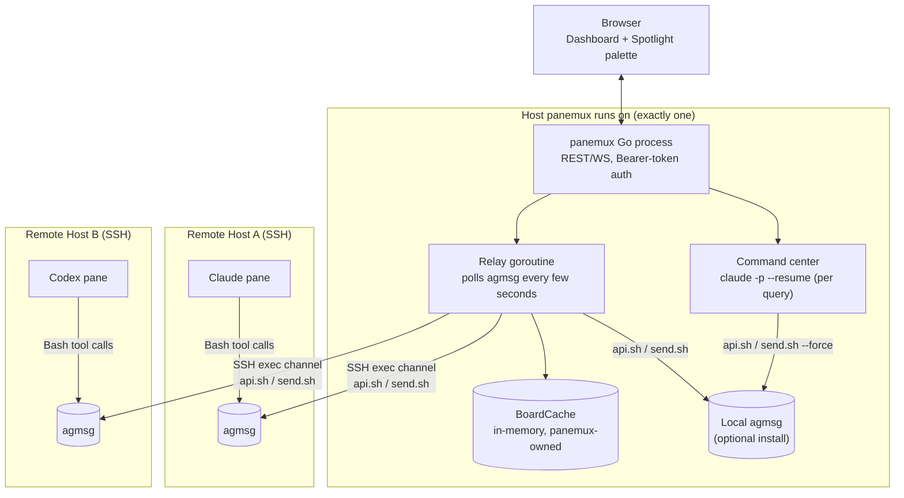
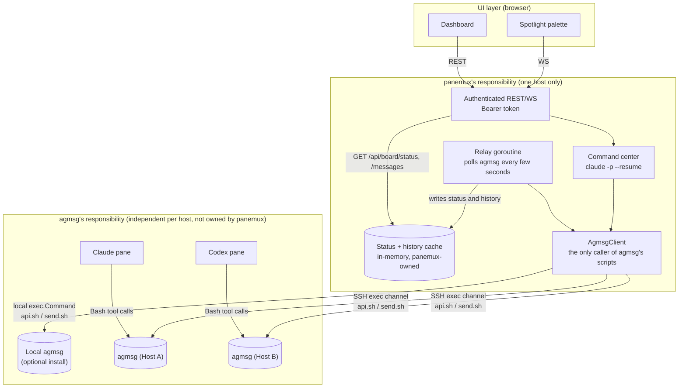
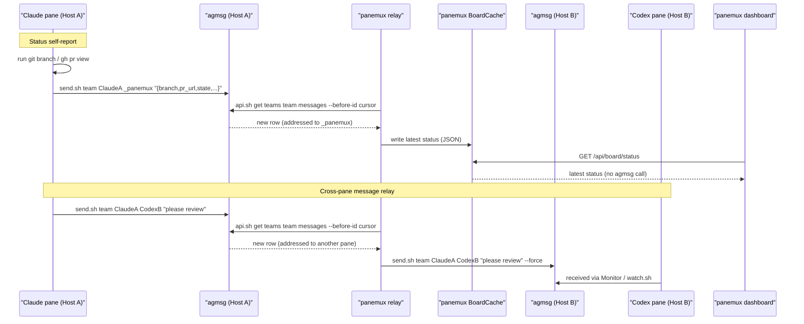
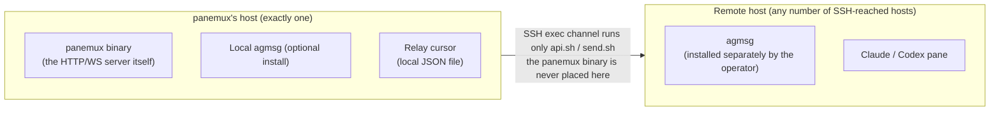

# Agent Board: Cross-Pane Claude Messaging and Status Aggregation

> **Status: design, not yet implemented.** This document specifies the target design for the
> `internal/board` package and its supporting API, config, and security surface. Update this
> status note (and cross-link it from [architecture.md](architecture.md), [security.md](security.md),
> and [behavior.md](behavior.md) as appropriate) once a phase below actually ships; until then, no
> other doc should describe `board` endpoints or config fields as current behavior.

## Purpose

panemux currently infers what an interactive Claude process in a pane is doing by parsing
`~/.claude/sessions/<pid>.json` and the matching transcript JSONL (see the Claude worktree
resolution notes in [architecture.md](architecture.md) and [behavior.md](behavior.md)). In
practice this is unreliable: it depends on undocumented, internal Claude/Codex transcript fields
that change without notice, and pane headers frequently fail to show a branch or PR as a result.
It is also read-only and pane-local: it cannot tell whether a session is idle or mid-turn, and it
gives panemux no way to send an agent a message or to let two agents in different panes talk to
each other.

Agent Board replaces that inference with a small, self-reported channel:

1. Panes report their own state — working directory, branch, repository, PR link, and whether
   they're idle, working, or waiting for approval — by running their own commands (`git`, `gh`)
   and telling panemux the result, instead of panemux guessing from an internal file format. This
   is the same information a human looking at the pane would see, obtained the same way a human
   would get it, so it is exactly as stable as the agent's own tool use — not as fragile as
   reverse-engineering a private transcript schema. See
   [Design principles](#design-principles) for why this generalizes beyond just this one field.
2. Lets a human broadcast a message to one or more panes' Claude sessions without racing raw
   keystrokes into a live PTY, and lets a local **command center** (see
   [Command center](#command-center)) do the same conversationally on the human's behalf.
3. Aggregates all of the above into one dashboard and, for the command center, one continuous,
   reviewable conversation history.
4. Is built entirely on [agmsg](https://github.com/fujibee/agmsg), an existing MIT-licensed
   bash+sqlite3 agent-messaging tool that already supports Claude Code, Codex, Gemini CLI, GitHub
   Copilot, Antigravity, OpenCode, and Hermes. panemux does not maintain a second, parallel
   messaging protocol of its own — see [Design principles](#design-principles) for why, and
   [Integration with agmsg](#integration-with-agmsg) for how.

## Design principles

- **Ask the agent; don't reverse-engineer its internal state.** This is the central lesson behind
  this whole redesign, and it applies uniformly to every piece of external state Agent Board
  touches, not only pane status:
  - panemux does not parse Claude/Codex transcript internals to guess branch/PR/cwd — it asks the
    agent to run `git`/`gh` itself and report the result (see
    [Status self-report](#status-self-report-and-message-flow)).
  - panemux does not read agmsg's `messages.db` or `teams/*/config.json` directly — those are
    agmsg's own internal storage, explicitly documented in agmsg's README as "internal and free to
    change." panemux only calls agmsg's own stable, documented entry points (`scripts/api.sh`,
    `scripts/send.sh`) — see [Integration with agmsg](#integration-with-agmsg).
  - Any future integration this document doesn't yet cover should default to the same rule: prefer
    a tool's own documented command/output contract over parsing whatever file it happens to keep
    its state in today.
- **One messaging mechanism, not two.** An earlier draft of this design also specified a
  panemux-owned SQLite schema and CLI ("`native`") for Claude-only panes, with agmsg reserved for
  panes that needed to talk to non-Claude agents. Building and maintaining a second protocol next
  to an already-working one turned out not to be worth it: agmsg already covers everything
  `native` tried to do, plus interoperability with Codex/Gemini/etc. that `native` could never
  offer, and every pane on `agmsg` from the start means no relay step is needed even for two panes
  that happen to both be Claude. Agent Board is therefore built entirely on agmsg; panemux owns no
  message schema of its own.
- **No new daemon, no new listening port.** panemux talks to agmsg the same way any of its scripts
  or a live agent session would: local `exec.Command` calls on the host panemux itself runs on,
  and the existing SSH exec channel (`GetCWD`/`InspectGitContext` already use it) for every other
  host. No new process listens for anything, locally or remotely.
- **panemux itself is never installed on a remote host, under any circumstances.** The `panemux`
  binary is also a server: running it can start the HTTP/WS listener, the auth surface, and the
  command center. Placing a copy on every SSH-reached host that wants board features would mean
  each of those hosts could accidentally end up running a second, unmanaged panemux server. Board
  features on a remote host depend only on an agmsg installation the operator put there themselves
  (see the next principle) — never on anything panemux ships.
- **Backend presence is detected, never installed, by panemux.** If agmsg is not found on a pane's
  host, panemux skips board bootstrap for that pane, logs a clear warning, and leaves the pane's
  shell session otherwise untouched — board is additive, never load-bearing for the pane to
  function. panemux never runs `npx agmsg`, `npm i -g agmsg`, `git clone`, or any other installer
  on the operator's behalf, on any host. See [Integration with agmsg](#integration-with-agmsg).
- **panemux is a trusted relay, not an end-to-end encrypted channel.** See
  [Cross-host relay](#cross-host-relay) and [Security model](#security-model).

## Architecture

### System overview



Every host in this picture is either the one host panemux itself runs on, or a host panemux only
ever reaches through an SSH exec channel it already holds for that pane's session — never a host
panemux is installed on. See [Local vs remote resource
placement](#local-vs-remote-resource-placement) for that constraint in more detail.

### Responsibility boundaries



Two responsibility boundaries, not four generic layers, because the boundary that actually matters
here is "what agmsg owns" vs. "what panemux owns" — the one place a future agmsg version bump can
break something is entirely inside `AgmsgClient`'s two call sites (`api.sh`, `send.sh`), never
anywhere else in panemux:

- **panemux's responsibility**: authentication, the relay, the **in-memory status cache** the
  dashboard actually reads (see below), the command center, and the single `AgmsgClient`
  abstraction that is the *only* code in panemux allowed to call agmsg's scripts. Everything here
  is panemux's own, version-independent of agmsg beyond that one narrow interface.
- **agmsg's responsibility**: one independent agmsg installation per host, each with its own
  durable message log, team roster, and delivery to the live agent sessions that are its actual
  members. panemux does not own this box, does not persist a copy of its contents beyond what the
  cache below needs, and is never a participant *inside* more than one host's agmsg installation at
  a time — it only ever reaches a remote one through the SSH exec channel it already holds for that
  pane's session, exactly as [Local vs remote resource
  placement](#local-vs-remote-resource-placement) details.

**Where agent status actually lives.** It does not live in a database panemux owns, and it is not
recomputed from a live agmsg call on every dashboard request either — both would be wrong for
different reasons (the first re-introduces "panemux owns a schema," which [Design
principles](#design-principles) rules out; the second makes every dashboard poll pay for an agmsg
round-trip, including an SSH hop for remote hosts). Instead: the relay goroutine, which is already
polling every host's agmsg for messages to forward, updates an **in-memory status cache** as a side
effect whenever it sees a status report addressed to `_panemux`. `GET /api/board/status` reads only
that cache — never agmsg directly. agmsg's own message log remains the durable source of truth (a
lost or restarted panemux process just means the cache is empty until the next poll cycle refills
it, per [Known limitations](#known-limitations)), but the *current, dashboard-facing view* of that
state is unambiguously something panemux computes and holds itself.

## Integration with agmsg

Reads and writes go through two different scripts under agmsg's `scripts/` directory, verified
against agmsg's source (not inferred). panemux never reads or writes agmsg's `messages.db` or
`teams/*/config.json` directly, matching agmsg's own README guidance that those are internal.

**Reads — `scripts/api.sh`, read-only.** Its `case "$VERB"` block implements only `get`:

| Call | Returns |
|---|---|
| `api.sh get teams` | `{"name": "<team>"}` per line, one per team under `teams/` |
| `api.sh get teams <team> members` | `{"name","types","project"}` per line |
| `api.sh get teams <team> messages [--agent <name>] [--limit N] [--before-id <id>]` | `{"type":"message_sent","id","team","from","to","body","at"}` per line, JSONL, oldest-first |

`id` is returned as a string (agmsg's own future-proofing against a non-integer ID scheme, per its
source comments), and `--agent`/`--limit`/`--before-id` are validated as plain digits before being
used in a query, guarding against SQL injection on agmsg's own side. Unlike agmsg's own
human-facing `inbox.sh`/`check-inbox.sh` (which mark whatever they display as read), `api.sh` never
writes `read_at` — panemux's dashboard/relay polling through it cannot cause a joined agent to miss
a message its own inbox/`Monitor` delivery would otherwise have shown it.

**Writes — `scripts/send.sh`, not `api.sh`.** Signature: `send.sh <team> <from> <to> <body>
[--force]`. Unlike `api.sh`, `send.sh` takes `body` as a **positional shell argument**, not stdin —
there is no stdin-based write path in agmsg to delegate to. `from` is checked against that team's
roster unless `--force` is passed, in which case an unregistered sender name is accepted as-is.

**Panes join with `join.sh <team> <agent_id> <agent_type> <project_path> [--force]`**, typically
via agmsg's own onboarding (the `/agmsg` skill flow a live Claude session runs itself, or the
equivalent for another agent type) rather than the raw script directly — see [Bootstrap
flow](#bootstrap-flow). This registers the pane into `teams/<team>/config.json`, which is the
"roster" `send.sh` checks `from` against. Any other agent already using agmsg on that host (Codex,
Gemini CLI, etc.) can then exchange messages with a panemux-managed pane directly through agmsg,
with no panemux involvement in that same-host exchange at all. Once joined, agmsg's own
`SessionStart`/`SessionEnd` hooks own that pane's `Monitor` (`watch.sh`)-process lifecycle
end-to-end (launch, liveness, cleanup) — panemux has no part in it and does not need to.

**panemux's own relay and command center are never agmsg roster members, and never go through
agmsg's own identity-detection layer, so any send they originate always passes `send.sh ...
--force`.** A live Claude session's own `/agmsg send` normally resolves `from` automatically —
`whoami.sh` matches environment variables or, failing that, walks the process tree against each
agent type's known process-name patterns, then `identities.sh` reconciles that against a joined
team/project — but that whole chain assumes a live process to introspect. The relay and command
center are panemux's own Go code, not a joined Claude/Codex process, so no identity-detection
result would ever exist for them to look up; `--force` is what lets `send.sh` accept an explicit
`from` (the originating pane's ID, or the reserved identity `_panemux` for the command center)
without that lookup succeeding first.

**Team naming.** All board-enabled panes on a given panemux instance join the same agmsg team by
default (`agent_board.team`, default `"panemux"`), so message addressing is just pane IDs within
one team — see [Config additions](#config-additions).

**Detection, not installation.** At bootstrap time panemux checks whether agmsg is available on
that pane's host (local: presence of `scripts/api.sh` under agmsg's known skill-install location,
or `command -v agmsg`; remote: the same check run once over the existing SSH exec channel). If not
found, panemux skips board bootstrap for that pane, logs a clear warning naming the pane, and
leaves the pane's shell session itself untouched. panemux never runs `npx agmsg`, `npm i -g agmsg`,
`git clone`, or any other installer on the operator's behalf, on any host.

**Version pinning.** agmsg's own compatibility promise (per its README) only covers reading through
`scripts/api.sh`, not `send.sh`'s argument order or `messages.db`. panemux implementation must pin
a specific tested agmsg version/tag and treat any change to either script's observed behavior as an
external dependency compatibility bug, tracked the same way any other pinned dependency's breaking
change would be.

## Status self-report and message flow

Instead of a `kind='status'` field panemux owns (agmsg has no such column), status reports are
ordinary agmsg messages addressed to the reserved identity `_panemux` — the same identity the
command center uses as its own `from` when sending. The relay goroutine, already polling every
host's agmsg with `api.sh get teams <team> messages --before-id <cursor>` for message forwarding,
recognizes any row addressed to `_panemux` as a status update and writes it into panemux's own
in-memory status cache (see [Architecture](#architecture)), keeping only the newest entry per
sender. The dashboard never queries agmsg directly for this — it only ever reads that cache.

The bootstrap instruction (see [Bootstrap flow](#bootstrap-flow)) tells Claude to gather this
itself, using its own `Bash` tool, and include it as a small JSON body:

```json
{
  "state": "working",
  "cwd": "/home/user/project",
  "branch": "feature/x",
  "repo": "owner/repo",
  "pr_url": "https://github.com/owner/repo/pull/123",
  "last_tool": "Edit internal/api/handler.go",
  "summary": "fixing failing tests"
}
```

`branch`/`repo`/`pr_url` come from the agent running `git branch --show-current`, `git remote get-
url origin`, and a PR lookup (e.g. `gh pr view --json url -q .url`) itself — panemux never computes
these; it only displays what the agent reported. `cwd`/`pr_url` may be absent if the agent isn't in
a repository or there's no open PR; the dashboard shows what's present.



**Honest tradeoff, stated explicitly.** Self-report is only as good as the agent's compliance: it
depends on the agent actually running the bootstrap instruction's commands each time it reports,
whereas the old transcript-parsing approach was passive and automatic (when it worked at all). The
bet this redesign makes is that "ask, and get an answer that tracks reality because the agent just
computed it" is more often correct than "silently infer from an internal format panemux does not
control," even though the former requires the agent's cooperation and the latter didn't.

## Package layout

### `internal/board`

```go
type Row struct {
    ID          int64
    Team        string
    From, To    string
    Body        string
    At          time.Time
}

type Status struct {
    State, CWD, Branch, Repo, PRURL, LastTool, Summary string
}

type AgmsgClient interface {
    HostID() string
    Send(ctx context.Context, team, from, to, body string) error         // send.sh ... --force
    Since(ctx context.Context, team string, afterID int64) ([]Row, error) // api.sh get ... messages
}

// BoardCache is the in-memory, panemux-owned view of recent board activity shown in Architecture.
// Only the relay writes to it, as a side effect of the same Since polling it already does for
// message forwarding; both dashboard-facing endpoints only ever read it, never calling
// AgmsgClient directly at request time.
type BoardCache struct {
    mu      sync.RWMutex
    status  map[string]Status // paneID -> latest self-reported status
    history []Row             // bounded ring buffer of recent messages, most recent last
}

func (c *BoardCache) RecordStatus(paneID string, s Status)  { /* mutex-guarded write */ }
func (c *BoardCache) AppendMessage(r Row)                   { /* mutex-guarded write */ }
func (c *BoardCache) StatusSnapshot() map[string]Status     { /* mutex-guarded copy */ }
func (c *BoardCache) MessagesSince(afterID int64) []Row     { /* mutex-guarded copy */ }
```

The relay inspects every `Row` it reads: if `To == "_panemux"` and `Body` parses as the JSON shape
from [Status self-report](#status-self-report-and-message-flow), it calls `RecordStatus` and does
*not* forward that row through the cross-host relay logic (status reports are local bookkeeping,
not messages meant for another pane). A `Body` addressed to `_panemux` that isn't valid JSON in
that shape is left alone as an ordinary chat message. Every row, status or not, is also appended to
`history` via `AppendMessage`, which is what `GET /api/board/messages` reads from — that endpoint
never calls `AgmsgClient` at request time either, for the same reason `GET /api/board/status`
doesn't: the relay has already seen everything the dashboard needs, as a side effect of polling it
was already doing.

- `LocalAgmsgClient` shells out to the local agmsg installation's `scripts/api.sh` for reads and
  `scripts/send.sh ... --force` for writes. Because this is a local `exec.Command` invocation, Go
  passes each argument as a genuine array element with no intermediate shell, so `send.sh`'s
  argument-based `body` parameter carries no injection risk here regardless of its content.
- `RemoteAgmsgClient` runs the same two scripts on the remote host over the SSH exec channel.
  Reads (`api.sh get ...`) only ever take digit-validated or path-traversal-validated arguments, so
  they need no special quoting beyond the discipline already applied everywhere else. Writes need
  single-quote-escaping of every argument (team, from, to, body) — the same `shellQuotePath`-style
  discipline `internal/session/ssh.go` already applies to `cwd` — before building the remote
  command string, since `send.sh` has no stdin option to keep `body` out of it entirely. `send.sh`
  does its own SQL escaping internally, so this is the *only* escaping layer panemux is responsible
  for here — there is no local schema of panemux's own to also escape SQL text for. See [Security
  model](#security-model) and [security.md](security.md).

Because panemux owns no schema, it needs no embedded database driver of its own at all — every
board operation is either a local `exec.Command` or a remote exec-channel command running agmsg's
own scripts.

### `internal/session` capability interfaces

Following the existing optional-capability pattern (`CWDGetter`, `ActiveWorkdirGetter`,
`GitContextGetter`, `SSHConnNamer`):

```go
// BoardHostID is implemented by every session type. It returns the identifier of the host whose
// agmsg installation this session's pane participates in: "local" for local/tmux sessions, the
// SSH connection name for ssh/ssh_tmux sessions.
type BoardHostID interface {
    BoardHostID() string
}

// BoardExecutor is implemented by SSH-backed sessions. It runs an agmsg script on the remote host
// over the session's existing exec channel, as a single shell command string built from args.
// Every argument must be single-quote-escaped (the same discipline internal/session/ssh.go already
// applies to cwd) before that string is built; send.sh has no stdin-based write path (see
// docs/agent-board.md#integration-with-agmsg).
type BoardExecutor interface {
    RunBoardCommand(ctx context.Context, args []string) ([]byte, error)
}
```

`LocalSession`/`TmuxLocalSession` implement only `BoardHostID` (`"local"`). `SSHSession`/
`SSHTmuxSession` implement both.

## Local vs remote resource placement



Nothing panemux-specific is ever written to a remote host's disk: no binary, no persisted helper
script. The only thing a remote host needs beyond what it already has for its own agents is agmsg
itself, installed by the operator for that host's own reasons (typically: so a non-Claude agent
there can participate at all).

## Cross-host relay

Two Claude/Codex processes on two different SSH-reached hosts cannot share one agmsg team directly
(agmsg is a single-host tool with no cross-host awareness, and the two hosts may not even be able
to reach each other). panemux is the only node with a connection to every host, so it relays:

1. A single goroutine polls every known host's `Since(team, cursor)` every few seconds.
2. `cursor` is one value per (host, team), persisted in a small local JSON file (e.g.
   `~/.config/panemux/board-relay-cursor.json`) — not a database table, since panemux owns no
   database — so a panemux restart resumes roughly where it left off.
3. For each new row, if `to == "_panemux"`, panemux updates the [in-memory status
   cache](#architecture) instead of relaying it — status reports never leave the host they were
   written on. Otherwise, panemux resolves `to` to its owning pane and that pane's host via the
   already-known pane→session config; if that host differs from the source host, panemux calls
   `Send` on the destination host's `AgmsgClient` with `--force`.
4. Same-host `to` needs no relay: sender and receiver are already members of the same local agmsg
   team.
5. `GET /api/board/status` never triggers an `AgmsgClient` call at all — it only reads the status
   cache the relay already keeps current, per [Architecture](#architecture).

**Delivery is at-least-once, not exactly-once — an accepted simplification, not an oversight.**
Because agmsg's own schema has no field for panemux to mark "this row has already been relayed,"
the cursor file is the only bookkeeping. If panemux crashes or restarts between relaying a message
and persisting the updated cursor, that message can be relayed again, and the destination agent
sees a duplicate. This is judged an acceptable, self-evident nuisance (a repeated message is easy
for an agent to recognize and ignore) rather than something worth a more complex dedup scheme —
consistent with agmsg's own documented v1 limitations elsewhere (see [Known
limitations](#known-limitations)).

This makes panemux's relay role structurally similar to a TURN server (always in the data path for
the life of the exchange, because a direct path between the two remote hosts is not assumed to
exist) rather than a STUN server (which only helps two peers find each other and then steps aside).
Unlike a general-purpose TURN server, panemux is the only possible relay for a given pair of hosts
(it is the sole node holding SSH credentials to both), so there is no negotiation step — delivery is
always routed through it by construction.

## Bootstrap flow

1. A pane config (or the global default) sets `agent_board.enabled: true`, optionally overriding
   `team` or `mode`.
2. panemux's existing interactive-agent process detection (already used for the Claude worktree
   override in [architecture.md](architecture.md)) notices a `claude` (or other configured agent)
   process start in that pane, then runs the agmsg detection check from [Integration with
   agmsg](#integration-with-agmsg). If agmsg is not found on that host, it logs a warning naming the
   pane and stops here — no PTY write happens, and the pane's shell session is otherwise unaffected.
3. panemux writes a one-time instruction into the pane's PTY (the same `Session.Write` path already
   used for all terminal input) telling the agent to join agmsg's team using agmsg's own onboarding
   flow (e.g. `/agmsg` or the equivalent first-run prompt), to rely on agmsg's own `Monitor`/hook
   wiring for delivery exactly as it would if the user had set this up by hand, and to include the
   [status self-report](#status-self-report-and-message-flow) fields on every status update. This
   is unaffected by local vs. remote — it is agmsg's own already-installed skill doing the work
   either way, not something panemux provisions per pane. This step only ever establishes *that
   pane's* participation; it never touches any other pane or any other agent already using agmsg on
   that host (a pre-existing Codex agent, for example, keeps working exactly as it did before
   panemux was involved).
4. If `mode` is `turn` or `both` (mirroring agmsg's own `/agmsg mode monitor|turn|both`, default
   `monitor`), the bootstrap instruction also tells the agent to run `/agmsg mode <value>` — this
   is agmsg's own setting, not something panemux tracks or enforces separately.

## Command center

### What it is

- A single, persistent **headless** Claude session, not a pane and not a PTY. panemux invokes it as
  a short-lived subprocess per query — `claude -p --resume <command-center-session-id>
  --output-format=stream-json "<prompt>"` — rather than a long-running process, so this does not
  introduce the "new daemon" [Design principles](#design-principles) rules out. `--resume` against
  one fixed session id is what gives the command center conversational continuity across separate
  queries.
- It runs on panemux's own local host only (never remote), so it uses the local agmsg installation
  directly: `send.sh <team> _panemux <to-pane-id> "<body>" --force` to instruct any pane, and
  `api.sh get teams <team> messages --agent _panemux --limit <N>` to read status across every pane
  — the same calls [Package layout](#package-layout)'s `AgmsgClient` already wraps, invoked as
  ordinary `Bash` tool calls within its own turn. Enabling the command center therefore requires
  agmsg to be present on panemux's own host, gated by the same detection (never installation) rule
  as any other agmsg-backed pane.
- Because the destination pane's host is resolved the same way for any `send.sh --force` call
  regardless of who issued it, the command center needs no special-cased routing: the [cross-host
  relay](#cross-host-relay) delivers its messages onward exactly as it would for any other pane's
  message to a pane on a different host.

### Authorization

The command center's privilege (it can message *any* board-enabled pane) is not granted by any
per-pane role — there is no pane role in this design. It is granted the same way every other
capability in panemux is: WS/REST access to the command center's own endpoints requires the global
bearer-token auth described in [Security model](#security-model).

**Trust implication, stated explicitly:** a message the command center sends is an ordinary
instruction to the receiving pane, not something pre-authorized — the same caveat already called
out for the `SendMessage` tool in Claude Code itself. The receiving pane's own normal confirmation
flow still applies.

### API and streaming

- `WS /ws/board-command`: the frontend sends `{"prompt": "..."}`, panemux runs `claude -p --resume
  <id> --output-format=stream-json "<prompt>"` and streams the subprocess's output back as it
  arrives, so the palette can show live output instead of waiting for the full response.
- `GET /api/board/command/history`: returns the command center's own turn-by-turn history. This is
  **not** re-derived from Claude Code's transcript file after the fact — per [Design
  principles](#design-principles)'s "ask, don't reverse-engineer" rule, panemux persists what it
  already captured directly from the `--output-format=stream-json` stream while relaying it to the
  WS client (a documented, stable CLI output contract), appending it to a local file panemux fully
  owns the format of. Because `send.sh`/`api.sh` calls the command center makes appear as ordinary
  tool-use entries in that same captured stream, the returned history already interleaves "what the
  user asked," "what the command center did on the board," and "what it told the user" in one
  chronological feed, with no extra bookkeeping required.

### UI

- A global keyboard shortcut opens a Spotlight-style modal palette (exact binding to be decided at
  implementation time, avoiding conflicts with OS-level shortcuts and existing terminal bindings).
- The palette shows recent history inline on open (via the history endpoint above) and streams the
  live response as it's generated.
- A separate, persistently accessible history panel (following the same UI pattern as the existing
  workspace-summary overlay) exposes the same history outside the quick-palette flow, for scrolling
  back further than what the palette shows inline.

### Scope, kept intentionally narrow for now

Exactly one command center session per panemux instance — not per-workspace, not multiple
concurrent command centers. Nothing in this design forecloses that later, but nothing here should
be built to anticipate it either, per this repository's own guidance against designing for
hypothetical future requirements.

## API additions

All of the following require the global bearer-token auth described in
[Security model](#security-model) — board auth is not scoped narrower than the rest of the API,
because an unauthenticated board endpoint would be a smaller problem than the pre-existing
unauthenticated `/ws/{sessionID}` full-shell endpoint, and once auth exists it should cover both.

| Endpoint | Purpose |
|---|---|
| `GET /api/board/status` | A snapshot of panemux's in-memory status cache — no `AgmsgClient` call happens on this request (see [Architecture](#architecture)) |
| `GET /api/board/messages?since=<id>` | History feed for the dashboard UI |
| `POST /api/board/broadcast` | `{ "to": ["pane-a","pane-b"], "body": "..." }`; sends directly to each target's own host via `AgmsgClient` (never via PTY injection, so it is safe to send to a pane mid-turn) |
| `WS /ws/board-command` | Command center chat: client sends `{"prompt": "..."}`, server streams the headless Claude response — see [Command center](#command-center) |
| `GET /api/board/command/history` | Command center's own captured conversation history — see [Command center](#command-center) |

## Config additions

```yaml
server:
  host: "127.0.0.1"
  port: 8080
  auth_token: ""   # empty = auto-generate on first run, saved to ~/.config/panemux/token (0600)

command_center:
  enabled: true   # default false; requires agmsg present on panemux's own host

agent_board:
  team: "panemux"  # default; all board-enabled panes share this agmsg team unless overridden

panes:
  - id: pane-a
    type: local
    agent_board:
      enabled: true
      mode: monitor    # monitor (default) | turn | both, mirrors agmsg's own /agmsg mode

  - id: pane-b          # e.g. a Codex pane
    type: ssh
    connection: build-host
    agent_board:
      enabled: true
```

A global `agent_board.enabled` default may also be supported so individual panes don't need to
repeat it, but board features on any given host still require agmsg to already be present there —
panemux will not install it, per [Integration with agmsg](#integration-with-agmsg).

## Security model

Full implementation rules live in [security.md](security.md); this section states the requirements
that shaped the design.

- **panemux does not terminate TLS.** `server.host` defaults to `127.0.0.1`. Exposing panemux
  beyond loopback is the operator's responsibility, using infrastructure built for it (an
  ALB/nginx/Caddy TLS-terminating reverse proxy, an SSH tunnel, Tailscale/WireGuard, etc.). The
  panemux↔proxy hop is then treated as trusted network, the same way panemux already treats its
  own host as trusted.
- **Auth token without transport encryption is close to meaningless** — a token sniffed on an
  unencrypted hop can be replayed, and worse, a request can be tampered with in transit (this
  matters more than usual here because `POST /api/board/broadcast` and the terminal WebSocket both
  ultimately drive shell-executing agents). Config validation must therefore fail closed: if
  `server.host` resolves to a non-loopback address and `server.auth_token` is empty, startup must
  be rejected (`internal/config/validate.go`, alongside the existing `server.port` range check).
- **Message bodies never reach a remote shell unescaped.** `send.sh` has no stdin-based way to
  receive its `body` argument — verified against agmsg's own source, not assumed — so
  `RemoteAgmsgClient` cannot avoid putting the body in the remote command string. The requirement
  is upheld the way `cwd` already is in `internal/session/ssh.go` (`validRemotePath` /
  `shellQuotePath`): every argument is single-quote-escaped before the command string is built,
  never concatenated unescaped. `send.sh` does its own SQL escaping internally, so this
  shell-escaping layer is the only one panemux is responsible for — there is no panemux-owned SQL
  text to also escape, unlike an earlier draft of this design that had panemux building its own SQL.
- **panemux itself is never deployed to a remote host.** Beyond the injection-surface argument
  above, the `panemux` binary is also the server: a copy running on an SSH-reached host could start
  its own HTTP/WS listener, auth surface, and command center — a second, unmanaged instance of
  everything this section already works to contain for the primary one, multiplied by every remote
  host in the config. Board features depend only on an agmsg installation the operator placed
  there, never on anything panemux ships.
- **agmsg is an operator-installed, unpinned-by-panemux external dependency.** panemux only detects
  and calls it; it never bundles, vendors, or auto-installs it (see [Integration with
  agmsg](#integration-with-agmsg) and [Design principles](#design-principles)). MIT license permits
  depending on it, but panemux's implementation still owes itself a pinned tested version/tag and
  treats a break in `scripts/api.sh`'s or `scripts/send.sh`'s behavior as an external dependency
  compatibility bug.
- **panemux sees plaintext at each relay hop.** SSH encrypts each hop (panemux↔host A,
  panemux↔host B), but panemux itself decrypts and re-serializes the row in between, so the
  panemux process/host must be trusted for the relay to be meaningful. There is no end-to-end
  encryption between two remote agents' Claude/Codex processes.
- **The command center's `/ws/board-command` and `/api/board/command/history` are gated by the same
  bearer token as everything else, and that gate is the entire authorization model for messaging
  any pane from the command center** — see [Command center](#command-center). There is deliberately
  no separate, weaker permission tier for it; anyone who can authenticate to panemux at all can
  already reach the full-shell terminal WebSocket, so a second, narrower gate here would not reduce
  real risk, only add a second thing to keep in sync.

## Known limitations

- **Account-wide token/cost totals are explicitly out of scope for Agent Board.** Unlike
  branch/PR/cwd, token usage isn't external world-state an agent can query with an ordinary command
  (`git`, `gh`), and there's no verified way for an agent to introspect its own cumulative usage and
  include it in a self-report. Since panemux-managed panes and the command center all run under the
  same Claude account in the common case, Claude Code's own `/usage` already gives an accurate
  account-wide view; Agent Board does not need to duplicate it.
- **Per-pane usage — "which session is using disproportionately more than the others" — is a
  different, genuinely useful question `/usage` doesn't answer, and is not ruled out by the above.**
  Every assistant turn's `usage` field (input/output/cache tokens) is a foundational, stable part
  of the Messages API response envelope that Claude Code's transcript already records for each
  turn — reading and summing it is a much shallower, lower-risk read than the branch/PR/worktree
  heuristics this redesign moved away from (those depended on deep, undocumented precedence rules
  across `session_meta.cwd`, `turn_context.cwd`, and subagent transcript files, which is what
  actually proved unstable in practice). This is not Agent Board's own responsibility to build,
  though: it fits naturally as an extension of panemux's existing, pre-board per-pane transcript
  inspection (already used for worktree/PR detection — see [architecture.md](architecture.md) and
  [behavior.md](behavior.md)), summing a stable field rather than parsing fragile ones, not as
  something carried through the agmsg self-report this document specifies. A future change to that
  existing mechanism, not to `internal/board`, is the right place for it.
- The status/history cache is in-memory only, not persisted to disk. A panemux restart starts it
  empty; `GET /api/board/status`/`/messages` show nothing until the relay's next poll cycle (which
  resumes from the persisted cursor, so it still only sees genuinely new rows, not the pane's full
  history) repopulates it. This is the same accepted eventual-consistency tradeoff already made for
  the relay cursor itself.
- No claim/lease semantics: if two workers were both addressed by the same message (not a supported
  case today, since `to` targets one pane), there is no exclusion mechanism. This mirrors agmsg's
  own documented v1 limitation. Distinct from that: agmsg's `actas-claim.sh` lock only prevents two
  sessions from claiming the *same role name* at once (exit code 1 if already held) — it says
  nothing about, and does not provide, message claim/lease semantics for delivery.
- Agents/teams are free-text identifiers with no cryptographic authentication of `from`. Any local
  process that can reach a host's agmsg installation can forge a sender. This is an integrity gap
  distinct from the transport-confidentiality concerns above and is accepted for the same reason
  panemux already accepts same-user process trust elsewhere.
- Relay delivery is at-least-once, bounded by the poll interval, not real-time or exactly-once; see
  [Cross-host relay](#cross-host-relay) for why a duplicate message after a panemux restart is an
  accepted outcome rather than something engineered away.
- Board features depend on an operator-installed third-party tool (agmsg) panemux does not manage
  the lifecycle of. If that installation is upgraded to a version whose scripts behave
  incompatibly, panemux's `AgmsgClient` can fail even though nothing in panemux's own config
  changed. This is the accepted cost of not vendoring/pinning a copy of agmsg inside panemux
  itself.
- Self-reported status depends on the agent's cooperation each time — see the honest tradeoff
  called out in [Status self-report](#status-self-report-and-message-flow). A pane that stops
  following its bootstrap instruction (e.g. a very long uninterrupted tool-use turn) simply stops
  updating its status until its next report, with no separate liveness signal from panemux itself.
- Exactly one command center session exists per panemux instance (see
  [Command center](#command-center)); it is not per-workspace and does not support multiple
  concurrent orchestrators today.
- The command center spawns `claude -p` as a subprocess per query; response latency includes
  process startup plus generation time, which is higher than a warm, already-running interactive
  session would give — acceptable for a "converse with an orchestrator" UX, not for anything
  latency-sensitive.

## Testing plan (see DEVELOPMENT.md for the TDD/coverage rules this must follow)

- `internal/board`: status JSON parsing (valid full payload, missing optional fields, a body that
  isn't the expected shape falls back to being treated as a plain message and is not mistaken for a
  status update), `BoardCache.StatusSnapshot` with multiple status rows for one pane (only the
  newest wins) and across multiple panes, `BoardCache.MessagesSince` ordering and bounding, a row
  addressed to `_panemux` never appearing in `MessagesSince`'s cross-pane relay path, an empty
  cache read (fresh start / post-restart) returning a well-defined empty result rather than an
  error, relay cursor persistence across a simulated restart (including the accepted at-least-once
  duplicate case — assert it is delivered again, not that it's silently dropped or that the relay
  errors), empty team.
- `internal/session`: for `RemoteAgmsgClient`, a body containing shell metacharacters (`'`, `;`,
  `` ` ``, `$(...)`) round-trips through the built `send.sh` command string as a single escaped
  literal argument, not as executed shell syntax.
- `internal/config`: `host != loopback && auth_token == ""` is a validation error; all other
  combinations are valid. `agent_board.team` defaults to `"panemux"` when unset.
- `internal/api`: missing/incorrect bearer token is rejected (401) on both REST and the WebSocket
  handshake; correct token succeeds.
- agmsg detection: a pane on a host where agmsg is absent skips bootstrap and logs a warning
  without touching the pane's session (asserted against a fake/no-op `BoardExecutor`/host check,
  not a real agmsg install); a pane on a host where agmsg is present bootstraps normally.
- Command center: `/ws/board-command` rejects an unauthenticated connection the same way the
  terminal WebSocket does; a `send.sh --force` call issued from the command center's subprocess
  reaches a target pane regardless of that pane's host, using a fake `AgmsgClient` per host to
  assert routing without a real agmsg/SSH dependency; `GET /api/board/command/history` returns a
  correctly ordered feed built from a fixture `stream-json` capture containing interleaved user
  turns, assistant text, and tool calls, and returns an empty/well-defined result before the
  command center has ever been used.

## Related documents

- Implementation structure: [architecture.md](architecture.md)
- Security requirements for implementation: [security.md](security.md)
- Runtime behavior and API specification: [behavior.md](behavior.md)
- Developer workflow rules: [../DEVELOPMENT.md](../DEVELOPMENT.md)
