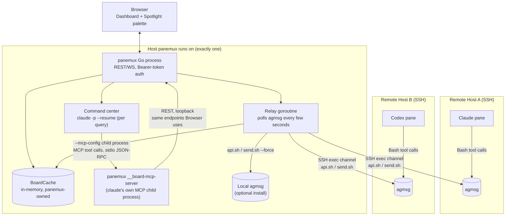
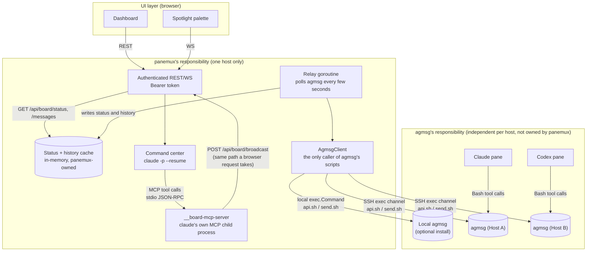
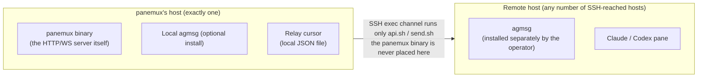

# Agent Board: architecture and package layout

> Part of the current [Agent Board design](../agent-board.md).

## Architecture

### System overview



Every host in this picture is either the one host panemux itself runs on, or a host panemux only
ever reaches through an SSH exec channel it already holds for that pane's session — never a host
panemux is installed on. See [Local vs remote resource
placement](#local-vs-remote-resource-placement) for that constraint in more detail.

The command center's own REST call is made by `McpServer` (`panemux __board-mcp-server`,
`internal/boardmcp`'s `Server` over stdio JSON-RPC) on the LLM's behalf, never by `CmdCenter`
(the `claude -p` subprocess) directly — see [Command center](command-center.md#command-center)'s "Permissions"
subsection for why an MCP tool, not a `Bash`+`curl` call, is what's allow-listed.

### Responsibility boundaries



Two responsibility boundaries, not four generic layers, because the boundary that actually matters
here is "what agmsg owns" vs. "what panemux owns" — the one place a future agmsg version bump can
break something is entirely inside `AgmsgClient`'s two call sites (`api.sh`, `send.sh`), never
anywhere else in panemux:

- **panemux's responsibility**: authentication, the relay, the **in-memory status cache** the
  dashboard actually reads (see below), the command center, and the single `AgmsgClient`
  abstraction that is the *only* code in panemux allowed to call agmsg's scripts. Everything here
  is panemux's own, version-independent of agmsg beyond that one narrow interface.
- **agmsg's responsibility**: one independent agmsg installation per host, each with its own
  durable message log, team roster, and delivery to the live agent sessions that are its actual
  members. panemux does not own this box, does not persist a copy of its contents beyond what the
  cache below needs, and is never a participant *inside* more than one host's agmsg installation at
  a time — it only ever reaches a remote one through the SSH exec channel it already holds for that
  pane's session, exactly as [Local vs remote resource
  placement](#local-vs-remote-resource-placement) details.

**Where agent status actually lives.** It does not live in a database panemux owns, and it is not
recomputed from a live agmsg call on every dashboard request either — both would be wrong for
different reasons (the first re-introduces "panemux owns a schema," which [Design
principles](../agent-board.md#design-principles) rules out; the second makes every dashboard poll pay for an agmsg
round-trip, including an SSH hop for remote hosts). Instead: the relay goroutine, which is already
polling every host's agmsg for messages to forward, updates an **in-memory status cache** as a side
effect whenever it sees a status report addressed to `_system`. `GET /api/board/status` reads only
that cache — never agmsg directly. agmsg's own message log remains the durable source of truth (a
lost or restarted panemux process just means the cache is empty until the next poll cycle refills
it, per [Known limitations](limitations.md#known-limitations)), but the *current, dashboard-facing view* of that
state is unambiguously something panemux computes and holds itself.

## Package layout

### `internal/board`

```go
type Row struct {
    ID          string    // agmsg's own id, host-scoped — NOT globally unique, NOT assumed numeric,
                          // NOT ordered: matched by equality only (see filterRowsAfter)
    Host        string    // which AgmsgClient/host this row came from; required to compare/sort across hosts
    Team        string
    From, To    string
    Body        string
    At          time.Time
}

type Status struct {
    State, CWD, Branch, Repo, PRURL, LastTool, Summary string
    UpdatedAt   time.Time // when this status was recorded, so staleness is visible to the dashboard
}

type AgmsgClient interface {
    HostID() string
    // Send always passes --force. There is no non-forced Send: every board-originated message
    // (self-reported status, cross-host relay, command center) needs to reach a to/from identity
    // that is not guaranteed to be in the destination team's roster — see Integration with agmsg.
    // Escaping (shell, and for reads, agmsg's own incomplete argument validation) is this
    // implementation's responsibility, not the caller's — see internal/session's BoardExecutor.
    Send(ctx context.Context, team, from, to, body string) error
    // Since has no true "after" primitive to call into (api.sh has no such flag). It calls
    // `api.sh get teams <team> messages --limit <limit>` and returns only rows whose ID sorts
    // after afterID; the caller must treat the possibility of dropped rows (more than `limit` new
    // rows since the last poll) as expected, not exceptional — see Integration with agmsg.
    Since(ctx context.Context, team, afterID string, limit int) ([]Row, error)
}

// ownSendLedger is a short-lived, in-memory record of Send calls panemux itself has issued (the
// broadcast handler and the command center — see Cross-host relay), used only to verify a row the
// relay later observes with From == "_system" actually corresponds to one of panemux's own sends,
// since send.sh --force never checks From against a roster and an ordinary board pane could
// otherwise forge that identity. Entries expire after a few poll intervals; a body is stored only
// as a hash, since the ledger's job is matching, not re-displaying content. entries is a multiset —
// one expiry per occurrence, not one per distinct key — because two broadcasts with the identical
// (destHost, team, to, body) are two real, independent sends that each produce their own row; a
// plain single-entry map would let the second Record silently overwrite the first and drop one of
// two genuinely delivered messages from history the next time the destination host is polled.
type ownSendLedger struct {
    mu      sync.Mutex
    entries map[ownSendKey][]time.Time // one expiry per occurrence of this key
}

type ownSendKey struct {
    DestHost string
    Team     string
    To       string
    BodyHash string // e.g. sha256, truncated; not a security boundary by itself, only a dedup key
}

func (l *ownSendLedger) Record(destHost, team, to, body string)      { /* appends one occurrence with a short TTL */ }
func (l *ownSendLedger) Consume(destHost, team, to, body string) bool { /* true+deletes if matched, false if expired/absent */ }

// BoardCache is the in-memory, panemux-owned view of recent board activity shown in Architecture.
// Only the relay writes to it, as a side effect of the same Since polling it already does for
// message forwarding; both dashboard-facing endpoints only ever read it, never calling
// AgmsgClient directly at request time. Unlike AgmsgClient.Since's per-host afterID (an opaque
// agmsg-native string), BoardCache assigns its own monotonically increasing, panemux-local `Seq`
// to every row as it's appended, specifically because agmsg IDs from different hosts are not
// comparable or even guaranteed non-colliding with each other — Seq is what GET
// /api/board/messages?since=<id> actually paginates on.
type BoardCache struct {
    mu       sync.RWMutex
    status   map[string]Status // paneID -> latest self-reported status (pane IDs are globally unique)
    nextSeq  int64
    history  []CachedRow       // bounded ring buffer, most recent last
}

// CachedRow pairs a Row with the BoardCache-local Seq it was assigned when appended. Exported
// because GET /api/board/messages?since=<seq> needs the Seq back from every returned row to use as
// its next since cursor — a bare []Row would discard exactly the value the caller needs.
type CachedRow struct {
    Row Row
    Seq int64
}

func (c *BoardCache) RecordStatus(paneID string, s Status)     { /* mutex-guarded write; sets s.UpdatedAt */ }
func (c *BoardCache) AppendMessage(r Row)                       { /* mutex-guarded write; assigns next Seq */ }
func (c *BoardCache) StatusSnapshot() map[string]Status         { /* mutex-guarded copy */ }
func (c *BoardCache) MessagesSince(afterSeq int64) []CachedRow  { /* mutex-guarded copy, filtered by Seq */ }
```

The relay inspects every `Row` it reads: if `To == "_system"` and `Body` parses as JSON with
`kind == "board_status"` (see [Status self-report](message-flow.md#status-self-report-and-message-flow) for why
the discriminator, not shape-sniffing, is what triggers this), it calls `RecordStatus` and does
*not* forward that row through the cross-host relay logic (status reports are local bookkeeping,
not messages meant for another pane). A `Body` addressed to `_system` that isn't valid JSON, or is
valid JSON without that exact `kind`, is left alone as an ordinary chat message — including a body
that happens to share some field names with the status shape by coincidence. Every row, status or
not, is also appended to
`history` via `AppendMessage`, which is what `GET /api/board/messages` reads from — that endpoint
never calls `AgmsgClient` at request time either, for the same reason `GET /api/board/status`
doesn't: the relay has already seen everything the dashboard needs, as a side effect of polling it
was already doing.

- `LocalAgmsgClient` shells out to the local agmsg installation's `scripts/api.sh` for reads and
  `scripts/send.sh ... --force` for writes. Because this is a local `exec.Command` invocation, Go
  passes each argument as a genuine array element with no intermediate shell, so no argument to
  either script carries shell-injection risk here regardless of its content.
- `RemoteAgmsgClient` runs the same two scripts on the remote host over the SSH exec channel and
  single-quote-escapes **every** argument to **every** call — reads included, `team` and `--agent`
  included, not just writes — before building the remote command string, using the same
  `shellQuotePath`-style discipline `internal/session/ssh.go` already applies to `cwd`. This is
  required because `api.sh`'s arguments are not all digit-validated: `--agent` is free text (see
  [Integration with agmsg](agmsg-integration.md#integration-with-agmsg)). In any case agmsg's own validation runs
  *inside the already-started remote shell process*, after panemux's command string has already
  been parsed — it cannot retroactively protect the string-construction step. `send.sh` does its
  own SQL escaping internally, so panemux never needs a second, SQL-literal escaping layer of its
  own on top of the shell layer — there is no local schema of panemux's own to escape SQL text for.
  See [Security model](security-model.md#security-model) and [security.md](../security.md).

`internal/board/relay.go`'s `Relay` type (constructed once in `board.go`'s `setupBoard` and shared
between the polling goroutine and the broadcast REST handler, per [Cross-host relay](relay.md#cross-host-relay))
implements the row-processing order and cold-start backfill described there: `Poll(ctx)` runs one
polling pass and is what `Run(ctx, interval)` calls on a real `time.Ticker` in production; tests drive
`runLoop` directly against an injected `<-chan time.Time` instead, since this is the first
time-driven goroutine loop in this codebase and keeping `Poll` synchronous and directly testable
avoids relying on wall-clock timing in any test. `Broadcast(ctx, from, to, body)` is what
`POST /api/board/broadcast` calls; it records into the same `ownSendLedger` instance the poll loop
consumes from, resolves each `to` pane ID to its host via the same config-derived pane→host map the
relay already holds, and returns an `*UnknownPaneError` (naming every unresolvable pane ID at once,
not just the first) rather than partially delivering to some panes and silently dropping others.
Relay cursors (`internal/board/cursor_store.go`'s `CursorEntry{Host, Team, Cursor}`) persist to
`~/.config/panemux/board-relay-cursor.json` (`0600`) after each poll and are loaded once at startup;
a missing or unreadable cursor file is logged and treated as a cold start, never a fatal error.

Because panemux owns no schema, it needs no embedded database driver of its own at all — every
board operation is either a local `exec.Command` or a remote exec-channel command running agmsg's
own scripts.

`internal/board/agmsg_presence.go` implements the "is agmsg actually installed here" check bootstrap
depends on: `LocalAgmsgPresent(agmsgPath string) bool` (`os.Stat` on `scripts/api.sh`) and
`RemoteAgmsgPresent(ctx, executor BoardExecutor, agmsgPath string) (bool, error)`, the latter running
a fixed, non-tainted `sh -c` probe script over the same `RunBoardCommand` channel `ResolveRemoteAgmsgPath`
already uses (see [security.md](../security.md) for why this probe is safe despite carrying no
regex-allowlist branch of its own — it takes no caller-supplied data at all). Both `cursor_store.go`
and `internal/board/bootstrap_store.go`'s `SaveBootstrapState`/`LoadBootstrapState`
(`~/.config/panemux/board-bootstrap-state.json`, `0600`) write through
[`internal/fileops`](../architecture.md)'s `AtomicWrite`, since both files need the identical atomicity
guarantee for an unrelated piece of persisted state — as does `internal/commandcenter`'s session
file, which is why that discipline lives in one shared package rather than a copy per caller.

`bootstrap.go` (`package main`, not `internal/board` — it depends on `internal/session.Manager` the
same way `board.go` already does) implements `bootstrapWatcher`, the poller described in [Bootstrap
flow](bootstrap.md#bootstrap-flow). It deliberately takes no dependency on `internal/config` at all: like
`board.RelayConfig`, its `bootstrapWatcherConfig` is a precomputed, static struct (`PaneHosts`,
`PaneModes`, `ResolvedPaths`, `Team`, `Persist`) that `board.go`'s `setupBoard` builds from config,
mirroring the same dependency direction `internal/board` itself already uses.

### `internal/session` capability interfaces

Following the existing optional-capability pattern (`CWDGetter`, `ActiveWorkdirGetter`,
`GitContextGetter`, `SSHConnNamer`):

```go
// BoardHostID is implemented by every session type. It returns the identifier of the host whose
// agmsg installation this session's pane participates in: "local" for local/tmux sessions, the
// SSH connection name for ssh/ssh_tmux sessions.
type BoardHostID interface {
    BoardHostID() string
}

// BoardExecutor is implemented by SSH-backed sessions. It runs an agmsg script on the remote host
// over the session's existing exec channel, as a single shell command string built from args.
// RunBoardCommand itself single-quote-escapes every element of args (the same discipline
// internal/session/ssh.go already applies to cwd) before building that string — the caller passes
// raw, unescaped values, exactly like exec.Command's own argv contract, so there is exactly one
// place this can be gotten wrong rather than one per call site. Neither api.sh (reads) nor send.sh
// (writes) has a stdin option for the values this carries (see
// docs/agent-board/agmsg-integration.md#integration-with-agmsg), so escaping the command string is the only
// available defense for either.
type BoardExecutor interface {
    RunBoardCommand(ctx context.Context, args []string) ([]byte, error)
}

// AgentTypeDetector is implemented by every session type. It reports the agmsg-recognized type
// name (e.g. "claude-code", "codex", "gemini") of any live, interactive coding-agent process
// currently running as a descendant of this pane's shell, among the set agmsg's own type.conf
// detect_proc key considers reliably process-detectable. This is narrower than the pre-existing
// ActiveWorkdirGetter (which only distinguishes Codex/Claude, and additionally resolves
// transcript-derived workdirs at real I/O cost) and returns WHICH type rather than a bare bool,
// since bootstrap writes a different onboarding instruction per agent type.
type AgentTypeDetector interface {
    DetectInteractiveAgentType() (agmsgType string, ok bool, err error)
}
```

`LocalSession`/`TmuxLocalSession` implement `BoardHostID` (`"local"`) and `AgentTypeDetector`.
`SSHSession`/`SSHTmuxSession` implement `BoardHostID`, `BoardExecutor`, and `AgentTypeDetector`.
`AgentTypeDetector` is a separate, purpose-built primitive for bootstrap — it does not reuse or
modify the pre-existing `ActiveWorkdirGetter`/`isInteractiveAgentCommand` code path the Claude
worktree override (see [architecture.md](../architecture.md)) depends on, though both share the same
generic process-tree-walk helper underneath.

## Local vs remote resource placement



Nothing panemux-specific is ever written to a remote host's disk: no binary, no persisted helper
script. The only thing a remote host needs beyond what it already has for its own agents is agmsg
itself, installed by the operator for that host's own reasons (typically: so a non-Claude agent
there can participate at all).
