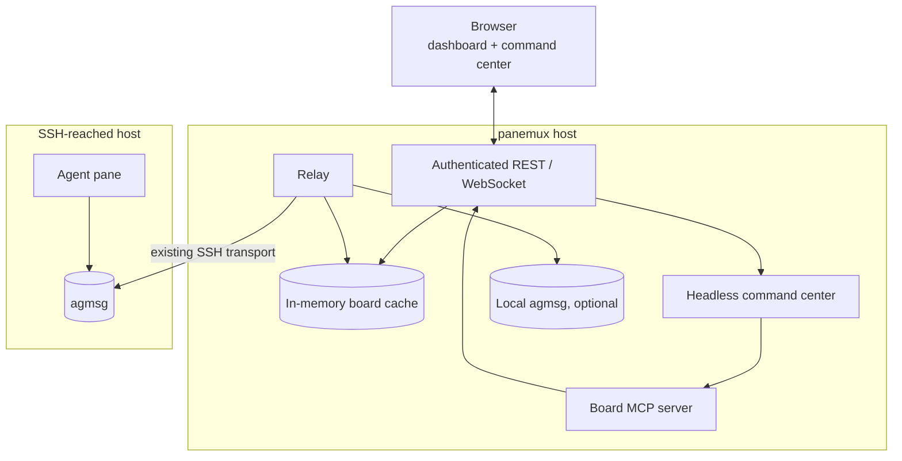

# Agent Board: architecture and ownership

> Part of the current [Agent Board design](../agent-board.md).

## Architecture

Panemux runs on one host. It reaches remote agmsg installations only through SSH connections that
already back configured panes; it never installs or runs panemux remotely. The command center uses
the same authenticated API as the browser, through a narrow MCP server, and never calls agmsg
directly.

### Ownership boundary

Panemux owns:

- configuration and authentication;
- host polling, cross-host routing, and relay cursors;
- the in-memory status/history view;
- the dashboard and command center;
- the single adapter that invokes agmsg scripts.

agmsg owns:

- team membership and agent identities;
- durable message storage and delivery;
- its data model and script behavior.

Panemux must not read or modify agmsg's database or team files. Compatibility work stays at the
script boundary described in [Integration with agmsg](agmsg-integration.md#integration-with-agmsg).

### State ownership

The relay updates the board cache while polling hosts. Dashboard requests read this cache and never
wait on local processes or SSH. agmsg remains the durable message source; restarting panemux loses
the cache until bounded backfill and later polls rebuild it.

Rows from different hosts retain agmsg's opaque, host-local IDs. The cache assigns its own
monotonic sequence for dashboard pagination because agmsg IDs cannot be ordered or compared across
hosts.

Panemux persists only operational metadata:

- one relay cursor per host and team;
- bootstrap state needed across panemux restarts;
- command-center session and captured history.

These files are local, private (`0600`), and atomically replaced. They are not a second message
store.

## Package layout

The package boundary enforces the ownership model:

| Area | Responsibility |
|---|---|
| `internal/board` | agmsg adapter, relay, cache, cursors, bootstrap records, and own-send ledger |
| `internal/session` | host identity, agent detection, and remote command capability for a pane |
| `internal/api`, `internal/ws`, `internal/server` | authenticated board REST and WebSocket surfaces |
| `internal/commandcenter` | one-at-a-time headless Claude queries and command history |
| `internal/boardmcp` | three board-only MCP tools backed by the authenticated REST API |

Only `internal/board` may invoke agmsg scripts. Other packages use its API or the authenticated
panemux API; this prevents agmsg-specific behavior and escaping rules from spreading through the
system.

The relay is the sole writer to board status/history. Broadcasts send immediately but appear in
history only after polling reads them back. Keeping one cache writer avoids duplicate and racing
history entries.

### Relay invariants

- A row is accepted only when its sender is a board-enabled pane on the source host, or a
  ledger-matched panemux send attributed to `_system`.
- Status rows update the cache and are not forwarded to another host.
- Same-host messages remain within that host's agmsg installation.
- Cross-host messages are routed by configured pane ID; unknown senders or recipients are dropped
  and logged.
- Dashboard sequence numbers are panemux-local and must never be confused with agmsg row IDs.

The own-send ledger is a short-lived multiset. It records each panemux-originated send separately,
stores only a body hash, and consumes one matching occurrence. This is required both to reject
forged `_system` rows and to preserve identical repeated broadcasts.

## Local vs remote resource placement

| Resource | Panemux host | SSH-reached host |
|---|---:|---:|
| panemux server and browser API | yes | never |
| board cache, cursors, command history | yes | never |
| agmsg | optional | installed separately by the operator |
| agent process | optional | yes |

Remote execution uses agmsg's installed scripts over the existing SSH transport. No panemux binary,
helper script, cache, or cursor is written to a remote host.
