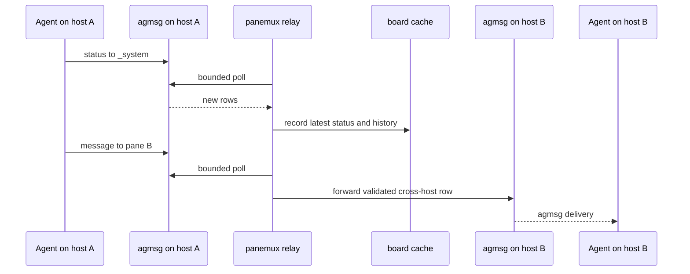

# Agent Board: status and message flow

> Part of the current [Agent Board design](../agent-board.md).

## Status self-report and message flow

Status is an ordinary agmsg message addressed to the reserved `_system` identity. Its body is JSON
with the required discriminator `"kind": "board_status"`:

```json
{
  "kind": "board_status",
  "state": "working",
  "cwd": "/workspace/user/project",
  "branch": "feature/x",
  "repo": "owner/repo",
  "pr_url": "https://github.com/owner/repo/pull/123",
  "last_tool": "Edit internal/api/handler.go",
  "summary": "Fixing the failing relay tests"
}
```

The discriminator is mandatory. JSON addressed to `_system` without that exact value remains an
ordinary message, even if it contains status-like fields. This prevents unrelated JSON from being
silently consumed as status.

Agents obtain `cwd`, Git, and PR data themselves. Panemux does not infer those values from private
transcripts. Optional fields may be absent. The dashboard centers on `summary`: one short sentence
describing the current task or blocker, updated when work starts, finishes, blocks, or becomes idle.
Panemux neither invents missing summaries nor enforces reporting cadence.



The relay keeps only the latest status per pane for the status view, while retaining status rows in
bounded history with an `is_status` marker. The dashboard filters those rows from conversation
history.

Self-reporting is cooperative: stale or missing reports remain visible as stale or missing rather
than being replaced by inferred state. This trades passive but fragile transcript inference for an
explicit, auditable agent report.
