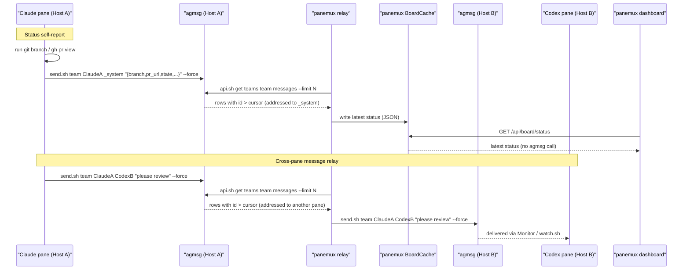

# Agent Board: status self-report and message flow

> Part of the current [Agent Board design](../agent-board.md).

## Status self-report and message flow

Instead of a `kind='status'` field panemux owns (agmsg has no such column), status reports are
ordinary agmsg messages addressed to the reserved identity `_system` — the same identity the
command center uses as its own `from` when sending. Because `_system` is never an agmsg roster
member (see [Integration with agmsg](agmsg-integration.md#integration-with-agmsg)), the agent's own `send.sh ...
--force` call is what lets a status report reach it at all. The relay goroutine, already polling
every host's agmsg with `api.sh get teams <team> messages --limit <N>` (no `--before-id` — see
[Integration with agmsg](agmsg-integration.md#integration-with-agmsg) for why that flag can't do this) for message
forwarding, recognizes any row addressed to `_system` as a status update and writes it into
panemux's own in-memory status cache (see [Architecture](architecture.md#architecture)), keeping only the newest
entry per sender. The dashboard never queries agmsg directly for this — it only ever reads that
cache.

The bootstrap instruction (see [Bootstrap flow](bootstrap.md#bootstrap-flow)) tells Claude to gather this
itself, using its own `Bash` tool, and include it as a small JSON body:

```json
{
  "kind": "board_status",
  "state": "working",
  "cwd": "/home/user/project",
  "branch": "feature/x",
  "repo": "owner/repo",
  "pr_url": "https://github.com/owner/repo/pull/123",
  "last_tool": "Edit internal/api/handler.go",
  "summary": "fixing failing tests"
}
```

**`kind: "board_status"` is a fixed, required discriminator, not an optional field.** Detecting a
status report by *shape alone* — "does this JSON happen to have a `state` key" — has a real false-
positive edge: a human typing an ordinary chat message to `_system` through the command center or
Spotlight palette could, by coincidence or by pasting unrelated JSON, produce a body that parses as
valid JSON and happens to contain a `state` field, and would then be silently swallowed into the
status cache instead of showing up as a message. Requiring a literal `"kind": "board_status"` value
removes the ambiguity: the relay treats a row as a status update only when `Body` parses as JSON
*and* `kind` is exactly that string; every other body — including JSON that merely resembles the
status shape — is left alone as an ordinary message, matching [Package
layout](architecture.md#package-layout)'s detection rule.

`branch`/`repo`/`pr_url` come from the agent running `git branch --show-current`, `git remote get-
url origin`, and a PR lookup (e.g. `gh pr view --json url -q .url`) itself — panemux never computes
these; it only displays what the agent reported. `cwd`/`pr_url` may be absent if the agent isn't in
a repository or there's no open PR. The dashboard does not render `branch`/`repo`/`pr_url` at all
(see [ui-design.md's Agent Board UI](../ui-design.md#agent-board-ui) for why), but they stay in the
schema because the relay stores whatever a pane reports.

**`summary` is the field the dashboard is built around, and the bootstrap instruction says so
explicitly.** It appears in the instruction with concrete guidance,
alongside "send an update whenever your state changes meaningfully" — which leaves both content and
cadence to the agent's discretion. Vague summaries may be survivable with two panes but are useless with eight: a
column of state pills tells an operator that work is happening somewhere, not which pane is doing
what. The instruction asks for one short sentence in plain language naming the current task
("Fixing the flaky relay test"), explicitly *not* the last tool call and not a session recap, with
what the pane is blocked on when it is blocked, sent when starting a task, finishing one, becoming
blocked, or going idle — events an agent can recognize, rather than a timer it would have to run.

panemux cannot enforce any of this. A pane that reports no `summary`, or a stale one, renders as a
card with a state pill and nothing to read, and that is the honest display of what the board knows
— the dashboard never invents a summary from `last_tool` or from git state to fill the gap.



**Honest tradeoff, stated explicitly.** Self-report is only as good as the agent's compliance: it
depends on the agent actually running the bootstrap instruction's commands each time it reports,
whereas the old transcript-parsing approach was passive and automatic (when it worked at all). The
bet this redesign makes is that "ask, and get an answer that tracks reality because the agent just
computed it" is more often correct than "silently infer from an internal format panemux does not
control," even though the former requires the agent's cooperation and the latter didn't.
