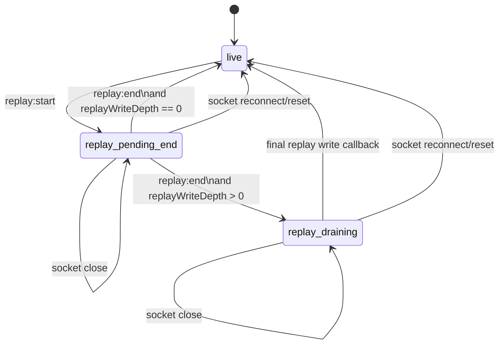
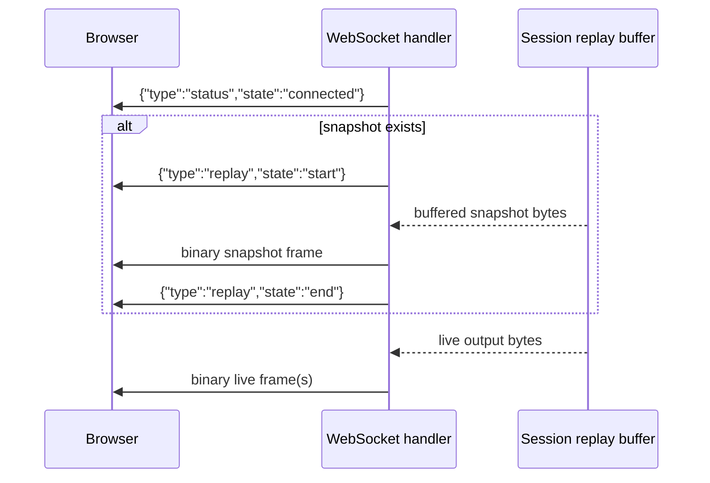

# Behavior Specification

## Startup Sequence

1. Parse `--config`, `--open`, and `--port`.
2. Load config: if `--config` is given, load that file; otherwise try `~/.config/panemux/config.yaml`; if that file does not exist, use the built-in default config with `~/.config/panemux/config.yaml` as the save path.
3. Override the configured port if `--port` is set.
4. Create the in-memory session manager.
5. Traverse the configured layout and create each pane session.
6. Start the HTTP server and serve the embedded frontend.
7. On `SIGINT` or `SIGTERM`, shut down the server and close all sessions.

If a configured session fails to start, the server logs a warning and continues booting other sessions.

## Configuration Rules

The YAML config defines:

- `server.host` and `server.port`
- `ssh_connections`
- `layout`
- optional `display` settings

Layout rules:

- `direction` must be `horizontal` or `vertical`
- sibling `size` values must sum to `100` within a small tolerance
- pane IDs must be unique
- `ssh` and `ssh_tmux` panes must reference a defined SSH connection
- `tmux` and `ssh_tmux` panes must define `tmux_session`

Path behavior:

- `~/` in SSH key paths and pane working directories is expanded at load time

## SSH Connections

### Defining connections in `ssh_connections`

Each entry under `ssh_connections` in the YAML config has the following fields:

| Field | Required | Description |
|---|---|---|
| `host` | yes | Hostname or IP address |
| `user` | yes | Remote username |
| `port` | no (default 22) | SSH port |
| `key_file` | no | Path to private key; `~/` is expanded at load time |
| `password` | no | Password for password-based authentication |
| `known_hosts_file` | no (default `~/.ssh/known_hosts`) | Path to known\_hosts file for host-key verification |

Example:

```yaml
ssh_connections:
  prod-web:
    host: 192.168.1.10
    user: deploy
    key_file: ~/.ssh/id_ed25519
  bastion:
    host: bastion.example.com
    user: ops
    key_file: ~/.ssh/id_ed25519
    known_hosts_file: ~/.ssh/known_hosts
```

### Using `~/.ssh/config` hosts

Panes can reference host aliases from `~/.ssh/config` directly in the `connection` field without duplicating them under `ssh_connections`. The following fields are read from each non-wildcard `Host` block:

- `HostName` — hostname or IP (defaults to the alias name if omitted)
- `User` — remote username
- `Port` — port number (defaults to 22 if omitted)
- `IdentityFile` — path to private key; `~/` is expanded at session creation time

Wildcard entries (`Host *`, `Host *.example.com`) are skipped.

`ssh_connections` takes precedence over `~/.ssh/config` when the same name appears in both.

### Authentication

When establishing an SSH connection, the following auth methods are attempted in order:

1. Key file specified in `key_file` (if present)
2. Password specified in `password` (if present)
3. Default key files in order: `~/.ssh/id_ed25519`, `~/.ssh/id_rsa`, `~/.ssh/id_ecdsa`

Host-key verification uses `known_hosts_file` if configured, or `~/.ssh/known_hosts` by default. If the known\_hosts file does not exist, the connection is refused (the app does not silently accept unknown hosts).

### SSH pane fields

| Field | Types | Required | Description |
|---|---|---|---|
| `connection` | `ssh`, `ssh_tmux` | yes | Name from `ssh_connections` or `~/.ssh/config` |
| `cwd` | `ssh`, `ssh_tmux` | no | Remote working directory; executes `cd {cwd} && exec $SHELL` |
| `tmux_session` | `ssh_tmux` | yes | Remote tmux session name to attach or create |

`tmux_session` must match `^[a-zA-Z0-9_.-]+$`.

`cwd` is validated against `validRemotePath` before use: absolute paths only, no shell metacharacters (`;|&$` + "`" + `'"<>(){}[]!`), no control characters. See *Security Design* in `architecture.md`.

Pane settings in the frontend expose a directory browser for `cwd`. Local and local tmux panes browse the local filesystem; `ssh` and `ssh_tmux` panes browse the selected SSH connection's remote filesystem. The browser lists directories only and hides dot-directories by default unless the user enables the hidden-directory toggle.

For local `tmux` panes, `cwd` is passed to `tmux new-session` via `-c` and, like `ssh_tmux`, only takes effect when tmux creates a brand-new session; attaching to an already-running session of the same name keeps that session's existing working directory.

Persistence behavior:

- layout and workspace changes are persisted immediately when a save path is available
- pane resize, split, close, quick-add create, move, workspace add/delete/rename, active-workspace changes, `tab_position` changes, and vertical workspace-bar width changes all follow the same immediate-save path
- when no `--config` is given, the default save path is `~/.config/panemux/config.yaml`; the directory is created automatically on first save
- pane maximize state is frontend-local, tracked per workspace, and restored when the user switches away from a workspace and then returns

## Agent Attention Notifications

The frontend watches terminal output for conservative agent confirmation prompts such as approval,
permission, proceed requests, and Codex MCP allow menus. Detection runs in the frontend and keeps a
lightweight background WebSocket subscription for every pane across every workspace, so hidden
workspaces are still watched even while their xterm instances are unmounted. When a prompt is
detected:

- the pane frame flashes until the pane receives focus or a click
- the containing workspace tab flashes when that workspace is not active, and clears when selected
- the browser Notification API is used when permission has already been granted and the prompt is not currently visible to the user
- clicking a browser notification focuses the app window and switches to the matching workspace
- if notification permission is undecided, the browser is asked on the first pointer or key
  interaction instead of waiting for the first prompt event

Browser notification eligibility is determined by the current UI state:

| Browser state | Pane state | Browser notification |
|---|---|---|
| active | visible in the active workspace | no |
| active | hidden in another workspace | yes |
| active | hidden by maximize in the active workspace | yes |
| inactive | any pane | yes |

To suppress redraw noise, panemux stores the last browser-notified prompt signature per pane in
browser storage. If the same pane replays the same prompt after a refresh, reconnect, or layout
change, the pane and workspace attention indicators can still reappear, but the browser
notification is not shown again. When the same pane later emits a different prompt, the stored
signature is replaced and the new prompt can notify again.

Attention detection remains frontend-only. The backend still buffers recent terminal output per
session and replays that snapshot when a pane reconnects after a workspace switch or browser reload,
but prompt notifications no longer depend on the pane being visibly mounted at the time the output
arrives.

For pane-header Git status, local and local tmux panes inspect the local filesystem, while `ssh`
and `ssh_tmux` panes run the equivalent Git inspection on the remote host. This allows headers to
show branch/repository info even when the repository exists only on the SSH target.

Workspace tab summaries and their integrated pane groups use the same Git metadata source and also
poll `/api/sessions` to summarize pane connection state across every workspace, including inactive
ones.

Pane-header Git and PR metadata is fetched immediately when a pane becomes visible, then refreshed
every 10 seconds only while both the browser tab and that pane remain visible.

The backend caches each session's git-info response for 30 seconds so that this steady-state polling
(and any other concurrent viewer of the same session, such as another browser tab) does not repeat
process/transcript scanning, remote git inspection over SSH, or `gh pr view` lookups on every request.
A pane's displayed Git/PR metadata may therefore lag the true state by up to 30 seconds; the cache is
cleared whenever a session is deleted or recreated so a new session never inherits another session's
cached response. Explicit refresh triggers — clicking or focusing a pane, restoring the browser tab,
or opening VS Code — only skip the frontend's own request if it already has a response no older than
10 seconds, matching the steady-state poll interval, so an explicit refresh is bounded by that 10
seconds plus the server-side cache above rather than compounding a larger, independent client-side
window on top of it.

Workspace-summary session-state and Git metadata polling are frontend-only and best-effort. While
the browser tab is visible, the frontend polls every 10 seconds so it can summarize all known
panes across all workspaces without mounting hidden terminal instances. The integrated summary view
marks the currently focused pane so the overview stays aligned with the live terminal focus state.
For `top` and `bottom` workspace bars, pane cards are shown in a hover/focus overlay anchored to
the workspace tab. For `left` and `right` workspace bars, pane cards stay expanded inline beneath
their workspace tab. In vertical mode, the workspace tabs and inline cards scroll inside the bar,
while the `+` action and tab-position controls stay pinned at the bottom.

When a pane is hidden behind maximize, its header Git/PR polling stops until it becomes visible
again. Restoring the browser tab or making a pane visible again triggers an immediate refresh so
newly created PR links become clickable without waiting for the next steady-state poll.

When panemux detects that an interactive `codex` or `claude` session is operating in a sibling Git
worktree for the same repository, pane-header Git/PR metadata and the VS Code open action prefer
that worktree. After the agent exits, panemux keeps the last valid sibling worktree pinned for that
pane session until a newer valid sibling worktree is detected or the pane itself changes to a
different repository.

To avoid repeatedly transferring and parsing unchanged interactive-agent logs, panemux reuses the
last parsed Codex or Claude worktree result while the underlying session-log or transcript file
fingerprint remains unchanged. For SSH-backed panes this check uses remote file metadata first and
only reads the full `jsonl` contents again when the fingerprint changes.

Remote Git inspection currently depends on `git rev-parse --path-format=absolute --git-common-dir`
on the SSH target, which requires Git 2.31 or newer. Older remote Git versions degrade to "no git
info" in the pane header for SSH-backed panes.

For terminal text selection, panemux keeps tmux mouse mode unchanged for `tmux` and `ssh_tmux`
panes. Plain drag therefore continues to follow tmux mouse behavior. To force browser-side xterm
selection while tmux mouse mode is active, hold `Option` during drag on macOS or `Shift` during
drag on Linux and Windows.

## REST API

### `GET /api/layout`

Returns the current layout tree as JSON.

### `PUT /api/layout`

Accepts a layout JSON document, validates it, updates in-memory state, and persists it when possible.

- `400`: invalid JSON
- `422`: structurally invalid layout
- `200`: accepted and returned

### `GET /api/workspaces`

Returns the active workspace ID, `tab_position`, `vertical_bar_width`, and all workspace layouts.

### `PUT /api/workspaces/tab-position`

Accepts `{ "tab_position": "top" | "bottom" | "left" | "right" }`, validates it, persists the workspace config, and returns the updated workspace response.

- `400`: invalid JSON
- `422`: invalid tab position
- `500`: unable to save the config
- `200`: updated and returned

### `PUT /api/workspaces/vertical-bar-width`

Accepts `{ "vertical_bar_width": <int> }`, validates the shared vertical workspace-bar width in pixels, persists the workspace config, and returns the updated workspace response.

- `400`: invalid JSON
- `422`: invalid width
- `500`: unable to save the config
- `200`: updated and returned

### `GET /api/sessions`

Returns a list of active sessions with `id`, `type`, `title`, and `state`.

### `POST /api/sessions`

Creates a session from a `PaneConfig` payload, provided the pane ID does not already exist.

- `400`: invalid JSON
- `409`: duplicate session ID
- `422`: invalid pane config
- `201`: session created

Current product use: the frontend uses this endpoint when the user splits a pane or uses the pane-header quick-add buttons to create a default local pane to the right or below. It remains a narrow pane-lifecycle API, not a general provisioning layer.

### `DELETE /api/sessions/{id}`

Closes the session, removes its pane from the layout, collapses redundant parent splits, normalizes sibling sizes, and returns `204`.

### `POST /api/sessions/{id}/restart`

Recreates the session for an existing pane from its config (e.g. after an SSH connection was lost). The
replacement session is created first; the old session is only removed and swapped out once the new one
starts successfully.

- `404`: no pane config exists for `id`
- `409`: a restart for this `id` is already in progress. Session creation can block on a real SSH
  dial, so concurrent restart requests for the same pane are serialized instead of each building a
  session independently and racing to swap it in.
- `500`: session creation failed (e.g. SSH dial/handshake error). The pane's prior session, if any,
  remains registered and servable — it is not removed on failure — so `/ws/{id}` and `/git-info` keep
  working against it instead of 404ing until a future restart succeeds.
- `200`: the new session replaced the old one (or was created fresh if none existed)

The SSH transport-dial step retries transient failures (such as a momentary DNS resolution error) a
bounded number of times with a short backoff before this endpoint returns `500`. Only the initial
TCP/ProxyJump/ProxyCommand connection step is retried, not SSH handshake or authentication failures.
The retry budget is a single wall-clock deadline shared across an entire ProxyJump chain (each hop
reuses the same deadline rather than getting its own fresh budget), and each retried attempt's own
timeout shrinks to whatever of that budget remains, so a hanging/unreachable host cannot make this
endpoint wait dramatically longer than the ceiling a single dial attempt already tolerated before
retries were introduced.

### `GET /api/ssh-connections`

Returns a sorted list of all known SSH connection names — the union of names defined in `ssh_connections` (YAML) and non-wildcard hosts from `~/.ssh/config`. Names present in both sources are deduplicated, with the YAML entry taking precedence.

Response:

```json
{ "names": ["bastion", "prod-web"] }
```

### `GET /api/ssh-config/hosts`

Returns all non-wildcard hosts from `~/.ssh/config` with full field details.

- `500`: unable to read `~/.ssh/config`
- `200`: list of host records

Response:

```json
{
  "hosts": [
    { "name": "bastion", "hostname": "bastion.example.com", "user": "ops", "port": 22, "identity_file": "~/.ssh/id_ed25519" }
  ]
}
```

Fields `port` and `identity_file` are omitted when not set in `~/.ssh/config`.

### `POST /api/ssh-config/hosts`

Appends a new `Host` block to `~/.ssh/config`.

Request body:

```json
{ "name": "my-server", "hostname": "192.168.1.5", "user": "deploy", "port": 22, "identity_file": "~/.ssh/id_ed25519" }
```

- `400`: invalid JSON
- `409`: a host with the same name already exists in `~/.ssh/config`
- `422`: validation error (name, hostname, or user missing; name contains invalid characters; port out of range)
- `500`: unable to read or write `~/.ssh/config`
- `201`: host appended

`name` must match `^[a-zA-Z0-9_.\-]+$`. `port` defaults to 0 (omitted from the written block) when not specified. `identity_file` is optional.

### `GET /api/display`

Returns display preferences such as header/status-bar visibility.

## Agent Board REST API

Full design and rationale live in [agent-board.md](agent-board.md); this section documents only the
request/response shapes and status codes of what is actually implemented today. Every `/api/board/*`
endpoint in this section requires `Authorization: Bearer <server.auth_token>` — see
[security.md](security.md#auth-token-and-transport-encryption). A missing or incorrect token returns
`401` before the handler runs. The one exception is `GET /api/session-token`, documented in its own
subsection below, which is deliberately unauthenticated.

### `GET /api/session-token`

Returns the bearer token the browser dashboard needs to authenticate every other `/api/board/*`
request and the `/ws/board-command` connection — there is no other way for the frontend's own
JavaScript to learn a token that may have been randomly generated on first run (see
`config.Config.EnsureAuthToken`, [security.md](security.md#auth-token-and-transport-encryption)) and
is never sent to the browser any other way. **This endpoint is deliberately not behind
`bearerAuthMiddleware`** — nothing could bootstrap the token without already knowing it otherwise.

It is gated by its own, narrower check instead: the caller's `RemoteAddr` must be a loopback IP *and*
its `Host` header must also name a loopback authority (`localhost`/`127.0.0.1`/`::1`, any port). Both
are required — see [security.md's Auth token and transport
encryption](security.md#auth-token-and-transport-encryption) for why RemoteAddr alone doesn't defend
against DNS rebinding, and why relying on CORS here (an earlier revision of this document's claim) was
wrong. A non-loopback `server.host` deployment cannot use this endpoint at all, by design.

Response:

```json
{ "token": "a1b2c3...", "command_center_enabled": true, "agent_board_enabled": true }
```

`agent_board_enabled` (added alongside the Phase 3 dashboard UI) is `true` when at least one
configured pane has `agent_board.enabled: true`, computed by scanning `cfg.AllPanes()` on every
request rather than cached at startup. It is deliberately independent of `command_center_enabled`:
a config can enable `agent_board` without `command_center`, or vice versa, and the frontend needs
both flags to decide whether to show the "Agent Board" dashboard button and the "Command History"
button separately.

- `403`: the caller failed the loopback RemoteAddr+Host check above
- `200`: otherwise, always — there is no other failure mode for this handler

Note this route lives at `/api/session-token`, not under `/api/board/`, despite belonging
conceptually to Agent Board: chi routes any path starting with `/api/board/` into the
`bearerAuthMiddleware`-wrapped sub-router regardless of where else a handler for that literal path is
registered, so a route literally named `/api/board/session-token` would always require the token it
exists to hand out. This is not a stylistic choice — an earlier revision of this endpoint lived at
that path and was silently caught by the auth middleware it was supposed to bypass.

**Bootstrap flow** (not a REST/WS endpoint — a background behavior). For every pane with
`agent_board.enabled: true`, panemux polls every 5s for a live, agmsg-detectable coding-agent
process (one of six agent types; see [agent-board.md's Bootstrap
flow](agent-board.md#bootstrap-flow)) and, once detected on two consecutive polls and agmsg is
confirmed present on that pane's host, writes a one-time onboarding instruction directly into the
pane's terminal — visible in the browser the same way any other terminal output is. This happens
with no operator action beyond setting the config flag; there is no API call to trigger or observe
it directly (its effect is only visible in the pane's own terminal output and, once the agent
follows the instruction, in `GET /api/board/status`/`/messages` after the relay's next poll).

### `GET /api/board/status`

Returns a snapshot of panemux's in-memory status cache. No `AgmsgClient` call happens on this
request — the relay goroutine is what keeps the cache current by polling agmsg on a schedule.

Response:

```json
{
  "statuses": {
    "pane-a": {
      "updated_at": "2026-08-10T12:00:00Z",
      "state": "working",
      "cwd": "/home/user/project",
      "branch": "feature/x",
      "repo": "owner/repo",
      "pr_url": "https://github.com/owner/repo/pull/123",
      "last_tool": "Edit internal/api/handler.go",
      "summary": "fixing failing tests"
    }
  }
}
```

An empty cache returns `200` with `{"statuses":{}}`, never `null`. All fields besides `updated_at`
are omitted (not emitted as empty strings) when the reporting pane didn't include them.

- `200`: snapshot returned (including when empty)

### `GET /api/board/messages?since=<seq>`

Returns board message history newer than `since`, `BoardCache`'s own panemux-local sequence number —
not an agmsg-native `id`, which isn't comparable across hosts. `since` defaults to `0` when omitted.

Response:

```json
{
  "messages": [
    {
      "seq": 42,
      "host": "local",
      "team": "panemux",
      "from": "pane-a",
      "to": "pane-b",
      "body": "please review",
      "at": "2026-08-10T12:00:00Z"
    }
  ]
}
```

- `400`: `since` is present but not a valid integer
- `200`: messages returned (`"messages":[]` when there are none, never `null`)

### `POST /api/board/broadcast`

Sends `body` to every pane ID in `to`, via the shared relay's `Broadcast`, directly to each target's
own host — never via PTY injection, so it is safe to send to a pane mid-turn. Delivery is immediate,
but the message appears in `GET /api/board/messages`'s history only after the relay's next poll
cycle reads it back.

Request body:

```json
{ "to": ["pane-a", "pane-b"], "body": "please review" }
```

- `400`: invalid JSON
- `422`: `to` is empty, `body` is empty, or `to` names one or more pane IDs the relay doesn't know
  about (`board.UnknownPaneError`, which names every unresolvable pane ID at once)
- `502`: a downstream `AgmsgClient`/SSH error while relaying to a resolved pane's host. Broadcasting
  is fail-fast, not all-or-nothing, once every `to` ID has resolved: it stops at the first `Send`
  failure, so an earlier pane in `to` may already have received the message. The response body is
  `{ "error": "...", "delivered": ["pane-a"] }` — the pane IDs successfully delivered to before the
  failure — so the caller can tell which panes to avoid re-sending to on retry.
- `200`: `{ "delivered": ["pane-a", "pane-b"] }`, the pane IDs the broadcast actually reached

### `GET /api/board/command/history`

Returns the command center's own captured turn-by-turn conversation history — read directly from a
local file the WS handler (below) appends to while streaming a query's output, never re-derived from
Claude Code's transcript after the fact. Requires the bearer token like every other route in this
section.

Response:

```json
{
  "entries": [
    { "at": "2026-08-10T12:00:00Z", "raw": { "type": "system", "subtype": "init", "session_id": "abc" } },
    { "at": "2026-08-10T12:00:03Z", "raw": { "type": "result", "result": "..." } }
  ]
}
```

`raw` is exactly one line of the command center subprocess's own `--output-format=stream-json`
output, unmodified. There is no pagination; the whole captured history is returned every time.

- `200`: entries returned (`"entries":[]` when the command center has never run or `command_center`
  is disabled — an empty or missing history file is not an error)
- `500`: the history file exists but could not be read (a genuinely corrupt file, not the ordinary
  missing-file case above)

## Command Center WebSocket Protocol

Endpoint: `GET /ws/board-command` — the Spotlight palette's chat connection. Full design lives in
[agent-board.md](agent-board.md#command-center).

**Authentication is different from every other route on this page.** Browsers cannot set an
`Authorization` header on a WebSocket upgrade request, so the token instead travels as a WebSocket
subprotocol: the client dials with `new WebSocket(url, [token])`, and the server reads it from the
`Sec-WebSocket-Protocol` request header, comparing it to `server.auth_token` in constant time. A
missing or incorrect value returns `401` and the upgrade never happens. This is a deliberate choice
over a `?token=...` query parameter, which would leak the token into server access logs, browser
history, and same-origin `Referer` headers. On success the server echoes the same value back in its
own `Sec-WebSocket-Protocol` response header, completing the handshake per the WebSocket spec.

Once connected, the client may send any number of prompts sequentially over the same connection:

- client → server (text frame): `{"prompt": "..."}`
- server → client (text frames), one of:
  - `{"type":"line","raw":{...}}` — one raw `--output-format=stream-json` line from the command
    center subprocess, forwarded as it arrives
  - `{"type":"error","message":"..."}` — the query failed (non-zero exit, malformed stream-json
    output, or a context cancellation/timeout); always the last frame for that query
  - `{"type":"done"}` — the query finished successfully; always the last frame for that query
  - `{"type":"busy"}` — a query was already in flight against the command center's single session
    (see [agent-board.md's Concurrency](agent-board.md#process-lifecycle)); the new prompt was
    rejected outright, not queued

A client that disconnects mid-query does not stop the underlying subprocess or corrupt the next
query's `--resume` continuity — the server keeps draining (but no longer forwarding) the query's
remaining output so the subprocess is never left blocked, and the command center's own busy state is
released normally once it finishes.

Two further protections back the "never blocked forever" guarantee above, both defensive: the
subprocess's own context carries a 5-minute default timeout (`commandcenter.RunnerConfig.QueryTimeout`),
so a hung or abandoned `claude` invocation is force-killed rather than running indefinitely even if
nothing else notices it; and every server→client write carries its own 10-second write deadline, so a
client that stops reading without closing its TCP connection (a sleeping laptop, a dropped network
with no FIN) fails the write — and falls into the same drain-without-forwarding path described above —
instead of blocking the server goroutine forever.

**A query killed by the timeout above is not treated as a `--resume` rejection.** The client sees a
distinct `{"type":"error","message":"claude query timed out after 5m0s"}` (or whatever
`QueryTimeout` is configured to), and the command center's persisted session id is left untouched —
running long says nothing about whether `claude` would still recognize that id on a fresh attempt.
Only a genuine resume failure (the CLI's own non-zero exit when it no longer recognizes the id — e.g.
the user cleared `~/.claude`, or the session was garbage collected) clears the persisted id, so it
isn't retried forever; a timeout on an otherwise-healthy, still-resumable conversation never does.

**A malformed `--output-format=stream-json` line cancels the subprocess immediately**, rather than
waiting for the subprocess to exit on its own (which, for a wedged or misbehaving `claude` process,
could otherwise hold the single-query busy flag for up to the full `QueryTimeout`). The client has
already received the corresponding `{"type":"error",...}` frame by the time this happens.

**The persisted `--resume` session id is validated before every use, not only when this Runner itself
wrote it.** `--resume`'s value is optional in the claude CLI's own argument parser, so a value
beginning with `-` would be parsed as a new CLI flag rather than a `--resume` value if passed through
as-is. A persisted id that doesn't match `^[A-Za-z0-9][A-Za-z0-9._-]*$` (the shape of every id claude
itself has ever been observed to emit) is treated exactly like no persisted id at all: the query runs
without `--resume`, and whatever session id that fresh run captures is persisted in its place.

## WebSocket Protocol

Endpoint: `GET /ws/{sessionID}`

Connection behavior:

- `404` if the session ID does not exist. After a successful `/restart` this cannot happen for a
  pane that was previously running; if `/restart` itself fails, the pane's prior session stays
  registered (see `POST /api/sessions/{id}/restart` below), so this 404 is limited to session IDs
  that were never created in the first place.
- initial text frame is a JSON status message with `type: "status"` and `state: "connected"`
- if a reconnect has buffered output, the backend sends `{"type":"replay","state":"start"}`,
  replays up to the recent per-session output buffer as a binary frame, then sends
  `{"type":"replay","state":"end"}` before streaming live output
- if there is no buffered output, live output starts immediately after the connected status

Frame behavior:

- binary frame from browser to server: raw terminal input bytes
- binary frame from server to browser: raw terminal output bytes
- text frame from browser to server: JSON control message

Supported control messages:

```json
{ "type": "resize", "cols": 120, "rows": 40 }
```

```json
{ "type": "replay", "state": "start" }
```

```json
{ "type": "replay", "state": "end" }
```

Resize messages with zero dimensions are ignored. Invalid JSON control frames are ignored rather than terminating the session.

Replay state machine:

| State | Entry condition | Allowed events | Exit condition | Frontend effect |
|---|---|---|---|---|
| `live` | initial steady state, or replay has fully completed | live binary output, `replay:start`, socket close, socket reconnect | `replay:start` or socket teardown | `disableStdin = false`; terminal input and xterm-generated replies may flow normally |
| `replay_pending_end` | `replay:start` received | replay binary output, `replay:end`, `replay:end` write failure, socket close, socket reconnect | `replay:end` or socket teardown | `disableStdin = true`; replay bytes may still be arriving |
| `replay_draining` | `replay:end` received while one or more replay writes are still in flight | replay write callback completion, socket close, socket reconnect | last replay write callback completes | `disableStdin = true`; no new replay bytes are expected, but already-scheduled writes may still cause xterm side effects |

State transition rules:

1. New connections start in `live`.
2. `replay:start` moves the terminal to `replay_pending_end` and suppresses stdin immediately.
3. Each replay binary frame is written while stdin remains suppressed.
4. `replay:end` moves the terminal to `replay_draining` if replay writes are still in flight, otherwise directly back to `live`.
5. The final replay write callback restores `live`.
6. A socket close or replay-control write failure can leave the frontend in a stale replay state until the next connection opens.
7. Any WebSocket reconnect force-resets replay state back to `live` before new frames are processed, so a partial replay cannot leave stale suppression behind.

Frontend replay state diagram:



Backend replay emission order:



Alloy model:

- The replay state machine above is mirrored in [replay_state.als](models/replay_state.als).
- The model abstracts the frontend into three states: `Live`, `ReplayPendingEnd`, and `ReplayDraining`.
- It checks these invariants:
  - `Live` never leaves `disableStdin` enabled
  - replay states always keep `disableStdin` enabled
  - `ReplayDraining` is only reachable while replay writes remain queued
  - `ReplayEndWriteFail` leaves the model in `ReplayPendingEnd` until reconnect
  - `SocketClose` does not falsely restore `Live` while replay is incomplete
  - `Reconnect` always resets the model to a clean `Live` state
  - stale replay suppression cannot survive in `Live`
- Any implementation that introduces or changes observable state transitions should ship with an
  Alloy model in `docs/models/` that captures those transitions.
- When state-transition behavior changes, update the corresponding Alloy model in the same change.
- To inspect counterexamples locally, open the model in Alloy and run the bundled `check` commands.
- CI runs Alloy model checks only when files under `docs/models/` change, so transition-changing
  code changes are expected to update the model if they need model-check coverage.

When the backend session reaches EOF, the handler emits:

```json
{ "type": "status", "state": "exited" }
```

## Frontend Runtime Behavior

### Initial page load

```text
Browser loads SPA
  -> GET /api/layout
  -> GET /api/display
  -> validate JSON with Zod
  -> render recursive split tree
  -> each TerminalPane opens /ws/{sessionID}
```

### Terminal I/O round trip

```text
User types in xterm.js
  -> browser sends binary WebSocket frame
  -> session.Write(...)
  -> shell/SSH/tmux produces output
  -> session.Read(...)
  -> backend sends binary WebSocket frame
  -> xterm.js writes bytes to the terminal
```

During replayed reconnect output, xterm stdin is suppressed until the replay end marker is fully
applied, so terminal query responses embedded in old output are not regenerated as fresh shell
input.

When an SSH-backed pane loses its transport unexpectedly, panemux classifies that session as
`disconnected` instead of `exited`. The frontend performs one automatic recovery attempt by
recreating the session and reconnecting the pane. Deliberate remote shell termination such as
`exit` remains `exited` and shows the restart action instead of auto-reconnecting.

The same one-shot automatic recovery also triggers if the pane's WebSocket connection itself
repeatedly fails to (re)establish and exhausts its own reconnect attempt budget, even if the
backend never reported a `disconnected` status frame (e.g. during a prolonged network outage that
prevents the WebSocket handshake from completing at all). Either way, if the automatic recovery
attempt itself fails, the pane shows the manual "Reconnect Session" action instead of the
"reconnecting..." indicator forever.

### Selection and copy behavior

- Terminal text can be selected with the mouse using xterm.js standard selection behavior.
- If text is selected, `Cmd+C` or `Ctrl+C` copies the current selection instead of sending terminal input.
- If no text is selected, `Cmd+C` or `Ctrl+C` is left to normal terminal behavior, so shell interrupts still work.
- This interaction is currently validated in Chrome.

### Resize and layout updates

- `ResizeObserver` triggers terminal fit logic when pane size changes.
- The browser sends a `resize` control message with current cols/rows.
- Dragging split dividers updates layout percentages in memory.
- Divider resize remains available during normal terminal use.
- Layout persistence for resize is debounced by 500 ms before `PUT /api/workspaces/{active}/layout`.

### Layout editing and pane movement

There is no separate edit mode. Layout editing is part of the normal interface.

- Pane split, close, maximize, settings, new terminal creation, workspace add/rename/delete, and pane move are all available from the standard UI.
- Terminal keyboard input remains active during normal use because drag initiation is restricted to the pane header handle.
- Layout and workspace mutations are persisted immediately to the active workspace config.
- The workspace bar is always visible, even when only one workspace exists, so workspace actions remain discoverable.

Drag-and-drop pane movement works like this:

1. User presses or drags the `⠿` handle in the pane header.
2. The source pane enters a drag state: it fades, scales down slightly, and the cursor switches to `grabbing`.
3. Workspace edges, pane targets, and divider targets become active drop targets.
4. If the pointer is over another pane, the nearest pane edge is resolved from pointer position and the corresponding half-pane preview is shown.
5. Releasing on a workspace edge moves the pane there and creates a new outer split.
6. Releasing on a pane edge inserts the dragged pane beside that target pane.
7. Releasing on a divider inserts the dragged pane relative to the adjacent subtree boundary.
8. `dragSourcePaneId` is cleared and the updated layout is persisted.

Pane movement is a re-layout operation, not a session recreation:

- moving a pane does not create a new backend session
- moving a pane does not restart the session
- only the pane's position in the layout tree changes

When a pane moves to a different parent node, the component may be remounted by React. xterm.js terminal instances survive remounting via a module-level `TerminalEntry` map keyed by session ID; the existing canvas is reattached to the new container with `appendChild` rather than `replaceChildren`, preserving React-managed sibling nodes such as overlays and restart controls.

### Split and close semantics

- Splitting a pane creates a new local pane, creates a backend session through `POST /api/sessions`, then rewrites the layout tree so the original and new panes each receive `50%` under a new split node.
- The original pane keeps its current visible terminal contents when split; it must not go blank or reset to a fresh prompt while the new sibling pane is created.
- Closing a pane calls `DELETE /api/sessions/{id}`, removes the pane from the tree, collapses parents with a single child, and renormalizes sizes to total `100`.
- Moving a pane calls the workspace layout save path only; it does not call session create or delete APIs.
- Dropping a pane on another workspace tab moves it into that workspace, inserts it at the destination workspace's right edge, persists both affected workspace layouts, and switches the active workspace to the destination.
- Dragging a pane card from the workspace summary view onto another workspace uses the same move path as dragging from the pane-header handle.

### New terminal creation

- The pane header exposes one-click `Add new pane to the right` and `Add new pane below` actions that immediately create a default `local` pane beside the current pane.
- The dialog supports two bases:
  - blank `local`
  - clone an existing pane's settings
- Before creation, the user can choose placement:
  - workspace `top`, `bottom`, `left`, or `right`
  - beside an existing pane on `top`, `bottom`, `left`, or `right`
- Creation flow:
  1. frontend builds the new `PaneConfig`
  2. frontend calls `POST /api/sessions`
  3. frontend inserts the pane into the active workspace layout
  4. frontend persists with `PUT /api/workspaces/{active}/layout`
- For cloned `tmux` and `ssh_tmux` panes, `tmux_session` is regenerated to avoid collisions.

### Pane Git and PR metadata

- The pane header shows Git metadata when the pane's current working context resolves to a Git repository.
- The displayed Git context is always resolved from the pane's current live work context, not from stale historical output, subject to the 30-second server-side response cache described above.
- For normal panes, the base context is the pane's current working directory.
- For local tmux and SSH+tmux panes, the base context is the currently active tmux pane only.
- When a local, local tmux, SSH, or SSH+tmux pane has an active interactive `codex` or `claude` process working in a different Git worktree for the same repository, panemux prefers that agent worktree over the pane's base directory.
- Only interactive agents are eligible for worktree override.
- Non-interactive commands such as `codex exec`, `claude -p`, and `claude --print` must not affect the displayed Git or PR metadata.
- For interactive Codex flows across all four pane types (`local`, `ssh`, `tmux`, and `ssh_tmux`), panemux may derive the active worktree from the Codex session log when the process has that log open.
- Codex log resolution currently prefers the most recent `response_item.payload.arguments.workdir` from `exec_command` tool calls, then falls back to `turn_context.cwd`, then `session_meta.cwd`.
- This ordering exists because the interactive Codex process and its thread metadata may stay on the original pane directory even while tool calls are executing inside a sibling Git worktree.
- If future Codex versions change their session-log schema or start updating `turn_context.cwd` to the active worktree reliably, compare the three fields above before changing panemux's resolver order.
- For interactive Claude flows across all four pane types, panemux may derive the active worktree from `~/.claude/sessions/<pid>.json` plus the matching transcript under `~/.claude/projects/...`.
- Claude session metadata is used only to identify the matching transcript (`sessionId`) and project directory key.
- Claude transcript resolution prefers the latest `Bash` tool `cd ... &&` target, then the latest top-level `cwd` recorded on transcript entries such as `user`, `assistant`, `attachment`, and `system`, then the latest non-auxiliary tool file path (`Read`/`Edit`/`Write`/etc) or file-history snapshot path.
- The `Bash` `cd` target is checked first because the top-level `cwd` field reflects the interactive Claude process's own OS-level working directory, fixed at launch and never updated for that process's lifetime — it does not track directories a Bash tool call actually `cd`'d into. A real Claude Code transcript has a non-empty top-level `cwd` on nearly every record, so preferring it over the `Bash` `cd` target made that detection unreachable in practice, permanently masking sibling-worktree divergence reached via a plain `cd` (this was reproduced directly against a real transcript, independent of any `/resume` involvement). This mirrors the same reasoning already applied to Codex's `workdir` precedence above.
- A tool file-touch path (`Read`/`Edit`/`Write`/etc) remains a weaker signal than the top-level `cwd`, since touching a single unrelated file elsewhere does not by itself indicate the agent moved its active work there.
- Claude Code also records delegated Task subagent activity in separate transcript files under `<sessionId>/subagents/*.jsonl`, next to the parent transcript. A subagent that does worktree-relative work there never updates the parent transcript's own `cwd`, so panemux additionally reads every subagent transcript file and resolves each one with the same rule above, independently of the parent.
- panemux does not apply any recency or time-window filter when considering subagent transcripts: every distinct worktree signaled by the parent transcript or any subagent transcript for the current session is a candidate, regardless of how long ago that transcript file was last written.
- This resolver intentionally does not depend on Claude `hooks` or `statusLine` configuration, so no extra Claude-side setup is required for pane-header Git or PR detection.
- If the agent exits, no longer has an eligible worktree, or the resolved worktree is not a sibling worktree of the pane's current repository, panemux falls back to the pane's own working directory immediately.
- For SSH panes, panemux resolves interactive agent processes from the remote process list on the current SSH connection.
- For SSH+tmux panes, panemux resolves interactive agent processes only from the currently active remote tmux pane.
- If the resolved repository origin can be converted into a browser URL, the header shows the repository name as a link to that repository page.
- For SCP-style SSH origins such as `git@alias:owner/repo.git`, panemux uses `~/.ssh/config` `Host` aliases to resolve both the browser link hostname and GitHub PR lookup repo host when a matching alias exists; otherwise it treats the SSH host token as the hostname directly.
- If the resolved branch has a GitHub pull request, the header shows a PR link labeled `#<number>`.
- When the active agent (including its subagents) has diverged into more than one distinct sibling worktree of the same repository, panemux shows all of them instead of just one, deduplicated by the worktree's repository root; the pane's own base directory is shown only when nothing has diverged from it. Each distinct worktree gets its own independent GitHub PR lookup, so more than one PR link can be shown at once. See [ui-design.md](ui-design.md) for how the header presents more than one worktree.
- The "last known worktree" sticky behavior applies per distinct worktree: if the active-workdir lookup transiently fails or returns nothing, panemux keeps showing the previously resolved set of worktrees until a subsequent lookup confirms they are no longer valid (e.g. the branch changed or the worktree was removed).

## Operational Assumptions

- The app is designed for local or otherwise trusted usage.
- Long-lived WebSocket connections are expected, so HTTP write timeout is disabled.
- The server serves the SPA with fallback to `index.html` for non-asset routes.
- Browser support is not uniform for terminal glyph rendering. Chrome is the validated browser for prompt themes that use Powerline private-use glyphs.
- oh-my-zsh `agnoster` uses Powerline glyphs such as `` and ``. Correct rendering depends on both the browser and locally installed Powerline-compatible fonts.

## Distribution and Installation

- Releases are distributed as versioned `.tar.gz` archives through GitHub Releases.
- The release archives contain the embedded-frontend CLI binary plus reference files such as `config.example.yaml`.
- macOS installation is expected through `install.sh`, which downloads the correct archive from GitHub Releases and installs the binary into a user-local bin directory by default.
- Windows installation is supported through WSL2 by using the Linux release archive and the same shell-based installer flow.
- The release pipeline builds the frontend first, then cross-compiles the Go binary so the shipped executable already contains `frontend/dist`.
- Repository automation is Makefile-first: CI and release workflows call `make` targets instead of duplicating raw `npm` and `go` command sequences in workflow steps.

Example installation flow:

```sh
curl -fsSL https://raw.githubusercontent.com/OWNER/REPO/main/install.sh | bash -s -- --repo OWNER/REPO
```

Example version-pinned installation:

```sh
MST_REPO=OWNER/REPO MST_VERSION=v1.2.3 ./install.sh
```
