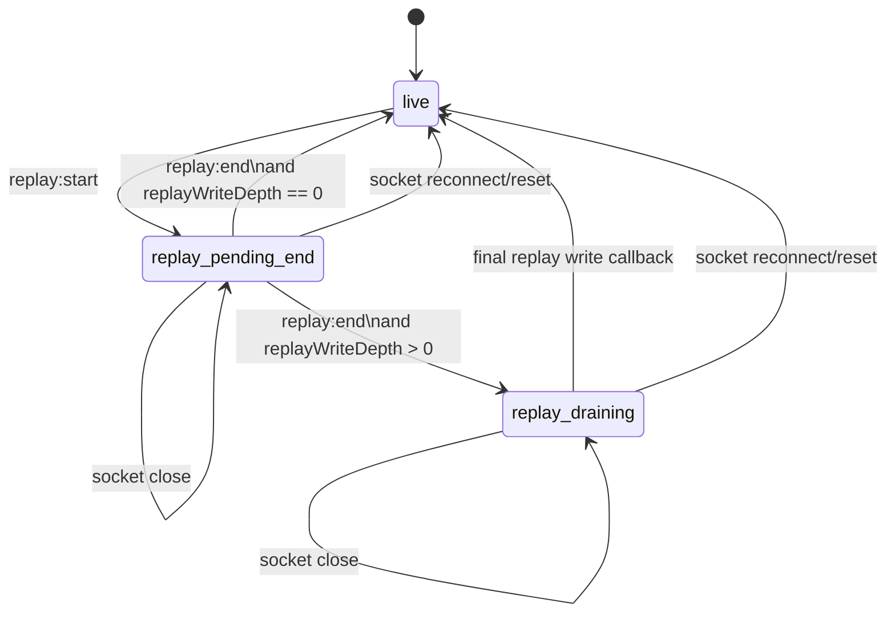
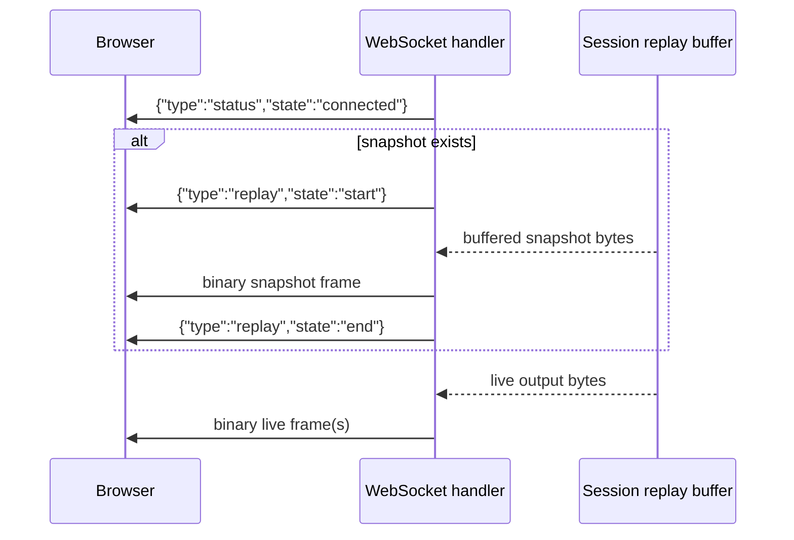

# Behavior: WebSocket protocols

> Part of the [behavior specification](../behavior.md). That document carries startup, configuration, and operational assumptions.

## Command Center WebSocket Protocol

Endpoint: `GET /ws/board-command` — the Spotlight palette's chat connection. Full design lives in
[agent-board/command-center.md](../agent-board/command-center.md#command-center).

**Authentication is different from every other route on this page.** Browsers cannot set an
`Authorization` header on a WebSocket upgrade request, so the token instead travels as a WebSocket
subprotocol: the client dials with `new WebSocket(url, [token])`, and the server reads it from the
`Sec-WebSocket-Protocol` request header, comparing it to `server.auth_token` in constant time. A
missing or incorrect value returns `401` and the upgrade never happens. This is a deliberate choice
over a `?token=...` query parameter, which would leak the token into server access logs, browser
history, and same-origin `Referer` headers. On success the server echoes the same value back in its
own `Sec-WebSocket-Protocol` response header, completing the handshake per the WebSocket spec.

Once connected, the client may send any number of prompts sequentially over the same connection:

- client → server (text frame): `{"prompt": "..."}`
- server → client (text frames), one of:
  - `{"type":"line","raw":{...}}` — one raw `--output-format=stream-json` line from the command
    center subprocess, forwarded as it arrives
  - `{"type":"error","message":"..."}` — the query failed (non-zero exit, malformed stream-json
    output, or a context cancellation/timeout); always the last frame for that query
  - `{"type":"done"}` — the query finished successfully; always the last frame for that query
  - either terminal frame may also carry `"warnings":["..."]` — e.g.
    `{"type":"done","warnings":["persisting command center history: ..."]}`. The key is omitted
    entirely unless something around the query failed; see the paragraph below
  - `{"type":"busy"}` — a query was already in flight against the command center's single session
    (see [agent-board/command-center.md's Concurrency](../agent-board/command-center.md#process-lifecycle)); the new prompt was
    rejected outright, not queued

A client that disconnects mid-query does not stop the underlying subprocess or corrupt the next
query's `--resume` continuity — the server keeps draining (but no longer forwarding) the query's
remaining output so the subprocess is never left blocked, and the command center's own busy state is
released normally once it finishes.

Two further protections back the "never blocked forever" guarantee above, both defensive: the
subprocess's own context carries a 5-minute default timeout (`commandcenter.RunnerConfig.QueryTimeout`),
so a hung or abandoned `claude` invocation is force-killed rather than running indefinitely even if
nothing else notices it; and every server→client write carries its own 10-second write deadline, so a
client that stops reading without closing its TCP connection (a sleeping laptop, a dropped network
with no FIN) fails the write — and falls into the same drain-without-forwarding path described above —
instead of blocking the server goroutine forever.

**A query that starts ends with exactly one of `error` and `done`, and `warnings` is how either one
reports a non-fatal failure.** Both frames above are documented as the last frame for a query, so
only one of them can be sent. (A prompt answered with `busy` never becomes a query: it was rejected
before a subprocess ran, so it receives neither of the two — `busy` is itself the last frame for
that prompt.)

The case that made this concrete is a failed history write (issue #214): the subprocess answered,
the operator has the answer on screen, and the only thing that failed was persisting the record of
it — genuinely not a failed query, but not something to hide either. It used to be reported as an
`error` frame followed by a `done` frame, which left the query with no terminal frame at all and
made the dashboard render a successful answer as failed. It now travels as a string in `warnings` on
whichever terminal frame the query ends with, which the palette renders under the answer rather than
in place of it.

**`warnings` rides the `error` frame as well as the `done` frame, and that is deliberate rather than
incidental.** Reporting it only on success would hide it from exactly the operator who needs it: one
whose `~/.config/panemux/` is read-only while their queries are also failing for an unrelated reason
sees every turn end in an `error`, the history file silently recording none of them, and the palette
— which seeds itself from `GET /api/board/command/history` on each open — showing nothing, with no
route from that symptom to its cause. Every warning is also written to panemux's own log, but for a
`panemux --open` desktop run that log is a terminal nobody is watching.

**A query killed by the timeout above is not treated as a `--resume` rejection.** The client sees a
distinct `{"type":"error","message":"claude query timed out after 5m0s"}` (or whatever
`QueryTimeout` is configured to), and the command center's persisted session id is left untouched —
running long says nothing about whether `claude` would still recognize that id on a fresh attempt.
Only a genuine resume failure (the CLI's own non-zero exit when it no longer recognizes the id — e.g.
the user cleared `~/.claude`, or the session was garbage collected) clears the persisted id, so it
isn't retried forever; a timeout on an otherwise-healthy, still-resumable conversation never does.

**A malformed `--output-format=stream-json` line cancels the subprocess immediately**, rather than
waiting for the subprocess to exit on its own (which, for a wedged or misbehaving `claude` process,
could otherwise hold the single-query busy flag for up to the full `QueryTimeout`). The
corresponding `{"type":"error",...}` frame is sent once the subprocess has been reaped, just after
that cancellation rather than just before it — so that the frame ending the query is emitted from
the one place that knows whether the history write succeeded, and can therefore carry its
`warnings`.

**The rest of the subprocess's output is drained only after that cancellation**, and this ordering is
load-bearing rather than incidental. The remaining output has to be read — otherwise a subprocess
still writing into a pipe no one reads can never exit, and `cmd.Wait()` never returns — but a drain
placed *before* the cancellation blocks on `read(2)` against a process that has stopped writing
without exiting, and nothing releases it until the `QueryTimeout` kills the process. That is the wait
the cancellation exists to cut short, so a cancellation queued behind it cannot deliver what it
promises: an earlier revision drained first, and both the busy flag and the client's error frame were
subject to the full timeout. Ordered cancel-then-drain, neither is: the drain can only ever wait on a
subprocess already being killed.

**The persisted `--resume` session id is validated before every use, not only when this Runner itself
wrote it.** `--resume`'s value is optional in the claude CLI's own argument parser, so a value
beginning with `-` would be parsed as a new CLI flag rather than a `--resume` value if passed through
as-is. A persisted id that doesn't match `^[A-Za-z0-9][A-Za-z0-9._-]*$` (the shape of every id claude
itself has ever been observed to emit) is treated exactly like no persisted id at all: the query runs
without `--resume`, and whatever session id that fresh run captures is persisted in its place.

## WebSocket Protocol

Endpoint: `GET /ws/{sessionID}`

Connection behavior:

- `404` if the session ID does not exist. After a successful `/restart` this cannot happen for a
  pane that was previously running; if `/restart` itself fails, the pane's prior session stays
  registered (see [`POST /api/sessions/{id}/restart`](rest-api.md#post-apisessionsidrestart)), so
  this 404 is limited to session IDs that were never created in the first place.
- initial text frame is a JSON status message with `type: "status"` and `state: "connected"`
- if a reconnect has buffered output, the backend sends `{"type":"replay","state":"start"}`,
  replays up to the recent per-session output buffer as a binary frame, then sends
  `{"type":"replay","state":"end"}` before streaming live output
- if there is no buffered output, live output starts immediately after the connected status

Frame behavior:

- binary frame from browser to server: raw terminal input bytes
- binary frame from server to browser: raw terminal output bytes
- text frame from browser to server: JSON control message

Supported control messages:

```json
{ "type": "resize", "cols": 120, "rows": 40 }
```

```json
{ "type": "replay", "state": "start" }
```

```json
{ "type": "replay", "state": "end" }
```

Resize messages with zero dimensions are ignored. Invalid JSON control frames are ignored rather than terminating the session.

Replay state machine:

| State | Entry condition | Allowed events | Exit condition | Frontend effect |
|---|---|---|---|---|
| `live` | initial steady state, or replay has fully completed | live binary output, `replay:start`, socket close, socket reconnect | `replay:start` or socket teardown | `disableStdin = false`; terminal input and xterm-generated replies may flow normally |
| `replay_pending_end` | `replay:start` received | replay binary output, `replay:end`, `replay:end` write failure, socket close, socket reconnect | `replay:end` or socket teardown | `disableStdin = true`; replay bytes may still be arriving |
| `replay_draining` | `replay:end` received while one or more replay writes are still in flight | replay write callback completion, socket close, socket reconnect | last replay write callback completes | `disableStdin = true`; no new replay bytes are expected, but already-scheduled writes may still cause xterm side effects |

State transition rules:

1. New connections start in `live`.
2. `replay:start` moves the terminal to `replay_pending_end` and suppresses stdin immediately.
3. Each replay binary frame is written while stdin remains suppressed.
4. `replay:end` moves the terminal to `replay_draining` if replay writes are still in flight, otherwise directly back to `live`.
5. The final replay write callback restores `live`.
6. A socket close or replay-control write failure can leave the frontend in a stale replay state until the next connection opens.
7. Any WebSocket reconnect force-resets replay state back to `live` before new frames are processed, so a partial replay cannot leave stale suppression behind.

Frontend replay state diagram:



Backend replay emission order:



Alloy model:

- The replay state machine above is mirrored in [replay_state.als](../models/replay_state.als).
- The model abstracts the frontend into three states: `Live`, `ReplayPendingEnd`, and `ReplayDraining`.
- It checks these invariants:
  - `Live` never leaves `disableStdin` enabled
  - replay states always keep `disableStdin` enabled
  - `ReplayDraining` is only reachable while replay writes remain queued
  - `ReplayEndWriteFail` leaves the model in `ReplayPendingEnd` until reconnect
  - `SocketClose` does not falsely restore `Live` while replay is incomplete
  - `Reconnect` always resets the model to a clean `Live` state
  - stale replay suppression cannot survive in `Live`
- Any implementation that introduces or changes observable state transitions should ship with an
  Alloy model in `docs/models/` that captures those transitions.
- When state-transition behavior changes, update the corresponding Alloy model in the same change.
- To inspect counterexamples locally, open the model in Alloy and run the bundled `check` commands.
- CI runs Alloy model checks only when files under `docs/models/` change, so transition-changing
  code changes are expected to update the model if they need model-check coverage.

When the backend session reaches EOF, the handler emits:

```json
{ "type": "status", "state": "exited" }
```
